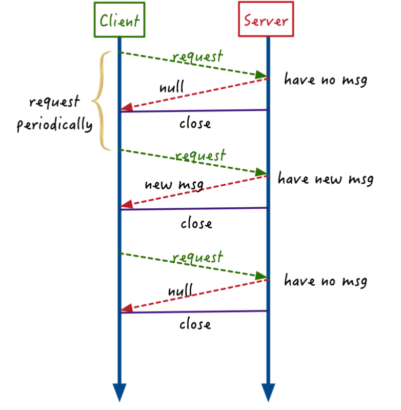
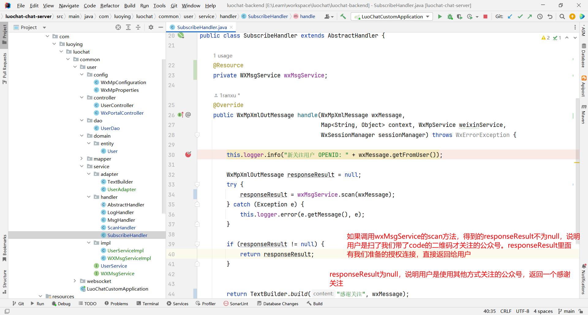
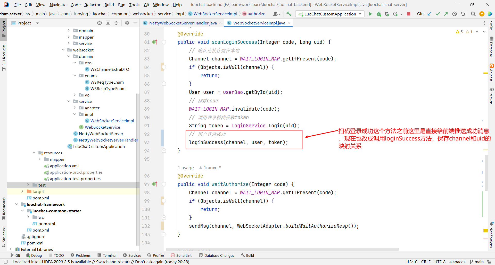
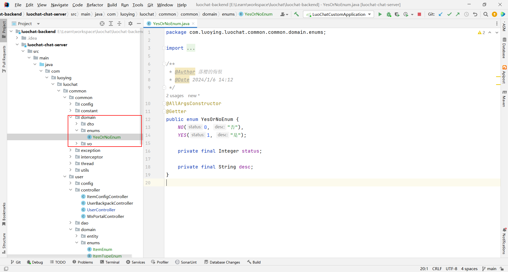
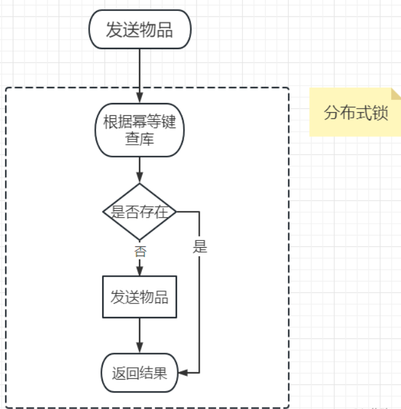
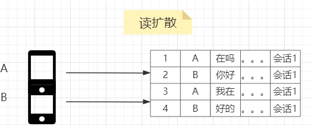
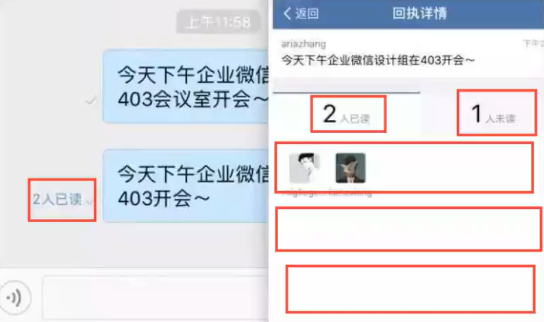

# 环境搭建

## docker环境部署

### 下载docker 

```sh
# 1.阿里云镜像资源（先执行这个下载加速）
yum-config-manager --add-rep https://mirrors.aliyun.com/docker-ce/linux/centos/docker-ce.repo
#2.安装docker
yum install -y docker-ce
```


### 启动Docker服务

安装完成后，使用下面的命令来启动 docker 服务，并将其设置为开机启动：

```sh
service docker start
chkconfig docker on
```

测试Docker是否安装成功

```sh
docker version
```

输入上述命令，返回docker的版本相关信息，证明docker安装成功。

### 设置国内镜像

```sh
vi  /etc/docker/daemon.json

#添加
{
    "registry-mirrors": ["https://mirror.ccs.tencentyun.com"],
    "live-restore": true
}
```

依次执行以下命令，重新启动 Docker 服务。

```sh
systemctl daemon-reload
service docker restart
```

检查是否生效

```sh
docker info
```

查看是否有如下信息

```sh
Registry Mirrors:
    https://mirror.ccs.tencentyun.com/
```


### Docker Compose的安装 

我们一般都是通过docker compose来安装中间件，所以这个必不可少。可手动下载，直接上传到`/usr/local/bin`

[下载地址](https://github.com/docker/compose/releases/download/1.28.6/docker-compose-Linux-x86_64)，

[百度云下载地址](https://pan.baidu.com/s/1xbK9p9Gz_2qVNgZhU2HseA?pwd=8888) 

将可执行权限应用于二进制文件：

```sh
sudo chmod +x /usr/local/bin/docker-compose
```

测试是否安装成功：

```sh
docker-compose --version
```


### 常用命令 

除过以上我们使用的Docker命令外，Docker还有一些其它常用的命令

**拉取docker镜像**

```sh
docker pull image_name
```

**查看宿主机上的镜像，Docker镜像保存在/var/lib/docker目录下:**

```sh
docker images
```

**删除镜像**

```sh
docker rmi image_name:version
#或者 
docker rmi b39c68b7af30
```

**查看当前有哪些容器正在运行**

```sh
docker ps
```

**查看所有容器**

```sh
docker ps -a
```

**启动、停止、重启容器命令**

```sh
docker start container_name/container_id 
docker stop container_name/container_id 
docker restart container_name/container_id
```

**后台启动一个容器后，如果想进入到这个容器，可以使用attach命令**

```sh
docker attach container_name/container_id
```

**删除容器的命令**

```sh
docker rm container_name/container_id
```

**删除所有停止的容器**

```sh
docker rm $(docker ps -a -q)
```

**查看当前系统Docker信息**

```sh
docker info
```

**从Docker hub上下载某个镜像**

```sh
#执行docker pull centos会将Centos这个仓库下面的所有镜像下载到本地repository。
docker pull centos:latest
```

**查找Docker Hub上的nginx镜像**

```sh
docker search nginx
```


## Mysql部署

`记得开防火墙端口3306`

mysql修改密码：http://www.yuyanba.com/default.aspx/did93214

创建挂载目录

```sh
#创建挂载目录
mkdir -p /data/mysql/data;
mkdir -p /data/mysql/conf;
```

创建yml文件

```
vi /data/mysql/docker-compose.yml
```

填入配置

```yml
version: '3'
services:
  mysql:
    image: mysql:5.7 #mysql版本
    container_name: mysql
    volumes:
      - /data/mysql/data:/var/lib/mysql
      - /data/mysql/conf/my.cnf:/etc/mysql/mysql.conf.d/mysqld.cnf
    restart: always
    ports:
      - 3306:3306
    environment:
      MYSQL_ROOT_PASSWORD: 115474287zxcczld #root用户密码
      TZ: Asia/Shanghai
    command: --character-set-server=utf8mb4 --collation-server=utf8mb4_unicode_ci
```

创建配置文件

```sh
vi /data/mysql/conf/my.cnf
```

```sh
[mysqld]
default-storage-engine=INNODB  # 创建新表时将使用的默认存储引擎
character-set-server=utf8mb4      # 设置mysql服务端默认字符集
pid-file        = /var/run/mysqld/mysqld.pid  # pid文件所在目录
socket          = /var/run/mysqld/mysqld.sock # 用于本地连接的socket套接字
datadir         = /var/lib/mysql              # 数据文件存放的目录
symbolic-links=0
sql_mode=STRICT_TRANS_TABLES,NO_ZERO_IN_DATE,NO_ZERO_DATE,ERROR_FOR_DIVISION_BY_ZERO,NO_ENGINE_SUBSTITUTION # 定义mysql应该支持的sql语法，数据校验等!

# 允许最大连接数
max_connections=200


# 同一局域网内注意要唯一
server-id=3306
# 开启二进制日志功能 & 日志位置存放位置`/var/lib/mysql`
#log-bin=mysql-bin
log-bin=/var/lib/mysql/mysql-bin
# binlog格式
# 1. STATEMENT：基于SQL语句的模式，binlog 数据量小，但是某些语句和函数在复制过程可能导致数据不一致甚至出错；
# 2. MIXED：混合模式，根据语句来选用是 STATEMENT 还是 ROW 模式；
# 3. ROW：基于行的模式，记录的是行的完整变化。安全，但 binlog 会比其他两种模式大很多；
binlog_format=ROW
# FULL：binlog记录每一行的完整变更 MINIMAL：只记录影响后的行
binlog_row_image=FULL
# 日志文件大小
max_binlog_size=100M
# 定义清除过期日志的时间(这里设置为7天)
expire_logs_days=7

# ================= ↑↑↑ mysql主从同步配置end ↑↑↑ =================

[mysql]
default-character-set=utf8mb4

[client]
default-character-set=utf8mb4  # 设置mysql客户端默认字符集
```

到对应目录下启动容器

```sh
cd /data/mysql
docker-compose up -d
```

可以测试是否连接成功


之后迁移数据到服务器，把conf和data目录复制服务器，使用挂载的方式挂载到mysql容器上


## Redis部署

创建挂载目录

```sh
#创建挂载目录
mkdir -p /data/redis
```

创建yml文件

```sh
vi /data/redis/docker-compose.yml
```

填入配置

```sh
version: '3'
services:
  redis:
    image: redis:6.2.6
    container_name: redis
    restart: always
    ports:
      - 6379:6379
    volumes:
      - /data/redis/redis.conf:/etc/redis/redis.conf
      - /data/redis/data:/data
      - /data/redis/logs:/logs
    command: ["redis-server","/etc/redis/redis.conf"]
```

创建挂载的配置文件

```sh
vi /data/redis/redis.conf
```

```sh
protected-mode no
port 6379
timeout 0
#rdb配置
save 900 1
save 300 10
save 60 10000
rdbcompression yes
dbfilename dump.rdb
dir /data
appendonly yes
appendfsync everysec
#设置你的redis密码
requirepass 123
```

到对应目录下启动容器

```sh
cd /data/redis
docker-compose up -d
#如果需要强制重新构建
docker-compose up --force-recreate -d
```

`记得开防火墙端口6379`


## rocketMQ部署

参考：[链接](https://blog.csdn.net/oschina_41731918/article/details/123115102),[帐号密码](https://www.cnblogs.com/binz/p/15252277.html)，[官方文档](https://github.com/apache/rocketmq/blob/master/docs/cn/acl/user_guide.md)

一般建议设置密码

### 不配置密码 

创建挂载目录

```sh
#创建挂载目录
mkdir -p /data/rocketmq/namesrv ;
mkdir -p /data/rocketmq/broker/conf ;
```

创建yml文件

```sh
vi /data/rocketmq/docker-compose.yml
```

填入配置

```sh
version: '3.5'
services:
  rocketmq-namesrv:
    image: foxiswho/rocketmq:4.8.0
    container_name: rocketmq-namesrv
    restart: always
    ports:
      - 9876:9876
    volumes:
      - ./namesrv/logs:/home/rocketmq/logs
      - ./namesrv/store:/home/rocketmq/store
    environment:
      JAVA_OPT_EXT: "-Duser.home=/home/rocketmq -Xms128M -Xmx128M -Xmn128m"
    command: ["sh","mqnamesrv"]
    networks:
      rocketmq_net:
        aliases:
          - rocketmq-namesrv


  rocketmq-broker:
    image: foxiswho/rocketmq:4.8.0
    container_name: rocketmq-broker
    restart: always
    ports:
      - 10909:10909
      - 10911:10911
    volumes:
      - ./broker/logs:/home/rocketmq/logs
      - ./broker/store:/home/rocketmq/store
      - ./broker/conf/broker.conf:/etc/rocketmq/broker.conf
    environment:
      JAVA_OPT_EXT: "-Duser.home=/home/rocketmq -Xms128m -Xmx128m -Xmn128m"
    command: ["sh","mqbroker","-c","/etc/rocketmq/broker.conf"]
    depends_on:
      - rocketmq-namesrv
    networks:
      rocketmq_net:
        aliases:
          - rocketmq-broker


  rocketmq-console:
    image: iamverygood/rocketmq-console:4.7.1
    container_name: rocketmq-console
    restart: always
    ports:
      - 8180:8080
    environment:
      JAVA_OPTS: "-Drocketmq.namesrv.addr=rocketmq-namesrv:9876 -Dcom.rocketmq.sendMessageWithVIPChannel=false"
    depends_on:
      - rocketmq-namesrv
    networks:
      rocketmq_net:
        aliases:
          - rocketmq-console

networks:
  rocketmq_net:
    name: rocketmq_net
    driver: bridge
```

创建挂载的配置文件

```sh
vim /data/rocketmq/broker/conf/broker.conf
```

```sh

#所属集群名字
brokerClusterName=DefaultCluster

#broker名字，注意此处不同的配置文件填写的不一样，如果在broker-a.properties使用:broker-a,
#在broker-b.properties使用:broker-b
brokerName=broker-a

#0 表示Master，>0 表示Slave
brokerId=0

#nameServer地址，分号分割
#namesrvAddr=rocketmq-nameserver1:9876;rocketmq-nameserver2:9876
namesrvAddr=rocketmq-namesrv:9876

#启动IP,如果 docker 报 com.alibaba.rocketmq.remoting.exception.RemotingConnectException: connect to <192.168.0.120:10909> failed
# 解决方式1 加上一句producer.setVipChannelEnabled(false);，解决方式2 brokerIP1 设置宿主机IP，不要使用docker 内部IP
brokerIP1=192.168.253.128

#在发送消息时，自动创建服务器不存在的topic，默认创建的队列数
defaultTopicQueueNums=4

#是否允许 Broker 自动创建Topic，建议线下开启，线上关闭 ！！！这里仔细看是false，false，false
autoCreateTopicEnable=true

#是否允许 Broker 自动创建订阅组，建议线下开启，线上关闭
autoCreateSubscriptionGroup=true

#Broker 对外服务的监听端口
listenPort=10911

#此参数控制是否开启密码,不开启可设置false
aclEnable=false

#删除文件时间点，默认凌晨4点
deleteWhen=04

#文件保留时间，默认48小时
fileReservedTime=120

#commitLog每个文件的大小默认1G
mapedFileSizeCommitLog=1073741824

#ConsumeQueue每个文件默认存30W条，根据业务情况调整
mapedFileSizeConsumeQueue=300000

#destroyMapedFileIntervalForcibly=120000
#redeleteHangedFileInterval=120000
#检测物理文件磁盘空间
diskMaxUsedSpaceRatio=88
#存储路径
#storePathRootDir=/home/ztztdata/rocketmq-all-4.1.0-incubating/store
#commitLog 存储路径
#storePathCommitLog=/home/ztztdata/rocketmq-all-4.1.0-incubating/store/commitlog
#消费队列存储
#storePathConsumeQueue=/home/ztztdata/rocketmq-all-4.1.0-incubating/store/consumequeue
#消息索引存储路径
#storePathIndex=/home/ztztdata/rocketmq-all-4.1.0-incubating/store/index
#checkpoint 文件存储路径
#storeCheckpoint=/home/ztztdata/rocketmq-all-4.1.0-incubating/store/checkpoint
#abort 文件存储路径
#abortFile=/home/ztztdata/rocketmq-all-4.1.0-incubating/store/abort
#限制的消息大小
maxMessageSize=65536

#flushCommitLogLeastPages=4
#flushConsumeQueueLeastPages=2
#flushCommitLogThoroughInterval=10000
#flushConsumeQueueThoroughInterval=60000

#Broker 的角色
#- ASYNC_MASTER 异步复制Master
#- SYNC_MASTER 同步双写Master
#- SLAVE
brokerRole=ASYNC_MASTER

#刷盘方式
#- ASYNC_FLUSH 异步刷盘
#- SYNC_FLUSH 同步刷盘
flushDiskType=ASYNC_FLUSH

#发消息线程池数量
#sendMessageThreadPoolNums=128
#拉消息线程池数量
#pullMessageThreadPoolNums=128
```

brokerIP1=192.168.253.128填上自己服务器公网ip，客户端发送消息要联这个

授权目录

```sh
#目录权限（不加会有坑，rocketmq没法操作挂载目录）：
chmod -R 777 /data/rocketmq/namesrv/;
chmod -R 777 /data/rocketmq/broker/;
```


### 设置密码 

创建挂载目录,一次性执行

```sh
#创建挂载目录
mkdir -p /data/rocketmq/namesrv;
mkdir -p /data/rocketmq/broker/conf;
mkdir -p /data/rocketmq/broker/lib;
mkdir -p /data/rocketmq/console/data;
```

创建挂载的配置文件

```sh
vi /data/rocketmq/broker/conf/broker.conf
```

```sh

#所属集群名字
brokerClusterName=DefaultCluster

#broker名字，注意此处不同的配置文件填写的不一样，如果在broker-a.properties使用:broker-a,
#在broker-b.properties使用:broker-b
brokerName=broker-a

#0 表示Master，>0 表示Slave
brokerId=0

#nameServer地址，分号分割
#namesrvAddr=rocketmq-nameserver1:9876;rocketmq-nameserver2:9876
namesrvAddr=rocketmq-namesrv:9876

#启动IP,如果 docker 报 com.alibaba.rocketmq.remoting.exception.RemotingConnectException: connect to <192.168.0.120:10909> failed
# 解决方式1 加上一句producer.setVipChannelEnabled(false);，解决方式2 brokerIP1 设置宿主机IP，不要使用docker 内部IP
brokerIP1=192.168.253.128

#在发送消息时，自动创建服务器不存在的topic，默认创建的队列数
defaultTopicQueueNums=4

#是否允许 Broker 自动创建Topic，建议线下开启，线上关闭 ！！！这里仔细看是false，false，false
autoCreateTopicEnable=true

#是否允许 Broker 自动创建订阅组，建议线下开启，线上关闭
autoCreateSubscriptionGroup=true

#Broker 对外服务的监听端口
listenPort=10911

#此参数控制是否开启密码,不开启可设置false
aclEnable=true

#删除文件时间点，默认凌晨4点
deleteWhen=04

#文件保留时间，默认48小时
fileReservedTime=120

#commitLog每个文件的大小默认1G
mapedFileSizeCommitLog=1073741824

#ConsumeQueue每个文件默认存30W条，根据业务情况调整
mapedFileSizeConsumeQueue=300000

#destroyMapedFileIntervalForcibly=120000
#redeleteHangedFileInterval=120000
#检测物理文件磁盘空间
diskMaxUsedSpaceRatio=88
#存储路径
#storePathRootDir=/home/ztztdata/rocketmq-all-4.1.0-incubating/store
#commitLog 存储路径
#storePathCommitLog=/home/ztztdata/rocketmq-all-4.1.0-incubating/store/commitlog
#消费队列存储
#storePathConsumeQueue=/home/ztztdata/rocketmq-all-4.1.0-incubating/store/consumequeue
#消息索引存储路径
#storePathIndex=/home/ztztdata/rocketmq-all-4.1.0-incubating/store/index
#checkpoint 文件存储路径
#storeCheckpoint=/home/ztztdata/rocketmq-all-4.1.0-incubating/store/checkpoint
#abort 文件存储路径
#abortFile=/home/ztztdata/rocketmq-all-4.1.0-incubating/store/abort
#限制的消息大小
maxMessageSize=65536

#flushCommitLogLeastPages=4
#flushConsumeQueueLeastPages=2
#flushCommitLogThoroughInterval=10000
#flushConsumeQueueThoroughInterval=60000

#Broker 的角色
#- ASYNC_MASTER 异步复制Master
#- SYNC_MASTER 同步双写Master
#- SLAVE
brokerRole=ASYNC_MASTER

#刷盘方式
#- ASYNC_FLUSH 异步刷盘
#- SYNC_FLUSH 同步刷盘
flushDiskType=ASYNC_FLUSH

#发消息线程池数量
#sendMessageThreadPoolNums=128
#拉消息线程池数量
#pullMessageThreadPoolNums=128
```

brokerIP1=192.168.253.128填上自己服务器公网ip，客户端发送消息要联这个

**如果有设置密码的需求，先给broker.conf开启acl密码配置 true** 


**创建acl文件，用于开启用户名密码** 

```sh
vi /data/rocketmq/broker/conf/plain_acl.yml
```

```sh
# Licensed to the Apache Software Foundation (ASF) under one or more
# contributor license agreements.  See the NOTICE file distributed with
# this work for additional information regarding copyright ownership.
# The ASF licenses this file to You under the Apache License, Version 2.0
# (the "License"); you may not use this file except in compliance with
# the License.  You may obtain a copy of the License at
#
#     http://www.apache.org/licenses/LICENSE-2.0
#
#  Unless required by applicable law or agreed to in writing, software
#  distributed under the License is distributed on an "AS IS" BASIS,
#  WITHOUT WARRANTIES OR CONDITIONS OF ANY KIND, either express or implied.
#  See the License for the specific language governing permissions and
#  limitations under the License.
# 全局白名单，如果配置了则不需要走acl校验，慎重配置
globalWhiteRemoteAddresses:
#  - 47.100.93.*
#  - 156.254.120.*
 
accounts:
  - accessKey: RocketMQ
    secretKey: 12345678
    whiteRemoteAddress:
    admin: false
    defaultTopicPerm: DENY
    defaultGroupPerm: SUB
    topicPerms:
      - topicA=DENY
      - topicB=PUB|SUB
      - topicC=SUB
    groupPerms:
      # the group should convert to retry topic
      - groupA=DENY
      - groupB=PUB|SUB
      - groupC=SUB

  - accessKey: luochat #用户名
    secretKey: 12345678 #密码
    whiteRemoteAddress: 
    # if it is admin, it could access all resources 上面的用于教学，我们用超级管理员账号
    admin: true #管理员权限
```

密码不能小于6位数，血的教训

名称也不能小于6位，血的教训！！！

权限的描述可参考[链接](https://github.com/apache/rocketmq/blob/master/docs/cn/acl/user_guide.md)


**给console加上账号密码** 

```sh
vi /data/rocketmq/console/data/users.properties
```

```sh
# This file supports hot change, any change will be auto-reloaded without Console restarting.
# Format: a user per line, username=password[,N] #N is optional, 0 (Normal User); 1 (Admin)

# Define Admin
# =============用户名和密码规则「用户名=密码,权限」，这里的权限为1表示管理员>，为0表示普通用户=============
# 例如：admin=admin123,1
luochat=123456,1


# Define Users
# =============屏蔽下边两个账户=============
#user1=user1
#user2=user2
```

**创建yml文件** 

```sh
vi /data/rocketmq/docker-compose.yml
```

填入配置

```sh
version: '3.5'
services:
  rocketmq-namesrv:
    image: foxiswho/rocketmq:4.8.0
    container_name: rocketmq-namesrv
    restart: always
    ports:
      - 9876:9876
    volumes:
      - ./namesrv/logs:/home/rocketmq/logs
      - ./namesrv/store:/home/rocketmq/store
    environment:
      JAVA_OPT_EXT: "-Duser.home=/home/rocketmq -Xms128M -Xmx128M -Xmn128m"
    command: ["sh","mqnamesrv"]
    networks:
      rocketmq_net:
        aliases:
          - rocketmq-namesrv


  rocketmq-broker:
    image: foxiswho/rocketmq:4.8.0
    container_name: rocketmq-broker
    restart: always
    ports:
      - 10909:10909
      - 10911:10911
    volumes:
      - ./broker/logs:/home/rocketmq/logs
      - ./broker/store:/home/rocketmq/store
      - ./broker/conf/plain_acl.yml:/home/rocketmq/rocketmq-4.8.0/conf/plain_acl.yml
      - ./broker/conf/broker.conf:/etc/rocketmq/broker.conf
    environment:
      JAVA_OPT_EXT: "-Duser.home=/home/rocketmq -Xms128m -Xmx128m -Xmn128m"
    command: ["sh","mqbroker","-c","/etc/rocketmq/broker.conf"]
    depends_on:
      - rocketmq-namesrv
    networks:
      rocketmq_net:
        aliases:
          - rocketmq-broker


  rocketmq-console:
    image: iamverygood/rocketmq-console:4.7.1
    container_name: rocketmq-console
    restart: always
    ports:
      - 8180:8080
    volumes:
      - ./console/data:/tmp/rocketmq-console/data
    environment:
      JAVA_OPTS: "-Drocketmq.namesrv.addr=rocketmq-namesrv:9876 -Dcom.rocketmq.sendMessageWithVIPChannel=false -Drocketmq.config.loginRequired=true -Drocketmq.config.aclEnabled=true -Drocketmq.config.accessKey=luochat -Drocketmq.config.secretKey=12345678"
    depends_on:
      - rocketmq-namesrv
    networks:
      rocketmq_net:
        aliases:
          - rocketmq-console

networks:
  rocketmq_net:
    name: rocketmq_net
    driver: bridge
```

如果你的acl密码改了，记得把yml的console帐号密码也一同更改

-Drocketmq.config.accessKey=luochat -Drocketmq.config.secretKey=12345678

授予目录权限

```sh
#目录权限：
chmod -R 777 /data/rocketmq/namesrv/;
chmod -R 777 /data/rocketmq/broker/;
chmod -R 777 /data/rocketmq/console/;
```

`记得防火墙开端口号 9876,10911,8180 !!!`

### 启动容器 

到对应目录下启动容器

```sh
cd /data/rocketmq
docker-compose up -d
```

docker ps，可以看见一直在重启中


注意，第一次会启动不成功，因为broker需要创建一堆文件，没有权限。再执行一遍权限命令

```sh
#目录权限：
chmod -R 777 /data/rocketmq/namesrv/;
chmod -R 777 /data/rocketmq/broker/;
chmod -R 777 /data/rocketmq/console/;
#然后强制重新构建
docker-compose up --force-recreate -d
```


安装过程中踩过一个坑，感兴趣可以看看

[RocketMQ部署失败排查](https://www.yuque.com/snab/mallchat/tt9mcnc6t0g125ow)


**docker-compose版本升级** 

可能有的小伙伴启动会报错。是因为我们的docker-compose版本太低了，识别不了networks命令需要更新一下。速度比较慢，等等就好

```sh
#更新版本
curl -L https://github.com/docker/compose/releases/download/1.28.6/docker-compose-`uname -s`-`uname -m` -o /usr/local/bin/docker-compose
#将可执行权限应用于二进制文件
sudo chmod +x /usr/local/bin/docker-compose
```

**登录控制台** 

启动后可以登录控制台，记得开防火墙！！！

http://ip:8180/


输入帐号密码 luochat123456


修改后端环境配置


测试生产者

```java
@Autowired
private RocketMQTemplate rocketMQTemplate;
@Test
public void sendMQ() {
    Message<String> build = MessageBuilder.withPayload("123").build();
    rocketMQTemplate.send("test-topic", build);
}
```


测试消费者

```java
import org.apache.rocketmq.spring.annotation.RocketMQMessageListener;
import org.apache.rocketmq.spring.core.RocketMQListener;
import org.springframework.stereotype.Component;

@RocketMQMessageListener(consumerGroup = "test-group", topic = "test-topic")
@Component
public class TestConsumer implements RocketMQListener<String> {

    @Override
    public void onMessage(String dto) {
        System.out.println("收到消息{}"+dto);
    }
}

```


消费者也注册上了test-topic

手动发消息


## minio部署

学习参考文档https://java.isture.com/arch/minio/minio-concept.html

比较完整https://blog.csdn.net/weixin_39060009/article/details/115520696

创建挂载目录

```sh
#创建挂载目录
mkdir -p /data/minio
```

创建yml文件

```sh
vi /data/minio/docker-compose.yml
```

填入配置

```sh
version: '3'
services:
  minio:
    image: "quay.io/minio/minio:RELEASE.2022-08-02T23-59-16Z"
    container_name: minio
    ports:
      - "9000:9000" # api 端口
      - "9001:9001" # 控制台端口
    environment:
      TZ: Asia/Shanghai # 时区上海
      MINIO_ROOT_USER: admin # 管理后台用户名
      MINIO_ROOT_PASSWORD: 12345678 # 管理后台密码，最小8个字符
      MINIO_SERVER_URL: "http://192.168.253.128:9000" # 指定分享的域名
      MINIO_COMPRESS: "off" # 开启压缩 on 开启 off 关闭
      MINIO_COMPRESS_EXTENSIONS: "" # 扩展名 .pdf,.doc 为空 所有类型均压缩
      MINIO_COMPRESS_MIME_TYPES: "" # mime 类型 application/pdf 为空 所有类型均压缩
    volumes:
      - /data/minio/data:/data/ # 映射当前目录下的data目录至容器内/data目录      
      - /data/minio/config:/root/.minio/ # 映射配置目录
    command: server --address ':9000' --console-address ':9001' /data  # 指定容器中的目录 /data
    privileged: true
```

有些非大陆服务器,，会出现登录不上，密码不对invalid Login的错误提示，改用下面的配置重新构建

```
docker-compose up --force-recreate -d
```

```sh
version: '3'
services:
  minio:
    image: "quay.io/minio/minio:RELEASE.2022-08-02T23-59-16Z"
    container_name: minio
    ports:
      - "9000:9000" # api 端口
      - "9001:9001" # 控制台端口
    environment:
      MINIO_ROOT_USER: admin # 管理后台用户名
      MINIO_ROOT_PASSWORD: 12345678 # 管理后台密码，最小8个字符
      MINIO_COMPRESS: "off" # 开启压缩 on 开启 off 关闭
      MINIO_COMPRESS_EXTENSIONS: "" # 扩展名 .pdf,.doc 为空 所有类型均压缩
      MINIO_COMPRESS_MIME_TYPES: "" # mime 类型 application/pdf 为空 所有类型均压缩
    volumes:
      - /data/minio/data:/data/ # 映射当前目录下的data目录至容器内/data目录      
      - /data/minio/config:/root/.minio/ # 映射配置目录
    command: server --address ':9000' --console-address ':9001' /data  # 指定容器中的目录 /data
    privileged: true
```

到对应目录下启动容器

```sh
cd /data/minio
docker-compose up -d
#如果需要强制重新构建
docker-compose up --force-recreate -d
```

打开对应的控制台

[http://ip:9001/](http://192.168.253.128:9001/)


`记得防火墙开端口号 9000,9001  !!!，输入帐号密码admin，12345678`


创建一个测试捅，尝试上传一张图片。


设置桶为公开桶


url替换成自己的服务器ip，删除后面的权限信息。尝试访问（不成功也没关系）

创建一个权限用户，获取密钥


会随机生成accessKey secretKey，点击create按钮后. 会将这两个key进行展示，此时可以复制粘贴到一个文本文件上，后续使用代码上传文件时需要用到这两个key

在配置文件中配置如下信息


endpoint就是你的minio部署的ip地址。


配置nginx的转发，一次性配置规范点，为对象存储搞个二级域名和https。

端口重定向增加minio.luochat.cn

```sh
server {
    listen       80;
    server_name  api.luochat.cn minio.luochat.cn;
    #将请求转成https
    rewrite ^(.*)$ https://$host$1 permanent;
}
```

增加一个二级域名的监听

```sh
server {
    listen       443 ssl;
    server_name  minio.luochat.cn;
    #频率控制
    limit_req zone=one burst=10 nodelay;

    ssl_certificate      ../cert/minio.mallchat.cn.pem;
    ssl_certificate_key  ../cert/minio.mallchat.cn.key;

    ssl_session_cache    shared:SSL:1m;
    ssl_session_timeout  5m;
    location / {
        client_body_buffer_size 10M;
        client_max_body_size 10G;
        proxy_buffers 1024 4k;
        proxy_pass http://127.0.0.1:9000;
        proxy_set_header Host $host;
        proxy_set_header X-Real-IP $remote_addr;
    }
}
```

证书放在指定位置


# WebSocket模块

不仅仅是IM通讯系统，在很多业务中都会有服务端需要主动推送web的场景。比如小红点提醒，新消息提醒，审批流提醒等。那么常见的推送方案有哪些？

## 服务端推送web方案 

### 短轮询 

短轮询，就是web端不停地间隔一段时间向服务端发一个 HTTP 请求，如果有新消息，就会在某次请求返回。




比如OA系统，用户需要收到小红点，审批流提醒等信息，为了方便，就直接采用每秒1次的请求，等待后端返回数据。

**适用场景：**

- 扫码登录：短时间内频繁查询二维码状态

- 小OA系统：客户端使用量不大的情况下可以使用

**缺点：**

- 大量无效请求：大量的无效请求，浪费服务器资源

- 服务端请求压力大：万人群聊频繁访问，上万并发服务扛不住。


### 长轮询 

长轮询和短轮询相比，一个最大的改进之处在于：

- 短轮询模式下，服务端不管本轮有没有新消息产生，都会马上响应并返回。而长轮询模式当本次请求没有获取到新消息时，并不会马上结束返回，而是会在服务端“悬挂（hang）”，等待一段时间；

- 如果在等待的这段时间内有新消息产生，就能马上响应返回。

这也意味着web端的请求超时时长得设置长一些。


**优点：相比短轮询模式**

- 大幅降低短轮询模式中客户端高频无用的轮询导致的网络开销和功耗开销

- 降低了服务端处理请求的 QPS

**缺点：**

- 无效请求：长轮询在超时时间内没有获取到消息时，会结束返回，因此仍然没有完全解决客户端“无效”请求的问题。

- 服务端压力大：服务端悬挂（hang）住请求，只是降低了入口请求的 QPS，并没有减少对后端资源轮询的压力。假如有 1000 个请求在等待消息，可能意味着有 1000 个线程在不断轮询消息存储资源。（轮询转移到了后端）


### Websocket长连接 

长轮询和短轮询是通过服务端被动地接收客户端发起的询问请求，从而达到服务端向客户端推送的一种曲线救国的方式，那最好的方案就是服务端直接向客户端推送，因此诞生了websocket。

实现原理：客户端和服务器之间维持一个 TCP/IP 长连接，全双工通道。


基本弥补了上面的缺点，唯一的缺点就是实现起来可能会有些复杂，我们需要去管理链接。


### websocket代码实现方案 

支持websocket的容器很多，我们实现一般用两种常见方案。


#### tomcat实现websocket 

原理和使用细节可以查看https://blog.csdn.net/devcloud/article/details/124681914


#### netty实现websocket 

用netty实现websocket可以看项目代码，或者参考文章：https://blog.csdn.net/mahao25/article/details/127418543


#### 为什么选netty不用tomcat？ 

- netty是nio基于事件驱动的多路复用框架，使用单线程或少量线程处理大量的并发连接。相比之下，Tomcat 是基于多线程的架构，每个连接都会分配一个线程，适用于处理相对较少的并发连接。最近的 Tomcat 版本（如 Tomcat 8、9）引入了 NIO（New I/O）模型。所以这个点并不是重点。

- Netty 提供了丰富的功能和组件，可以灵活地构建自定义的网络应用。它具有强大的编解码器和处理器，可以轻松处理复杂的协议和数据格式。Netty 的扩展性也非常好，可以根据需要添加自定义的组件。比如我们可以用netty的pipeline方便的进行前置后置的处理，可以用netty的心跳处理器来检查连接的状态。这些都是netty的优势。


### websocket的连接过程 

客户端依靠发起HTTP握手，告诉服务端进行WebSocket协议通讯，并告知WebSocket协议版本。服务端确认协议版本，升级为WebSocket协议。之后如果有数据需要推送，会主动推送给客户端。 


连接开始时，客户端使用HTTP协议和服务端升级协议，升级完成后，后续数据交换遵循WebSocket协议。我们看看Request Headers


其中关键的字段Upgrade,Connection就是告诉 Apache 、 Nginx 等服务器：注意啦，我要升级成Websocket协议，不再使用原先的HTTP。

其中，Sec-WebSocket-Key当成是请求id就好了。


Sec-WebSocket-Accept: 用来告知服务器愿意发起一个websocket连接， 值是根据客户端请求头的Sec-WebSocket-Key计算出来。

## 项目搭建和多环境配置

### 创建父模块


### 创建子模块


对子模块进行版本管理


luochat-chat-server引入common包


### 编写配置

`luochat-backend的pom`

```xml
<parent>
    <groupId>org.springframework.boot</groupId>
    <artifactId>spring-boot-starter-parent</artifactId>
    <version>2.6.7</version>
    <relativePath/> <!-- lookup parent from repository -->
</parent>
<properties>
    <project.build.sourceEncoding>UTF-8</project.build.sourceEncoding>
    <project.reporting.outputEncoding>UTF-8</project.reporting.outputEncodi
    <java.version>1.8</java.version>
    <skipTests>true</skipTests>
    <docker.host>http://192.168.3.101:2375</docker.host>
    <hutool.version>5.8.18</hutool.version>
    <springfox-swagger.version>3.0.0</springfox-swagger.version>
    <swagger-models.version>1.6.0</swagger-models.version>
    <mybatis-plus-generator.version>3.4.1</mybatis-plus-generator.version>
    <mybatis.version>3.5.10</mybatis.version>
    <mysql-connector.version>8.0.29</mysql-connector.version>
    <spring-data-commons.version>2.7.5</spring-data-commons.version>
    <jjwt.version>0.9.1</jjwt.version>
    <logstash-logback.version>7.2</logstash-logback.version>
    <minio.version>8.4.5</minio.version>
    <jaxb-api.version>2.3.1</jaxb-api.version>
    <lombok.version>1.18.10</lombok.version>
    <netty-all.version>4.1.76.Final</netty-all.version>
    <weixin-java-mp.version>4.4.0</weixin-java-mp.version>
    <mybatis-plus-boot-starter.version>3.4.0</mybatis-plus-boot-starter.ver
    <jsoup.version>1.15.3</jsoup.version>
    <okhttp.version>4.8.1</okhttp.version>
    <redisson-spring-boot-starter.version>3.17.1</redisson-spring-boot-star
</properties>
<dependencyManagement>
    <dependencies>
        <dependency>
            <groupId>com.luoying</groupId>
            <artifactId>luochat-common-starter</artifactId>
            <version>${version}</version>
        </dependency>
        <dependency>
            <groupId>com.squareup.okhttp3</groupId>
            <artifactId>okhttp</artifactId>
            <version>${okhttp.version}</version>
        </dependency>
        <dependency>
            <groupId>org.jsoup</groupId>
            <artifactId>jsoup</artifactId>
            <version>${jsoup.version}</version>
        </dependency>
        <dependency>
            <groupId>com.baomidou</groupId>
            <artifactId>mybatis-plus-boot-starter</artifactId>
            <version>${mybatis-plus-boot-starter.version}</version>
        </dependency>
        <dependency>
            <groupId>org.projectlombok</groupId>
            <artifactId>lombok</artifactId>
            <version>${lombok.version}</version>
        </dependency>
        <dependency>
            <groupId>com.github.binarywang</groupId>
            <artifactId>weixin-java-mp</artifactId>
            <version>${weixin-java-mp.version}</version>
        </dependency>
        <!-- netty -->
        <dependency>
            <groupId>io.netty</groupId>
            <artifactId>netty-all</artifactId>
            <version>${netty-all.version}</version>
        </dependency>
        <dependency>
            <groupId>cn.hutool</groupId>
            <artifactId>hutool-all</artifactId>
            <version>${hutool.version}</version>
        </dependency>
        <!-- MyBatis-->
        <dependency>
            <groupId>org.mybatis</groupId>
            <artifactId>mybatis</artifactId>
            <version>${mybatis.version}</version>
        </dependency>
        <dependency>
            <groupId>com.baomidou</groupId>
            <artifactId>mybatis-plus-generator</artifactId>
            <version>${mybatis-plus-generator.version}</version>
        </dependency>
        <!--Mysql数据库驱动-->
        <dependency>
            <groupId>mysql</groupId>
            <artifactId>mysql-connector-java</artifactId>
            <version>${mysql-connector.version}</version>
        </dependency>
        <!--JWT(Json Web Token)登录支持-->
        <dependency>
            <groupId>io.jsonwebtoken</groupId>
            <artifactId>jjwt</artifactId>
            <version>${jjwt.version}</version>
        </dependency>
        <!-- 阿里云OSS -->
        <dependency>
            <groupId>io.minio</groupId>
            <artifactId>minio</artifactId>
            <version>${minio.version}</version>
        </dependency>
        <dependency>
            <groupId>org.redisson</groupId>
            <artifactId>redisson-spring-boot-starter</artifactId>
            <version>${redisson-spring-boot-starter.version}</version>
        </dependency>
    </dependencies>
</dependencyManagement>
```

`luochat-common-starter的pom`

```xml
<dependencies>
    <dependency>
        <groupId>org.springframework.boot</groupId>
        <artifactId>spring-boot-starter</artifactId>
    </dependency>
    <dependency>
        <groupId>org.springframework.boot</groupId>
        <artifactId>spring-boot-starter-web</artifactId>
    </dependency>
    <dependency>
        <groupId>org.springframework.boot</groupId>
        <artifactId>spring-boot-starter-aop</artifactId>
    </dependency>
    <dependency>
        <groupId>org.projectlombok</groupId>
        <artifactId>lombok</artifactId>
    </dependency>
    <dependency>
        <groupId>cn.hutool</groupId>
        <artifactId>hutool-all</artifactId>
    </dependency>
    <!-- MyBatis-->
    <dependency>
        <groupId>com.baomidou</groupId>
        <artifactId>mybatis-plus-boot-starter</artifactId>
    </dependency>
    <dependency>
        <groupId>org.apache.velocity</groupId>
        <artifactId>velocity-engine-core</artifactId>
        <version>2.0</version>
    </dependency>
    <!--Mysql数据库驱动-->
    <dependency>
        <groupId>mysql</groupId>
        <artifactId>mysql-connector-java</artifactId>
    </dependency>
    <!-- netty -->
    <dependency>
        <groupId>io.netty</groupId>
        <artifactId>netty-all</artifactId>
    </dependency>
    <dependency>
        <groupId>org.springframework.boot</groupId>
        <artifactId>spring-boot-starter-validation</artifactId>
    </dependency>
    <dependency>
        <groupId>com.github.xiaoymin</groupId>
        <!--使用Swagger2-->
        <artifactId>knife4j-spring-boot-starter</artifactId>
        <version>2.0.9</version>
    </dependency>  
    <!-- test -->
    <dependency>
        <groupId>org.springframework.boot</groupId>
        <artifactId>spring-boot-test</artifactId>
    </dependency>
    <dependency>
        <groupId>junit</groupId>
        <artifactId>junit</artifactId>
    </dependency>    
    <dependency>
        <groupId>org.springframework</groupId>
        <artifactId>spring-test</artifactId>
    </dependency> 
    <!-- redis -->
    <dependency>
    	<groupId>org.springframework.boot</groupId>
    	<artifactId>spring-boot-starter-data-redis</artifactId>
	</dependency>
</dependencies>
```

`luochat-chat-server的application.yml`

```yml
spring:
  profiles:
    #运行的环境
    active: test
  application:
    name: luochat
  datasource:
    url: jdbc:mysql://${luochat.mysql.ip}:${luochat.mysql.port}/${luochat.mysql.db}?useUnicode=true&characterEncoding=UTF-8&serverTimezone=Asia/Shanghai
    username: ${luochat.mysql.username}
    password: ${luochat.mysql.password}
    driver-class-name: com.mysql.cj.jdbc.Driver
  redis:
    # Redis服务器地址
    host: ${luochat.redis.host}
    # Redis服务器端口号
    port: ${luochat.redis.port}
    # 使用的数据库索引，默认是0
    database: 0
    # 连接超时时间
    timeout: 1800000
    # 设置密码
    password: ${luochat.redis.password}
  jackson:
    serialization:
      write-dates-as-timestamps: true
```

`luochat-chat-server的application-test.properties`

```properties
##################mysql配置##################
luochat.mysql.ip=192.168.253.128
luochat.mysql.port=3306
luochat.mysql.db=luochat
luochat.mysql.username=root
luochat.mysql.password=123
##################redis配置##################
luochat.redis.host=192.168.253.128
luochat.redis.port=6379
luochat.redis.password=123
```


## netty实现websocket 

### 编码


**NettyWebSocketServer**

```java
import io.netty.bootstrap.ServerBootstrap;
import io.netty.channel.ChannelInitializer;
import io.netty.channel.ChannelOption;
import io.netty.channel.ChannelPipeline;
import io.netty.channel.EventLoopGroup;
import io.netty.channel.nio.NioEventLoopGroup;
import io.netty.channel.socket.SocketChannel;
import io.netty.channel.socket.nio.NioServerSocketChannel;
import io.netty.handler.codec.http.HttpObjectAggregator;
import io.netty.handler.codec.http.HttpServerCodec;
import io.netty.handler.codec.http.websocketx.WebSocketServerProtocolHandler;
import io.netty.handler.logging.LogLevel;
import io.netty.handler.logging.LoggingHandler;
import io.netty.handler.stream.ChunkedWriteHandler;
import io.netty.handler.timeout.IdleStateHandler;
import io.netty.util.NettyRuntime;
import io.netty.util.concurrent.Future;
import lombok.extern.slf4j.Slf4j;
import org.springframework.context.annotation.Configuration;

import javax.annotation.PostConstruct;
import javax.annotation.PreDestroy;

/**
 * @Author 落樱的悔恨
 * @Date 2024/1/1 12:37
 */
@Slf4j
@Configuration
public class NettyWebSocketServer {
    public static final int WEB_SOCKET_PORT = 8090;
    public static final NettyWebSocketServerHandler NETTY_WEB_SOCKET_SERVER_HANDLER = new NettyWebSocketServerHandler();
    // 创建线程池执行器
    private EventLoopGroup bossGroup = new NioEventLoopGroup(1);
    private EventLoopGroup workerGroup = new NioEventLoopGroup(NettyRuntime.availableProcessors());

    /**
     * 启动 ws server
     *
     * @return
     * @throws InterruptedException
     */
    @PostConstruct
    public void start() throws InterruptedException {
        run();
    }

    /**
     * 销毁
     */
    @PreDestroy
    public void destroy() {
        Future<?> future = bossGroup.shutdownGracefully();
        Future<?> future1 = workerGroup.shutdownGracefully();
        future.syncUninterruptibly();
        future1.syncUninterruptibly();
        log.info("关闭 ws server 成功");
    }

    public void run() throws InterruptedException {
        // 服务器启动引导对象
        ServerBootstrap serverBootstrap = new ServerBootstrap();
        serverBootstrap.group(bossGroup, workerGroup)
                .channel(NioServerSocketChannel.class)
                .option(ChannelOption.SO_BACKLOG, 128)
                .option(ChannelOption.SO_KEEPALIVE, true)
                .handler(new LoggingHandler(LogLevel.INFO)) // 为 bossGroup 添加 日志处理器
                .childHandler(new ChannelInitializer<SocketChannel>() {
                    @Override
                    protected void initChannel(SocketChannel socketChannel) throws Exception {
                        ChannelPipeline pipeline = socketChannel.pipeline();
                        //30秒客户端没有向服务器发送心跳则关闭连接
                        // pipeline.addLast(new IdleStateHandler(30, 0, 0));
                        // 因为使用http协议，所以需要使用http的编码器，解码器
                        pipeline.addLast(new HttpServerCodec());
                        // 以块方式写，添加 chunkedWriter 处理器
                        pipeline.addLast(new ChunkedWriteHandler());
                        /**
                         * 说明：
                         *  1. http数据在传输过程中是分段的，HttpObjectAggregator可以把多个段聚合起来；
                         *  2. 这就是为什么当浏览器发送大量数据时，就会发出多次 http请求的原因
                         */
                        pipeline.addLast(new HttpObjectAggregator(8192));
                        //保存用户ip
                        // pipeline.addLast(new HttpHeadersHandler());
                        /**
                         * 说明：
                         *  1. 对于 WebSocket，它的数据是以帧frame 的形式传递的；
                         *  2. 可以看到 WebSocketFrame 下面有6个子类
                         *  3. 浏览器发送请求时： ws://localhost:7000/hello 表示请求的uri
                         *  4. WebSocketServerProtocolHandler 核心功能是把 http协议升级为 ws 协议，保持长连接；
                         *      是通过一个状态码 101 来切换的
                         */
                        pipeline.addLast(new WebSocketServerProtocolHandler("/"));
                        // 自定义handler ，处理业务逻辑
                        pipeline.addLast(NETTY_WEB_SOCKET_SERVER_HANDLER);
                    }
                });
        // 启动服务器，监听端口，阻塞直到启动成功
        serverBootstrap.bind(WEB_SOCKET_PORT).sync();
    }

}
```

明白了websocket的升级过程，对netty的处理的就比较简单了。websocket初期是通过http请求，进行升级，建立双方的连接。

1.所以编解码器需要用到`HttpServerCodec`

2.`WebSocketServerProtocolHandler`是netty进行websocket升级的处理器。在这期间会抹除http相关的信息，比如请求头啥的。如果想获取相关信息，需要在这之前获取。

3.`HttpHeadersHandler`是我们自己的处理器。赶在websocket升级之前，获取用户的ip地址，然后保存到channel的附件里。

4.`NettyWebSocketServerHandler`是我们的业务处理器，里面处理客户端的事件。

5.`IdleStateHandler`实现心跳检测。

**NettyWebSocketServerHandler**

```java
import io.netty.channel.ChannelHandler.Sharable;
import io.netty.channel.ChannelHandlerContext;
import io.netty.channel.SimpleChannelInboundHandler;
import io.netty.handler.codec.http.websocketx.TextWebSocketFrame;
import lombok.extern.slf4j.Slf4j;

/**
 * @Author 落樱的悔恨
 * @Date 2024/1/1 12:37
 */
@Slf4j
@Sharable
public class NettyWebSocketServerHandler extends SimpleChannelInboundHandler<TextWebSocketFrame> {
    @Override
    protected void channelRead0(ChannelHandlerContext ctx, TextWebSocketFrame msg) throws Exception {
        String text = msg.text();
        System.out.println(text);
    }
}
```

除了`NettyWebSocketServerHandler`是无状态的（必须要加上`@Sharable`，这是netty提供的一个标识，代表所有的pipeline可以共用它，不然后台没有检测到会报错），其他处理器都是有状态的（也就是这些处理器是不能共用的）

**LuoChatCustomApplication**

```java
import org.springframework.boot.SpringApplication;
import org.springframework.boot.autoconfigure.SpringBootApplication;
import org.springframework.boot.web.servlet.ServletComponentScan;

/**
 * @Author 落樱的悔恨
 * @Date 2024/1/1 12:37
 */
@SpringBootApplication(scanBasePackages = {"com.luoying.luochat"})
public class LuoChatCustomApplication {

    public static void main(String[] args) {
        SpringApplication.run(LuoChatCustomApplication.class,args);
    }

}
```

启动主类后，使用apipost来测试


**流程：**

发起连接时，会向netty服务器发起http请求，服务器的initChannel方法会对对http请求进行一个协议的转换，转换成WebSocket协议，然后本地的业务处理器就可以处理请求


### 原理

点进`WebSocketServerProtocolHandler`的源码


点进`WebSocketServerProtocolHandshakeHandler`


## websocket前后端交互协议

### 协议

我们用websocket的目的，主要是用于后端推送前端，前端能用http的就尽量用http。这样的好处是，http丰富的拦截器，注解，请求头等功能，可以更好地实现或者是收口我们想要的功能。尽量对websocket的依赖降到最低。

前后端的交互用的是json串，里面通过type标识次此次的事件类型。

**前端请求示例**

```json
{
type:1,//1.请求登录二维码，2.心跳检测 3.用户认证
data:{}
}
```

- 请求登录二维码

发送type=1从后端请求一个登录二维码

- 心跳包

前端连接websocket后，需要**10**s发送一次心跳包消息。

- 用户认证

用户在刷新后，连接会断开。前端拿着本地存储的token来对连接进行认证，证明这个连接的所有者是个已登录用户

```json
{
type:3,
data:{
    token:asdajsfhjda//用户的登录凭证，每次请求携带，不需要加Bearer前缀
    }
}
```

**后端返回示例**（既有主动返回，也有被动返回）

```json
{
  type:1//1.登录返回二维码 2.用户扫描成功等待授权 3.用户登录成功返回用户信息 4.收到消息 5.上下线推送6.前端token失效 7.拉黑用户（隐藏它的所有消息）
  data:jsondata//根据不同的类型有不同的返回对象
}

```

### 编码


**编写基本的websocket请求，响应类**

```java
import lombok.Data;

/**
 * @Author 落樱的悔恨
 * @Date 2024/1/1 21:24
 */
@Data
public class WSBaseReq {
    /**
     * @see com.luoying.luochat.common.websocket.domain.enums.WSReqTypeEnum
     */
    private Integer type;

    private String data;
}
```

```java
import lombok.Data;

/**
 * @Author 落樱的悔恨
 * @Date 2024/1/1 21:30
 */
@Data
public class WSBaseResp<T> {
    /**
     * @see com.luoying.luochat.common.websocket.domain.enums.WSRespTypeEnum
     */
    private Integer type;

    private T data;
}
```


**复制原项目的`WSReqTypeEnum`，`WSRespTypeEnum`**


**复制原项目提供的后端返回类**


**业务处理器中添加业务逻辑**


## netty心跳原理

如果用户突然关闭网页，是不会有断开通知给服务端的。那么服务端永远感知不到用户下线。因此需要客户端维持一个心跳，当指定时间没有心跳，服务端主动断开，进行用户下线操作。

直接接入netty的现有组件`new IdleStateHandler(30, 0, 0)`可以实现30秒链接没有读请求，就主动关闭链接。我们的web前端需要保持每10s发送一个心跳包。


**点进`IdleStateHandler`的源码**


# 用户模块

## 用户表设计

```sql
CREATE TABLE `user` (
  `id` bigint(20) unsigned NOT NULL AUTO_INCREMENT COMMENT '用户id',
  `name` varchar(20) COLLATE utf8mb4_unicode_ci DEFAULT NULL COMMENT '用户昵称',
  `avatar` varchar(255) COLLATE utf8mb4_unicode_ci DEFAULT NULL COMMENT '用户头像',
  `sex` int(11) DEFAULT NULL COMMENT '性别 1为男性，2为女性',
  `open_id` char(32) COLLATE utf8mb4_unicode_ci NOT NULL COMMENT '微信openid用户标识',
  `active_status` int(11) DEFAULT '2' COMMENT '在线状态 1在线 2离线',
  `last_opt_time` datetime(3) NOT NULL DEFAULT CURRENT_TIMESTAMP(3) COMMENT '最后上下线时间',
  `ip_info` json DEFAULT NULL COMMENT 'ip信息',
  `item_id` bigint(20) DEFAULT NULL COMMENT '佩戴的徽章id',
  `status` int(11) DEFAULT '0' COMMENT '使用状态 0.正常 1拉黑',
  `create_time` datetime(3) NOT NULL DEFAULT CURRENT_TIMESTAMP(3) COMMENT '创建时间',
  `update_time` datetime(3) NOT NULL DEFAULT CURRENT_TIMESTAMP(3) ON UPDATE CURRENT_TIMESTAMP(3) COMMENT '修改时间',
  PRIMARY KEY (`id`) USING BTREE,
  UNIQUE KEY `uniq_open_id` (`open_id`) USING BTREE,
  UNIQUE KEY `uniq_name` (`name`) USING BTREE,
  KEY `idx_create_time` (`create_time`) USING BTREE,
  KEY `idx_update_time` (`update_time`) USING BTREE,
  KEY `idx_active_status_last_opt_time` (`active_status`,`last_opt_time`)
) ENGINE=InnoDB AUTO_INCREMENT=11000 DEFAULT CHARSET=utf8mb4 COLLATE=utf8mb4_unicode_ci ROW_FORMAT=DYNAMIC COMMENT='用户表';
```

用户表主要满足几个场景：

- **用户登录**

用户登录采用的微信扫码登录，需要保存微信的`open_id`，以及通过微信授权后获得的用户`name`，`avatar`，`sex`等

- **用户在线管理**

`active_status`来保存用户是否在线的信息。

`last_opt_time`保存用户最后一次上下线的时间，用于群成员排序。

- **ip归属地**

`ip_info`是json类型的字段，用来存ip相关的信息，以及解析后的地区。

- **徽章**

`item_id`保存用户佩戴的徽章

- **黑名单**

防止有小黑子发敏感言论，设置了黑名单功能，可拉黑用户。通过`status`来表示。


## mp代码生成器使用

简单的crud，应该快速的去生成，减少我们的时间，提高我们的效率。

由于我们项目用的是mybatisplus，直接用官方的代码生成器即可。为了适配项目的结构，我做了一些改动。

### 引入依赖

`luochat-chat-server的pom`

```xml
<dependency>
    <groupId>com.baomidou</groupId>
    <artifactId>mybatis-plus-generator</artifactId>
    <exclusions>
        <exclusion>
            <artifactId>mybatis-plus-extension</artifactId>
            <groupId>com.baomidou</groupId>
        </exclusion>
    </exclusions>
</dependency>
```

### 创建代码生成器模板

复制下面这段代码，在项目的test包下创建一个类

```java
import com.baomidou.mybatisplus.annotation.DbType;
import com.baomidou.mybatisplus.annotation.FieldFill;
import com.baomidou.mybatisplus.generator.AutoGenerator;
import com.baomidou.mybatisplus.generator.config.DataSourceConfig;
import com.baomidou.mybatisplus.generator.config.GlobalConfig;
import com.baomidou.mybatisplus.generator.config.PackageConfig;
import com.baomidou.mybatisplus.generator.config.StrategyConfig;
import com.baomidou.mybatisplus.generator.config.po.TableFill;
import com.baomidou.mybatisplus.generator.config.rules.NamingStrategy;

import java.util.ArrayList;
import java.util.List;

public class MPGenerator {
    public static void main(String[] args) {
        //代码生成器
        AutoGenerator autoGenerator = new AutoGenerator();

        //数据源配置
        DataSourceConfig dataSourceConfig = new DataSourceConfig();
        dataSourceConfig.setDbType(DbType.MYSQL);//指定数据库类型
        //---------------------------数据源-----------------------------------
        assembleDev(dataSourceConfig);//配置数据源
        autoGenerator.setDataSource(dataSourceConfig);

        //全局配置
        GlobalConfig globalConfig = new GlobalConfig();
        globalConfig.setOpen(false);
        //todo 要改输出路径
        globalConfig.setOutputDir(System.getProperty("user.dir") + "/luochat-chat-server/src/main/java");
        //设置作者名字
        globalConfig.setAuthor("<a href=\"https://github.com/1ranxu\">luoying</a>");
        //去掉service的I前缀,一般只需要设置service就行
        globalConfig.setServiceImplName("%sDao");
        autoGenerator.setGlobalConfig(globalConfig);

        //包配置
        PackageConfig packageConfig = new PackageConfig();
        packageConfig.setParent("com.luoying.luochat.common.user");//自定义包的路径
        packageConfig.setEntity("domain.entity");
        packageConfig.setMapper("mapper");
        packageConfig.setController("controller");
        packageConfig.setServiceImpl("dao");
        autoGenerator.setPackageInfo(packageConfig);

        //策略配置
        StrategyConfig strategyConfig = new StrategyConfig();
        //是否使用Lombok
        strategyConfig.setEntityLombokModel(true);
        //包，列的命名规则，使用驼峰规则
        strategyConfig.setNaming(NamingStrategy.underline_to_camel);
//        strategyConfig.setTablePrefix("t_");
        strategyConfig.setColumnNaming(NamingStrategy.underline_to_camel);
        //字段和表注解
        strategyConfig.setEntityTableFieldAnnotationEnable(true);
        //todo 这里修改需要自动生成的表结构
        strategyConfig.setInclude(
                "user"
        );
        //自动填充字段,在项目开发过程中,例如创建时间，修改时间,每次，都需要我们来指定，太麻烦了,设置为自动填充规则，就不需要我们赋值咯
        List<TableFill> list = new ArrayList<TableFill>();
        TableFill tableFill1 = new TableFill("create_time", FieldFill.INSERT);
        TableFill tableFill2 = new TableFill("update_time", FieldFill.INSERT_UPDATE);
        list.add(tableFill1);
        list.add(tableFill2);

		//strategyConfig.setTableFillList(list);
        autoGenerator.setStrategy(strategyConfig);

        //执行
        autoGenerator.execute();

    }
    //todo 这里修改你的数据源
    public static void assembleDev(DataSourceConfig dataSourceConfig) {
        dataSourceConfig.setDriverName("com.mysql.cj.jdbc.Driver");
        dataSourceConfig.setUsername("root");
        dataSourceConfig.setPassword("115474287zxcczld");
        dataSourceConfig.setUrl("jdbc:mysql://192.168.253.128:3306/luochat?useUnicode=true&characterEncoding=utf-8&useSSL=true&serverTimezone=UTC");
    }
}
```


我们只需要修改，`表`和`数据源`即可

### 执行生成


## 扫码登录方案选型

一个正经的项目肯定是需要登录的，这样才能通过登录态去限制用户的一些行为，提高不安定用户的捣乱门槛。但是项目也不应该处处强制登录，这样只会赶走想要尝试的用户！

我们的聊天室，当然要打造最佳的用户体验。只有发消息需要用户登录，其他的成员列表、消息列表，未登录都可以看见。

那么微信登录要如何实现呢？先来比对业界几种常见方案，然后再针对我们的方案做详细的技术讲解。


### 扫公众号事件码+手机号注册

这种支持扫码或者短信登录的，如果我为了方便不接验证码，选择扫码登录，登录成功后还会要求我绑定手机，非常难受。


### 扫公众号事件码+授权

wps就采用这样的登录方式

1.通过扫描一个携带参数的二维码类似`https://qrcode.wx.com?code=123`

2.关注公众号后。后端会收到扫码用户的事件消息，里面有`open_id`以及事件码`123`

3.如果是一个未注册过的用户，为了获取用户昵称和头像，公众号会主动推送一个链接，用户点击授权后，就能获取用户信息。

但这种方式需要企业认证的公众号才能做


### 公众号获取事件码+网站填写事件号

以鱼皮的编程导航为例，扫的是一张普通的公众号二维码，里面没有附带任何信息。


关注后会给一个动态码。同时后端也会记录对应的`关注事件`的`open_id`。


将动态码写入网站的登录框，就完成了微信`open_id`和网站用户的绑定、


### 网站展示事件码+公众号填写事件号

再看看技术派的实现

用户跟随指示，在公众号输入对应的事件码，然后后端收到消息，里面携带了用户的`open_id`和`事件码`，完成用户的绑定。


### 总结

事件码的作用和验证码一样，用来标识是本人操作。其实在哪里填这个事件码都一样，但是编程导航是在网站填写事件码。容易被小黑子暴力撞库，正好撞上了一个刚关注的用户。所以给的事件码就会比较复杂。而技术派由于是公众号内回复，所以可以准备一批简单的事件码比如666，888的数字，让用户去填，比较安全。

为了用户最好的体验，不需要手动输入任何信息，采用第二种方案，我们可以用测试公众号


## Token认证技术方案选型

### Token 生成方式

Token 的生成方式通常有以下几种：

- 随机字符串：可以使用一些随机数生成算法，如 **UUID**、**Snowflake** 等来生成一个随机的字符串作为 Token。由于随机字符串本身就是随机分布的，因此具有很高的安全性。
- **JWT**（JSON Web Token）：JWT 是一种基于 JSON 格式的开放标准（RFC 7519），用于在多方之间安全地传输信息。它将用户身份信息和权限等相关信息编码成一个 JSON 对象，并通过数字签名或者加密等方式进行验证和保护。JWT 除了可以用于 Token 登录外，还可以用于 API 认证、单点登录等场景。
- **SessionID**。

通常的Token在服务器端的实现方式有这几个：

1. 用SessionID实现Token的功能
2. 使用Json Web Token (JWT)
3. 中心化存储Token


### Cookie + Session 登录

大家都知道，HTTP 是一种无状态的协议。

无状态是指协议对于事务处理没有记忆能力，服务器不知道客户端是什么状态。即用户给服务器发送 HTTP 请求之后，服务器根据请求返回数据，但不会记录任何信息（比如发起请求的用户信息）。

为了解决 HTTP 无状态的问题，出现了 Cookie。

Cookie 是服务器端发送给客户端的一段特殊信息，这些信息以文本的方式存放在客户端，客户端每次向服务器端发送请求时都会带上这些特殊信息。

1. 前端输入账号密码，提交给后端
2. 后端验证成功后，创建一个`Session`。`Session`是一种服务器端保存用户会话信息的机制，用于识别多次请求之间的逻辑关系。
3. 后端将`Session ID`（通常是一个随机的字符串）返回给前端，并通过 `Cookie` 的方式将`Session ID`保存在浏览器中。这样就可以保证当用户再次发送请求时，后端可以通过该 `Session ID `来识别用户身份，并完成相关的操作。
4. 在后续的请求中，浏览器会自动将保存的 `Cookie `信息发送到后端进行验证，如果` Session ID`有效，则返回相应的数据。如果 `Session ID `失效或者不存在，则需要重新登录获取新的 `Session ID`。
5. 用户退出时，后端要删除对应的`Session`信息

#### cookie的设置原理

cookie的简单之处，在于前端是无感知的，无需开发者额外开发。这是http协议的约定，后端可以通过返回的报文，将cookie设置进网页，网页下次请求也会自动携带。`SetCookie` 命令


#### 缺点

- 跨域问题：Cookie 是和某个域名相关联的，只能在同域名下共享，因为它请求的是使用某个域名的服务器，如果访问另一个域名，就不会携带之前的Cookie ，因此跨域访问时无法访问到对应的服务器中的session信息。这时，可能需要采用一些其他的跨域解决方案，如 JSONP、CORS 等。
- 扩展性问题：由于 Session 信息存储在服务器端，当系统扩展到多台服务器时，需要采用一些集中式的 Session 管理方案，否则会出现 Session 不一致或者丢失等问题。
- 一些移动设备和浏览器可能会禁用 Cookie 和 Session 机制，这会导致无法正常登录

#### 总结

- 给浏览器的`sessionID`其实就相当于是一个`token`，只不过前端是无感知的设置进`cookie`的，这种方案 通常适用于后台。
- 由于cookie的一些限制，这个token最好还是由前端**主动保存**，比如保存到**localStorage**。登录的时候主动携带在**请求头**中。
- 由于现在都是集群部署，token的关系保存，最好是**集中化管理**，或者**无状态化管理**


### JWT实现Token

简单来说JWT就是通过可逆加密算法，生成一串包含用户、过期时间等关键信息的Token，每次请求携带Token，服务器拿到这个Token解密出来就能得到用户信息，从而判断用户状态。

#### 优点

1. JWT的最大特点是**服务器不保存会话状态，**无论哪个服务器**解析**出来的Token信息都一样，而且不需要做任何查询操作，省掉了数据库/Redis的开销

#### 缺点

1. 因为JWT的特点，使用期间不可能取消令牌或更改令牌的权限，一旦JWT签发，在有效期内将会一直有效。
2. 无法主动更新Token的有效性，只要用户传回来的Token没有过期，服务器就会认为这个用户操作是有效的。比如一下这个场景：某用户被封禁，此时该用户所有操作都应该被禁止，但是由于之前发给用户的JWT Token还没有过期，服务器仍然认为该用户操作合法。有一个解决方案是维护一张JWT黑名单表，只有没在表上的用户的JWT是有效的。**但是随之而来又有一个问题便是这个JWT黑名单表存在哪里？存在服务器，那么又要搞多服务器同步；存在关系数据库，那么查数据库效率又低。存在Redis，则又回到了Token丢失问题。** 
3. 解析JWT Token也是消耗服务器CPU的

#### 总结

1. 由于jwt是无状态的，它一经发布，就意味着固定了过期时间。我们没法对他做**失效**，没法实现**续期**，它的好处也是显而易见的。不需要任何一个中心化的地方去保存它，管理它，查询它，比对它。


### 双token方案

双token是为了**解决jwt的续期**问题的。由于jwt一颁布，就意味着在指定时间内能够通行。

1. 如果给的有**效期过长**，风险是比较大的，服务器失去了掌控力。在这期间如果想让用户失效，或者是有人盗取了token。都可以胡作非为好久。
2. 如果给的有**效期过短**，用户经常需要重新登录，体验也很不好。
3. 如果**中心化管理**用户状态，也就是每次解析jwt token之后，还需要到中心库比对能否通过。这样又违背了初衷。增加每次**认证的耗时**

双token分为`access_token`和`refresh_token`。一般`access_token`的有效期可以设置为10分钟，`refresh_token`的有效期可以设置为7天。用户每次请求都用`access_token`，如果前端发现请求401，也就是过期了，就用`refresh_token`去重新申请一个`access_token`。继续请求。

这里的关键在于，`refresh_token`申请`access_token`的时候，用户是无感知的，前后端的框架自动去更新这个新的`access_token`。

还有一个点在申请`access_token`的时候，后端这时候会去校验用户的状态等问题，如果发现用户被禁用了，就申请不到token了。

#### 总结

双token是一个多方平衡的完美方案。它希望对用户的认证有所**掌控**，又不希望每次的检验会增加**耗时**。它不想给用户**过长的授权时间**，又不想用户因此**频繁登录**影响体验。因此变成了每当`access_token`过期后，服务器都会重新掌控局面，进行重新认证的复杂判断。


### 中心管理token

JWT碰巧有去中心化的特性，但为了能够控制它的**上下线**，**主动下线** ，**登录续期**等功能。我们依然可以对它进行中心化的管理。

使用redis中心化管理uid -> token的信息。确保一个uid只有一个有效的token。用户登录后，每一次认证都会从token中解析出uid，并请求redis进行token比对。并且异步判断有效期小于一天，进行续期。

选择用JWT的话，因为正好包含了uid，可以让前端传起来方便


## 集成微信登录SDK

微信文档

[请求凭证](https://developers.weixin.qq.com/doc/offiaccount/Basic_Information/Get_access_token.html)

[带参二维码](https://developers.weixin.qq.com/doc/offiaccount/Account_Management/Generating_a_Parametric_QR_Code.html)

[用户授权](https://developers.weixin.qq.com/doc/offiaccount/OA_Web_Apps/Wechat_webpage_authorization.html)

我们采用微信登录，有好多需要对接的微信接口。如果要为每一个请求去列举一个url。两个出入参实体类。可就太麻烦了。

我们可以直接引入Binary Wang大神的sdk。

### 引入依赖

`luochat-chat-server的pom`

```xml
<dependency>
    <groupId>com.github.binarywang</groupId>
    <artifactId>weixin-java-mp</artifactId>
    <version>4.4.0</version>
</dependency>
```


### 配置文件


```java
package com.luoying.luochat.common.user.config;

import com.luoying.luochat.common.user.service.handler.LogHandler;
import com.luoying.luochat.common.user.service.handler.MsgHandler;
import com.luoying.luochat.common.user.service.handler.ScanHandler;
import com.luoying.luochat.common.user.service.handler.SubscribeHandler;
import lombok.AllArgsConstructor;
import me.chanjar.weixin.mp.api.WxMpMessageRouter;
import me.chanjar.weixin.mp.api.WxMpService;
import me.chanjar.weixin.mp.api.impl.WxMpServiceImpl;
import me.chanjar.weixin.mp.config.impl.WxMpDefaultConfigImpl;
import org.springframework.boot.context.properties.EnableConfigurationProperties;
import org.springframework.context.annotation.Bean;
import org.springframework.context.annotation.Configuration;

import java.util.List;
import java.util.stream.Collectors;

import static me.chanjar.weixin.common.api.WxConsts.EventType;
import static me.chanjar.weixin.common.api.WxConsts.EventType.SUBSCRIBE;
import static me.chanjar.weixin.common.api.WxConsts.XmlMsgType.EVENT;

/**
 * wechat mp configuration
 *
 * @author <a href="https://github.com/binarywang">Binary Wang</a>
 */
@AllArgsConstructor
@Configuration
@EnableConfigurationProperties(WxMpProperties.class)
public class WxMpConfiguration {
    private final LogHandler logHandler;
    private final MsgHandler msgHandler;
    private final SubscribeHandler subscribeHandler;
    private final ScanHandler scanHandler;
    private final WxMpProperties properties;

    @Bean
    public WxMpService wxMpService() {
        // 代码里 getConfigs()处报错的同学，请注意仔细阅读项目说明，你的IDE需要引入lombok插件！！！！
        final List<WxMpProperties.MpConfig> configs = this.properties.getConfigs();
        if (configs == null) {
            throw new RuntimeException("大哥，拜托先看下项目首页的说明（readme文件），添加下相关配置，注意别配错了！");
        }

        WxMpService service = new WxMpServiceImpl();
        service.setMultiConfigStorages(configs.stream().map(a -> {
            WxMpDefaultConfigImpl configStorage;
            configStorage = new WxMpDefaultConfigImpl();

            configStorage.setAppId(a.getAppId());
            configStorage.setSecret(a.getSecret());
            configStorage.setToken(a.getToken());
            configStorage.setAesKey(a.getAesKey());
            return configStorage;
        }).collect(Collectors.toMap(WxMpDefaultConfigImpl::getAppId, a -> a, (o, n) -> o)));
        return service;
    }

    @Bean
    public WxMpMessageRouter messageRouter(WxMpService wxMpService) {
        final WxMpMessageRouter newRouter = new WxMpMessageRouter(wxMpService);

        // 记录所有事件的日志 （异步执行）
        newRouter.rule().handler(this.logHandler).next();

        // 关注事件
        newRouter.rule().async(false).msgType(EVENT).event(SUBSCRIBE).handler(this.subscribeHandler).end();

        // 扫码事件
        newRouter.rule().async(false).msgType(EVENT).event(EventType.SCAN).handler(this.scanHandler).end();

        // 默认
        newRouter.rule().async(false).handler(this.msgHandler).end();

        return newRouter;
    }

}
```

```java
import cn.hutool.json.JSONUtil;
import lombok.Data;
import org.springframework.boot.context.properties.ConfigurationProperties;

import java.util.List;

/**
 * wechat mp properties
 *
 * @author <a href="https://github.com/binarywang">Binary Wang</a>
 */
@Data
@ConfigurationProperties(prefix = "wx.mp")
public class WxMpProperties {
    /**
     * 是否使用redis存储access token
     */
    private boolean useRedis;

    /**
     * 多个公众号配置信息
     */
    private List<MpConfig> configs;

    @Data
    public static class MpConfig {
        /**
         * 设置微信公众号的appid
         */
        private String appId;

        /**
         * 设置微信公众号的app secret
         */
        private String secret;

        /**
         * 设置微信公众号的token
         */
        private String token;

        /**
         * 设置微信公众号的EncodingAESKey
         */
        private String aesKey;
    }

    @Override
    public String toString() {
        return JSONUtil.toJsonStr(this);
    }
}
```


### 配置消息处理器

这些消息处理器是从原项目复制过来的，因为有些类还没有创建，等到需要的时候才会创建，所以需要把一些报错的地方删除


```java
import me.chanjar.weixin.mp.api.WxMpMessageHandler;
import org.slf4j.Logger;
import org.slf4j.LoggerFactory;

/**
 */
public abstract class AbstractHandler implements WxMpMessageHandler {
    protected Logger logger = LoggerFactory.getLogger(getClass());
}
```

```java
import cn.hutool.json.JSONUtil;
import lombok.extern.slf4j.Slf4j;
import me.chanjar.weixin.common.session.WxSessionManager;
import me.chanjar.weixin.mp.api.WxMpService;
import me.chanjar.weixin.mp.bean.message.WxMpXmlMessage;
import me.chanjar.weixin.mp.bean.message.WxMpXmlOutMessage;
import org.springframework.stereotype.Component;

import java.util.Map;

/**
 */
@Component
@Slf4j
public class LogHandler extends AbstractHandler {
    @Override
    public WxMpXmlOutMessage handle(WxMpXmlMessage wxMessage,
                                    Map<String, Object> context, WxMpService wxMpService,
                                    WxSessionManager sessionManager) {
        log.info("\n接收到请求消息，内容：{}", JSONUtil.toJsonStr(wxMessage));
        return null;
    }

}
```

```java
import cn.hutool.json.JSONUtil;
import me.chanjar.weixin.common.error.WxErrorException;
import me.chanjar.weixin.common.session.WxSessionManager;
import me.chanjar.weixin.mp.api.WxMpService;
import me.chanjar.weixin.mp.bean.message.WxMpXmlMessage;
import me.chanjar.weixin.mp.bean.message.WxMpXmlOutMessage;
import org.apache.commons.lang3.StringUtils;
import org.springframework.stereotype.Component;

import java.util.Map;

import static me.chanjar.weixin.common.api.WxConsts.XmlMsgType;

/**
 *
 */
@Component
public class MsgHandler extends AbstractHandler {


    @Override
    public WxMpXmlOutMessage handle(WxMpXmlMessage wxMessage,
                                    Map<String, Object> context, WxMpService weixinService,
                                    WxSessionManager sessionManager) {
        if (true) {
            return null;
        }
        if (!wxMessage.getMsgType().equals(XmlMsgType.EVENT)) {
            //可以选择将消息保存到本地
        }

        //当用户输入关键词如“你好”，“客服”等，并且有客服在线时，把消息转发给在线客服
        try {
            if (StringUtils.startsWithAny(wxMessage.getContent(), "你好", "客服")
                    && weixinService.getKefuService().kfOnlineList()
                    .getKfOnlineList().size() > 0) {
                return WxMpXmlOutMessage.TRANSFER_CUSTOMER_SERVICE()
                        .fromUser(wxMessage.getToUser())
                        .toUser(wxMessage.getFromUser()).build();
            }
        } catch (WxErrorException e) {
            e.printStackTrace();
        }

        //组装回复消息
        String content = "收到信息内容：" + JSONUtil.toJsonStr(wxMessage);

        return null;

    }

}

```

```java
import me.chanjar.weixin.common.error.WxErrorException;
import me.chanjar.weixin.common.session.WxSessionManager;
import me.chanjar.weixin.mp.api.WxMpService;
import me.chanjar.weixin.mp.bean.message.WxMpXmlMessage;
import me.chanjar.weixin.mp.bean.message.WxMpXmlOutMessage;
import org.springframework.stereotype.Component;

import java.util.Map;

@Component
public class ScanHandler extends AbstractHandler {


    @Override
    public WxMpXmlOutMessage handle(WxMpXmlMessage wxMpXmlMessage, Map<String, Object> map,
                                    WxMpService wxMpService, WxSessionManager wxSessionManager) throws WxErrorException {
        return null;

    }

}
```

```java
import java.util.Map;

/**
 */
@Component
public class SubscribeHandler extends AbstractHandler {


    @Override
    public WxMpXmlOutMessage handle(WxMpXmlMessage wxMessage,
                                    Map<String, Object> context, WxMpService weixinService,
                                    WxSessionManager sessionManager) throws WxErrorException {

        this.logger.info("新关注用户 OPENID: " + wxMessage.getFromUser());

        WxMpXmlOutMessage responseResult = null;
        try {
            // responseResult = this.handleSpecial(weixinService, wxMessage);
        } catch (Exception e) {
            this.logger.error(e.getMessage(), e);
        }

        if (responseResult != null) {
            return responseResult;
        }


        return null;
    }


}
```


### 配置属性

`application.yml`

```yml
wx:
  mp:
    callback: ${luochat.wx.callback}
    configs:
      - appId: ${luochat.wx.appId} # 第一个公众号的appid
        secret: ${luochat.wx.secret} # 公众号的appsecret
        token: ${luochat.wx.token} # 接口配置里的Token值
        aesKey: ${luochat.wx.aesKey} # 接口配置里的EncodingAESKey值
```

`application-test.properties`

```properties
##################微信公众号信息(记得替换)##################
##内网穿透域名
luochat.wx.callback=http://431c2e53.r11.cpolar.top
luochat.wx.appId=wxafe32aa5a1c21782
luochat.wx.secret=450c57e0aed2879a98c03eb64df6d504
# 接口配置里的Token值
luochat.wx.token=dfasf627
```


### 编写controller接口

```java
import lombok.AllArgsConstructor;
import lombok.extern.slf4j.Slf4j;
import me.chanjar.weixin.mp.api.WxMpMessageRouter;
import me.chanjar.weixin.mp.api.WxMpService;
import me.chanjar.weixin.mp.bean.message.WxMpXmlMessage;
import me.chanjar.weixin.mp.bean.message.WxMpXmlOutMessage;
import org.apache.commons.lang3.StringUtils;
import org.springframework.web.bind.annotation.*;
import org.springframework.web.servlet.view.RedirectView;

/**
 * Description: 微信api交互接口
 *
 * @author <a href="https://github.com/1ranxu">luoying</a>
 * @since 2024-01-02
 */
@Slf4j
@AllArgsConstructor
@RestController
@RequestMapping("wx/portal/public")
public class WxPortalController {

    private final WxMpService wxService;
    private final WxMpMessageRouter messageRouter;


    @GetMapping(produces = "text/plain;charset=utf-8")
    public String authGet(@RequestParam(name = "signature", required = false) String signature,
                          @RequestParam(name = "timestamp", required = false) String timestamp,
                          @RequestParam(name = "nonce", required = false) String nonce,
                          @RequestParam(name = "echostr", required = false) String echostr) {

        log.info("\n接收到来自微信服务器的认证消息：[{}, {}, {}, {}]", signature,
                timestamp, nonce, echostr);
        if (StringUtils.isAnyBlank(signature, timestamp, nonce, echostr)) {
            throw new IllegalArgumentException("请求参数非法，请核实!");
        }


        if (wxService.checkSignature(timestamp, nonce, signature)) {
            return echostr;
        }

        return "非法请求";
    }

    @GetMapping("/callBack")
    public RedirectView callBack(@RequestParam String code) {

        return null;
    }

    @PostMapping(produces = "application/xml; charset=UTF-8")
    public String post(@RequestBody String requestBody,
                       @RequestParam("signature") String signature,
                       @RequestParam("timestamp") String timestamp,
                       @RequestParam("nonce") String nonce,
                       @RequestParam("openid") String openid,
                       @RequestParam(name = "encrypt_type", required = false) String encType,
                       @RequestParam(name = "msg_signature", required = false) String msgSignature) {
        log.info("\n接收微信请求：[openid=[{}], [signature=[{}], encType=[{}], msgSignature=[{}],"
                        + " timestamp=[{}], nonce=[{}], requestBody=[\n{}\n] ",
                openid, signature, encType, msgSignature, timestamp, nonce, requestBody);

        if (!wxService.checkSignature(timestamp, nonce, signature)) {
            throw new IllegalArgumentException("非法请求，可能属于伪造的请求！");
        }

        String out = null;
        if (encType == null) {
            // 明文传输的消息
            WxMpXmlMessage inMessage = WxMpXmlMessage.fromXml(requestBody);
            WxMpXmlOutMessage outMessage = this.route(inMessage);
            if (outMessage == null) {
                return "";
            }

            out = outMessage.toXml();
        } else if ("aes".equalsIgnoreCase(encType)) {
            // aes加密的消息
            WxMpXmlMessage inMessage = WxMpXmlMessage.fromEncryptedXml(requestBody, wxService.getWxMpConfigStorage(),
                    timestamp, nonce, msgSignature);
            log.debug("\n消息解密后内容为：\n{} ", inMessage.toString());
            WxMpXmlOutMessage outMessage = this.route(inMessage);
            if (outMessage == null) {
                return "";
            }

            out = outMessage.toEncryptedXml(wxService.getWxMpConfigStorage());
        }

        log.debug("\n组装回复信息：{}", out);
        return out;
    }

    private WxMpXmlOutMessage route(WxMpXmlMessage message) {
        try {
            return this.messageRouter.route(message);
        } catch (Exception e) {
            log.error("路由消息时出现异常！", e);
        }

        return null;
    }
}
```

启动项目后，重新绑定一下公众号的域名和token


## 带参二维码接口


## 用户信息授权接口

[用户授权](https://developers.weixin.qq.com/doc/offiaccount/OA_Web_Apps/Wechat_webpage_authorization.html)

### 用户同意授权，获取code


```java
import com.luoying.luochat.common.user.service.adapter.TextBuilder;
import me.chanjar.weixin.common.error.WxErrorException;
import me.chanjar.weixin.common.session.WxSessionManager;
import me.chanjar.weixin.mp.api.WxMpService;
import me.chanjar.weixin.mp.bean.message.WxMpXmlMessage;
import me.chanjar.weixin.mp.bean.message.WxMpXmlOutMessage;
import org.springframework.beans.factory.annotation.Value;
import org.springframework.stereotype.Component;

import java.net.URLEncoder;
import java.util.Map;

@Component
public class ScanHandler extends AbstractHandler {

    @Value("${wx.mp.callback}")
    private String callback;

    private static final String URL = "https://open.weixin.qq.com/connect/oauth2/authorize?appid=%s&redirect_uri=%s&response_type=code&scope=snsapi_userinfo&state=STATE#wechat_redirect";

    @Override
    public WxMpXmlOutMessage handle(WxMpXmlMessage wxMpXmlMessage, Map<String, Object> map,
                                    WxMpService wxMpService, WxSessionManager wxSessionManager) throws WxErrorException {
        String code = wxMpXmlMessage.getEventKey();
        String openId = wxMpXmlMessage.getFromUser();
        // todo 扫码
        String authorizeUrl = String.format(URL,
                wxMpService.getWxMpConfigStorage().getAppId(),
                URLEncoder.encode(callback + "/wx/portal/public/callBack"));
        return TextBuilder.build("请点击链接登录：<a href=\"" + authorizeUrl + "\">登录</a>", wxMpXmlMessage);
    }

}
```


### 通过code换取网页授权access_token


```java
@GetMapping("/callBack")
public RedirectView callBack(@RequestParam String code) throws WxErrorException {
    WxOAuth2AccessToken accessToken = wxMpService.getOAuth2Service().getAccessToken(code);
    WxOAuth2UserInfo userInfo = wxMpService.getOAuth2Service().getUserInfo(accessToken, "zh_CN");
    System.out.println(userInfo);
    return null;
}
```


## 微信扫码登录实现

我们的项目就是采用的扫公众号事件码的方式登录。

具体的时序图如下


整体流程介绍的比较详细，用户初次注册才需要授权信息。第二次登录只需要到第9步，就登录完成了。

### 建立websocket连接

进入到这个页面的时候，前端就开始和后端建立了websocket，这时候就已经可以接受新消息推送啦。不过目前这个连接是一个未登录的用户。需要进行登录认证。


前端通过`new WebSocket("URL")`和后端建立连接。

后端通过在netty中添加处理器，记录并管理连接


将连接放入一个map中管理，目前该连接是未登录态。


### 前端请求登录二维码

前端点击登录，会发出一个请求登录二维码的websocket信息。后端做了三件事

1. 生成一个不重复的`登录码`。并且将登录码和这个Channel关联起来。
2. 然后请求微信的接口，将这个`登录码`转成一个带参数的二维码链接
3. 返回给前端，前端就将这个二维码链接转成二维码图片展示


这个事件码就是之后用户登录携带的参数，只有它能和这个`channel`连接关联起来，很重要。

**引入依赖**

`luochat-chat-server的pom`

```xml
<dependency>
    <groupId>com.github.ben-manes.caffeine</groupId>
    <artifactId>caffeine</artifactId>
</dependency>
```


### 用户扫码

当用户扫码后关注公众号，公众号会给我们后台回调一个关注事件 

当用户扫码且已经关注公众号， 公众号会给我们后台回调一个扫码事件。

都会携带二维码参数 即**登录码**




### 用户注册

用户扫码后的回调，我们能够获得用户的openid和登录码code，这还不够，对于新用户我们需要他的头像和昵称。

这个信息需要额外的用户授权。于是我们先让用户注册了，再额外给用户发一个推送，请求用户授权。

同时用户注册后，会先临时保存一个openid和登录码的关系映射，以便在用户授权后，通过openId找到code，再通过code找到channel，最后使用channel给前端发送登录成功的用户信息


### 授权用户信息

我们推送的授权信息是一个微信授权地址，用户点击后，微信就会回调我们的系统，并且获取一个重定向的地址给用户展示。

```java
private static final String URL = "https://open.weixin.qq.com/connect/oauth2/authorize?appid=%s&redirect_uri=%s&response_type=code&scope=snsapi_userinfo&state=STATE#wechat_redirect";
```


用户看到这样一条信息，点击登录，微信就会给我们发送授权成功的回调。

通过这个userInfo我们就能拿到昵称，openid等。通过openid关联出之前的登录码code，再通过code找到channel，最后使用channel给前端发送登录成功的用户信息

执行回调中的authorize方法


RedisKey用于构建我们使用redis时所需要的key

```java
/**
 * @Author 落樱的悔恨
 * @Date 2024/1/4 14:54
 */
public class RedisKey {
    private static final String BASE_KEY = "luochat:chat:";

    /**
     * 用户token的key
     */
    public static final String USER_TOKEN_STRING = "userToken:uid_%d";

    public static String getKey(String key, Object... o) {
        return BASE_KEY + String.format(key, o);
    }
}
```


**LoginServiceImpl 1.0**

```java
/**
 * @Author 落樱的悔恨
 * @Date 2024/1/3 20:46
 */
@Service
public class LoginServiceImpl implements LoginService {
    public static final int TOKEN_EXPIRE_DAYS = 3;
    public static final int TOKEN_RENEWAL_DAYS = 1;
    @Resource
    private JwtUtils jwtUtils;

    @Override
    public void renewalTokenIfNecessary(String token) {
        Long uid = getValidUid(token);
        String userTokenKey = getUserTokenKey(uid);
        Long expireDays = RedisUtils.getExpire(userTokenKey, TimeUnit.DAYS);
        if (expireDays == -2) { // 不存在的key
            return;
        }
        if (expireDays < TOKEN_RENEWAL_DAYS) {
            RedisUtils.expire(getUserTokenKey(uid), TOKEN_EXPIRE_DAYS, TimeUnit.DAYS);
        }
    }

    @Override
    public String login(Long uid) {
        String token = jwtUtils.createToken(uid);
        RedisUtils.set(getUserTokenKey(uid), token, TOKEN_EXPIRE_DAYS, TimeUnit.DAYS);
        return token;
    }

    @Override
    public Long getValidUid(String oldToken) {
        Long uid = jwtUtils.getUidOrNull(oldToken);
        if (Objects.isNull(uid)) {
            return null;
        }
        String tokenInRedis = RedisUtils.getStr(getUserTokenKey(uid));
        if (StrUtil.isBlank(tokenInRedis)) {
            return null;
        }
        // oldToken必须与tokenInRedis相同，才能返回uid，如果不做判断直接返回，会导致即使两者不相同也能返回uid
        // 这种情况是不允许发生的，不相同说明用户的oldToken已经过期了且用户又重新登录了一次，此时用户竟然拿着过期的
        // token来测试我们系统的严谨性，当然得让他看看我们的技术了
        return Objects.equals(tokenInRedis, oldToken) ? uid : null;
    }

    private String getUserTokenKey(Long uid) {
        return RedisKey.getKey(RedisKey.USER_TOKEN_STRING, uid);
    }
}
```

login方法生成用户的token，设置到用户信息里，返回给前端，前端保存token。前端请求后端时，携带token，后端解析token获取有效的uid


为什么还需要一个在线uid管理呢？

因为用户可能在多端登录，一个uid就可能会多个连接。思考两个场景：用户所有连接都下线，才能算用户下线；私聊推送用户的时候，需要推送某个uid的所有连接。都需要额外有个uid作为key的关系映射map。

假设用户在手机端也登录了。就是这样的效果


### 后端主动推送

后端推送就很简单了，目前都是针对所有连接推送。所以我们应该选取在线连接管理里的所有连接。


## 整合JWT

### 引入依赖

`luochat-chat-server的pom`

```xml
<dependency>
    <groupId>com.auth0</groupId>
    <artifactId>java-jwt</artifactId>xml
    <version>3.19.0</version>
</dependency>
```

### 引入工具类

```java
import com.auth0.jwt.JWT;
import com.auth0.jwt.algorithms.Algorithm;
import com.auth0.jwt.interfaces.Claim;
import com.auth0.jwt.interfaces.DecodedJWT;
import com.auth0.jwt.interfaces.JWTVerifier;
import lombok.extern.slf4j.Slf4j;
import org.apache.commons.lang3.StringUtils;
import org.springframework.beans.factory.annotation.Value;
import org.springframework.stereotype.Component;

import java.util.Date;
import java.util.Map;
import java.util.Optional;

/**
 * Description: jwt的token生成与解析
 * @Author 落樱的悔恨
 * @Date 2024/1/4 12:57
 */
@Slf4j
@Component
public class JwtUtils {

    /**
     * token秘钥，请勿泄露，请勿随便修改
     */
    @Value("${luochat.jwt.secret}")
    private String secret;

    private static final String UID_CLAIM = "uid";
    private static final String CREATE_TIME = "createTime";

    /**
     * JWT生成Token.<br/>
     * <p>
     * JWT构成: header, payload, signature
     */
    public String createToken(Long uid) {
        // build token
        String token = JWT.create()
                .withClaim(UID_CLAIM, uid) // 只存一个uid信息，其他的自己去redis查
                .withClaim(CREATE_TIME, new Date())
                .sign(Algorithm.HMAC256(secret)); // signature
        return token;
    }

    public static void main(String[] args) {
        JwtUtils jwtUtils = new JwtUtils();
        String token = jwtUtils.createToken(123L);
        System.out.println(token);
    }

    /**
     * 解密Token
     *
     * @param token
     * @return
     */
    public Map<String, Claim> verifyToken(String token) {
        if (StringUtils.isEmpty(token)) {
            return null;
        }
        try {
            JWTVerifier verifier = JWT.require(Algorithm.HMAC256(secret)).build();
            DecodedJWT jwt = verifier.verify(token);
            return jwt.getClaims();
        } catch (Exception e) {
            log.error("decode error,token:{}", token, e);
        }
        return null;
    }


    /**
     * 根据Token获取uid
     *
     * @param token
     * @return uid
     */
    public Long getUidOrNull(String token) {
        return Optional.ofNullable(verifyToken(token))
                .map(map -> map.get(UID_CLAIM))
                .map(Claim::asLong)
                .orElse(null);
    }

}
```


### 修改application.yml

```yml
jwt:
  secret: ${luochat.jwt.secret}
```

### 修改application-test.properties

```properties
##################jwt##################
luochat.jwt.secret=12srtgdf213
```


## 整合Redis

### 引入依赖

`luochat-common-starter的pom`

```
<dependency>
    <groupId>org.springframework.boot</groupId>
    <artifactId>spring-boot-starter-data-redis</artifactId>
</dependency>
```

### 配置文件

`application.yml`

```yml
spring:
  redis:
    # Redis服务器地址
    host: ${luochat.redis.host}
    # Redis服务器端口号
    port: ${luochat.redis.port}
    # 使用的数据库索引，默认是0
    database: 0
    # 连接超时时间yml
    timeout: 1800000
    # 设置密码
    password: ${luochat.redis.password}
```

### 代码实践

```java
@Resource
private RedisTemplate redisTemplate;
@Test
public void testRedis() throws InterruptedException {
    redisTemplate.opsForValue().set("name","卷心菜");
    String name = (String) redisTemplate.opsForValue().get("name");
    System.out.println(name); //卷心菜
}
```

问题出现了：当我们使用Redis客户端查看刚刚存入[Redis数据库](https://so.csdn.net/so/search?q=Redis数据库&spm=1001.2101.3001.7020)的数据时，结果是这样的：


是因为在使用默认的对象redisTemplate时，会把value值序列化为byte类型，所以就出现了上图的结果。

### 自定义序列化器

```java
@Configuration
public class RedisConfig {
    @Bean
    public RedisTemplate<String, Object> redisTemplate(RedisConnectionFactory redisConnectionFactory)
            throws UnknownHostException {
        // 创建模板
        RedisTemplate<String, Object> redisTemplate = new RedisTemplate<>();
        // 设置连接工厂
        redisTemplate.setConnectionFactory(redisConnectionFactory);
        // 设置序列化工具
        GenericJackson2JsonRedisSerializer jsonRedisSerializer =
                new GenericJackson2JsonRedisSerializer();
        // key和 hashKey采用 string序列化
        redisTemplate.setKeySerializer(RedisSerializer.string());
        redisTemplate.setHashKeySerializer(RedisSerializer.string());
        // value和 hashValue采用 JSON序列化
        redisTemplate.setValueSerializer(jsonRedisSerializer);
        redisTemplate.setHashValueSerializer(jsonRedisSerializer);
        return redisTemplate;
    }
}
```

当配置好配置类后，再次执行上文的代码就不会出现上述情况了，但是问题又来了，当我们的value是一个对象时，会把类名也存进去，造成空间浪费：


不仅仅是这个问题，由于我们的value是object类型。在反序列化的时候还经常会出现把long值转成int值导致泛型转化失败等场景。

这里不推荐**json序列化器**，直接用**string序列化器**

**用**spring的 **stringRedisTemplate，**要求只能存储String类型的key和value。

这样每次存取很麻烦，但是可以通过redisUtils工具类来屏蔽这层麻烦。


### RedisUtil使用

```java
import cn.hutool.extra.spring.SpringUtil;
import lombok.extern.slf4j.Slf4j;
import org.springframework.data.redis.connection.RedisConnection;
import org.springframework.data.redis.connection.RedisConnectionFactory;
import org.springframework.data.redis.core.Cursor;
import org.springframework.data.redis.core.RedisConnectionUtils;
import org.springframework.data.redis.core.ScanOptions;
import org.springframework.data.redis.core.StringRedisTemplate;
import org.springframework.data.redis.core.ZSetOperations.TypedTuple;
import org.springframework.data.redis.core.script.DefaultRedisScript;
import org.springframework.data.redis.core.script.RedisScript;

import java.util.*;
import java.util.concurrent.TimeUnit;
import java.util.stream.Collectors;

@Slf4j
public class RedisUtils {

    private static StringRedisTemplate stringRedisTemplate;

    static {
        RedisUtils.stringRedisTemplate = SpringUtil.getBean(StringRedisTemplate.class);
    }

    private static final String LUA_INCR_EXPIRE =
            "local key,ttl=KEYS[1],ARGV[1] \n" +
                    " \n" +
                    "if redis.call('EXISTS',key)==0 then   \n" +
                    "  redis.call('SETEX',key,ttl,1) \n" +
                    "  return 1 \n" +
                    "else \n" +
                    "  return tonumber(redis.call('INCR',key)) \n" +
                    "end ";

    public static Long inc(String key, int time, TimeUnit unit) {
        RedisScript<Long> redisScript = new DefaultRedisScript<>(LUA_INCR_EXPIRE, Long.class);
        return stringRedisTemplate.execute(redisScript, Collections.singletonList(key), String.valueOf(unit.toSeconds(time)));
    }

    /**
     * 自增int
     *
     * @param key  键
     * @param time 时间(秒)
     */
    public static Integer integerInc(String key, int time, TimeUnit unit) {
        RedisScript<Long> redisScript = new DefaultRedisScript<>(LUA_INCR_EXPIRE, Long.class);
        Long result = stringRedisTemplate.execute(redisScript, Collections.singletonList(key), String.valueOf(unit.toSeconds(time)));
        try {
            return Integer.parseInt(result.toString());
        } catch (Exception e) {
            RedisUtils.del(key);
            throw e;
        }
    }

    /**
     * 指定缓存失效时间
     *
     * @param key  键
     * @param time 时间(秒)
     */
    public static Boolean expire(String key, long time) {
        try {
            if (time > 0) {
                stringRedisTemplate.expire(key, time, TimeUnit.SECONDS);
            }
        } catch (Exception e) {
            log.error(e.getMessage(), e);
            return false;
        }
        return true;
    }

    /**
     * 指定缓存失效时间
     *
     * @param key      键
     * @param time     时间(秒)
     * @param timeUnit 单位
     */
    public static Boolean expire(String key, long time, TimeUnit timeUnit) {
        try {
            if (time > 0) {
                stringRedisTemplate.expire(key, time, timeUnit);
            }
        } catch (Exception e) {
            log.error(e.getMessage(), e);
            return false;
        }
        return true;
    }

    /**
     * 根据 key 获取过期时间
     *
     * @param key 键 不能为null
     * @return 时间(秒) 返回0代表为永久有效
     */
    public static Long getExpire(String key) {
        return stringRedisTemplate.getExpire(key, TimeUnit.SECONDS);
    }

    /**
     * 根据 key 获取过期时间
     *
     * @param key 键 不能为null
     * @return 时间(秒) 返回0代表为永久有效
     */
    public static Long getExpire(String key, TimeUnit timeUnit) {
        return stringRedisTemplate.getExpire(key, timeUnit);
    }

    /**
     * 查找匹配key
     *
     * @param pattern key
     * @return /
     */
    public static List<String> scan(String pattern) {
        ScanOptions options = ScanOptions.scanOptions().match(pattern).build();
        RedisConnectionFactory factory = stringRedisTemplate.getConnectionFactory();
        RedisConnection rc = Objects.requireNonNull(factory).getConnection();
        Cursor<byte[]> cursor = rc.scan(options);
        List<String> result = new ArrayList<>();
        while (cursor.hasNext()) {
            result.add(new String(cursor.next()));
        }
        try {
            RedisConnectionUtils.releaseConnection(rc, factory);
        } catch (Exception e) {
            log.error(e.getMessage(), e);
        }
        return result;
    }

    /**
     * 分页查询 key
     *
     * @param patternKey key
     * @param page       页码
     * @param size       每页数目
     * @return /
     */
    public static List<String> findKeysForPage(String patternKey, int page, int size) {
        ScanOptions options = ScanOptions.scanOptions().match(patternKey).build();
        RedisConnectionFactory factory = stringRedisTemplate.getConnectionFactory();
        RedisConnection rc = Objects.requireNonNull(factory).getConnection();
        Cursor<byte[]> cursor = rc.scan(options);
        List<String> result = new ArrayList<>(size);
        int tmpIndex = 0;
        int fromIndex = page * size;
        int toIndex = page * size + size;
        while (cursor.hasNext()) {
            if (tmpIndex >= fromIndex && tmpIndex < toIndex) {
                result.add(new String(cursor.next()));
                tmpIndex++;
                continue;
            }
            // 获取到满足条件的数据后,就可以退出了
            if (tmpIndex >= toIndex) {
                break;
            }
            tmpIndex++;
            cursor.next();
        }
        try {
            RedisConnectionUtils.releaseConnection(rc, factory);
        } catch (Exception e) {
            log.error(e.getMessage(), e);
        }
        return result;
    }

    /**
     * 判断key是否存在
     *
     * @param key 键
     * @return true 存在 false不存在
     */
    public static Boolean hasKey(String key) {
        try {
            return stringRedisTemplate.hasKey(key);
        } catch (Exception e) {
            log.error(e.getMessage(), e);
            return false;
        }
    }


    /**
     * 删除缓存
     *
     * @param keys
     */
    public static void del(String... keys) {
        if (keys != null && keys.length > 0) {
            if (keys.length == 1) {
                Boolean result = stringRedisTemplate.delete(keys[0]);
                log.debug("--------------------------------------------");
                log.debug("删除缓存：" + keys[0] + "，结果：" + result);
            } else {
                Set<String> keySet = new HashSet<>();
                for (String key : keys) {
                    Set<String> stringSet = stringRedisTemplate.keys(key);
                    if (Objects.nonNull(stringSet) && !stringSet.isEmpty()) {
                        keySet.addAll(stringSet);
                    }
                }
                Long count = stringRedisTemplate.delete(keySet);
                log.debug("--------------------------------------------");
                log.debug("成功删除缓存：" + keySet);
                log.debug("缓存删除数量：" + count + "个");
            }
            log.debug("--------------------------------------------");
        }
    }

    public static void del(List<String> keys) {
        stringRedisTemplate.delete(keys);
    }

    // ============================String=============================

    /**
     * 普通缓存获取
     *
     * @param key 键
     * @return 值
     */
    private static String get(String key) {
        return key == null ? null : stringRedisTemplate.opsForValue().get(key);
    }

    /**
     * 普通缓存放入
     *
     * @param key   键
     * @param value 值
     * @return true成功 false失败
     */
    public static Boolean set(String key, Object value) {
        try {
            stringRedisTemplate.opsForValue().set(key, objToStr(value));
            return true;
        } catch (Exception e) {
            log.error(e.getMessage(), e);
            return false;
        }
    }

    public static String getStr(String key) {
        return get(key, String.class);
    }

    public static <T> T get(String key, Class<T> tClass) {
        String s = get(key);
        return toBeanOrNull(s, tClass);
    }

    public static <T> List<T> mget(Collection<String> keys, Class<T> tClass) {
        List<String> list = stringRedisTemplate.opsForValue().multiGet(keys);
        if (Objects.isNull(list)) {
            return new ArrayList<>();
        }
        return list.stream().map(o -> toBeanOrNull(o, tClass)).collect(Collectors.toList());
    }

    static <T> T toBeanOrNull(String json, Class<T> tClass) {
        return json == null ? null : JsonUtils.toObj(json, tClass);
    }

    public static String objToStr(Object o) {
        return JsonUtils.toStr(o);
    }

    public static <T> void mset(Map<String, T> map, long time) {
        Map<String, String> collect = map.entrySet().stream().collect(Collectors.toMap(Map.Entry::getKey, (e) -> objToStr(e.getValue())));
        stringRedisTemplate.opsForValue().multiSet(collect);
        map.forEach((key, value) -> {
            expire(key, time);
        });
    }


    /**
     * 普通缓存放入并设置时间
     *
     * @param key   键
     * @param value 值
     * @param time  时间(秒) time要大于0 如果time小于等于0 将设置无限期
     * @return true成功 false 失败
     */
    public static Boolean set(String key, Object value, long time) {
        try {
            if (time > 0) {
                stringRedisTemplate.opsForValue().set(key, objToStr(value), time, TimeUnit.SECONDS);
            } else {
                set(key, value);
            }
            return true;
        } catch (Exception e) {
            log.error(e.getMessage(), e);
            return false;
        }
    }

    /**
     * 普通缓存放入并设置时间
     *
     * @param key      键
     * @param value    值
     * @param time     时间
     * @param timeUnit 类型
     * @return true成功 false 失败
     */
    public static Boolean set(String key, Object value, long time, TimeUnit timeUnit) {
        try {
            if (time > 0) {
                stringRedisTemplate.opsForValue().set(key, objToStr(value), time, timeUnit);
            } else {
                set(key, value);
            }
            return true;
        } catch (Exception e) {
            log.error(e.getMessage(), e);
            return false;
        }
    }

    // ================================Map=================================

    /**
     * HashGet
     *
     * @param key  键 不能为null
     * @param item 项 不能为null
     * @return 值
     */
    public static Object hget(String key, String item) {
        return stringRedisTemplate.opsForHash().get(key, item);
    }

    /**
     * 获取hashKey对应的所有键值
     *
     * @param key 键
     * @return 对应的多个键值
     */
    public static Map<Object, Object> hmget(String key) {
        return stringRedisTemplate.opsForHash().entries(key);

    }

    /**
     * HashSet
     *
     * @param key 键
     * @param map 对应多个键值
     * @return true 成功 false 失败
     */
    public static Boolean hmset(String key, Map<String, Object> map) {
        try {
            stringRedisTemplate.opsForHash().putAll(key, map);
            return true;
        } catch (Exception e) {
            log.error(e.getMessage(), e);
            return false;
        }
    }

    /**
     * HashSet 并设置时间
     *
     * @param key  键
     * @param map  对应多个键值
     * @param time 时间(秒)
     * @return true成功 false失败
     */
    public static Boolean hmset(String key, Map<String, Object> map, long time) {
        try {
            stringRedisTemplate.opsForHash().putAll(key, map);
            if (time > 0) {
                expire(key, time);
            }
            return true;
        } catch (Exception e) {
            log.error(e.getMessage(), e);
            return false;
        }
    }

    /**
     * 向一张hash表中放入数据,如果不存在将创建
     *
     * @param key   键
     * @param item  项
     * @param value 值
     * @return true 成功 false失败
     */
    public static Boolean hset(String key, String item, Object value) {
        try {
            stringRedisTemplate.opsForHash().put(key, item, value);
            return true;
        } catch (Exception e) {
            log.error(e.getMessage(), e);
            return false;
        }
    }

    /**
     * 向一张hash表中放入数据,如果不存在将创建
     *
     * @param key   键
     * @param item  项
     * @param value 值
     * @param time  时间(秒) 注意:如果已存在的hash表有时间,这里将会替换原有的时间
     * @return true 成功 false失败
     */
    public static Boolean hset(String key, String item, Object value, long time) {
        try {
            stringRedisTemplate.opsForHash().put(key, item, value);
            if (time > 0) {
                expire(key, time);
            }
            return true;
        } catch (Exception e) {
            log.error(e.getMessage(), e);
            return false;
        }
    }

    /**
     * 删除hash表中的值
     *
     * @param key  键 不能为null
     * @param item 项 可以使多个 不能为null
     */
    public static void hdel(String key, Object... item) {
        stringRedisTemplate.opsForHash().delete(key, item);
    }

    /**
     * 判断hash表中是否有该项的值
     *
     * @param key  键 不能为null
     * @param item 项 不能为null
     * @return true 存在 false不存在
     */
    public static Boolean hHasKey(String key, String item) {
        return stringRedisTemplate.opsForHash().hasKey(key, item);
    }

    /**
     * hash递增 如果不存在,就会创建一个 并把新增后的值返回
     *
     * @param key  键
     * @param item 项
     * @param by   要增加几(大于0)
     * @return
     */
    public static Double hincr(String key, String item, double by) {
        return stringRedisTemplate.opsForHash().increment(key, item, by);
    }

    /**
     * hash递减
     *
     * @param key  键
     * @param item 项
     * @param by   要减少记(小于0)
     * @return
     */
    public static Double hdecr(String key, String item, double by) {
        return stringRedisTemplate.opsForHash().increment(key, item, -by);
    }

    // ============================set=============================

    /**
     * 根据key获取Set中的所有值
     *
     * @param key 键
     * @return
     */
    public static Set<String> sGet(String key) {
        try {
            return stringRedisTemplate.opsForSet().members(key);
        } catch (Exception e) {
            log.error(e.getMessage(), e);
            return null;
        }
    }

    /**
     * 根据value从一个set中查询,是否存在
     *
     * @param key   键
     * @param value 值
     * @return true 存在 false不存在
     */
    public static Boolean sHasKey(String key, Object value) {
        try {
            return stringRedisTemplate.opsForSet().isMember(key, value);
        } catch (Exception e) {
            log.error(e.getMessage(), e);
            return false;
        }
    }

    /**
     * 将数据放入set缓存
     *
     * @param key    键
     * @param values 值 可以是多个
     * @return 成功个数
     */
    public static Long sSet(String key, Object... values) {
        try {
            String[] s = new String[values.length];
            for (int i = 0; i < values.length; i++) {
                s[i] = objToStr(values[i]);
            }
            return stringRedisTemplate.opsForSet().add(key, s);
        } catch (Exception e) {
            log.error(e.getMessage(), e);
            return 0L;
        }
    }

    /**
     * 将set数据放入缓存
     *
     * @param key    键
     * @param time   时间(秒)
     * @param values 值 可以是多个
     * @return 成功个数
     */
    public static Long sSetAndTime(String key, long time, Object... values) {
        try {
            String[] s = new String[values.length];
            for (int i = 0; i < values.length; i++) {
                s[i] = objToStr(values[i]);
            }
            Long count = stringRedisTemplate.opsForSet().add(key, s);
            if (time > 0) {
                expire(key, time);
            }
            return count;
        } catch (Exception e) {
            log.error(e.getMessage(), e);
            return 0L;
        }
    }

    /**
     * 获取set缓存的长度
     *
     * @param key 键
     * @return
     */
    public static Long sGetSetSize(String key) {
        try {
            return stringRedisTemplate.opsForSet().size(key);
        } catch (Exception e) {
            log.error(e.getMessage(), e);
            return 0L;
        }
    }

    /**
     * 移除值为value的
     *
     * @param key    键
     * @param values 值 可以是多个
     * @return 移除的个数
     */
    public static Long setRemove(String key, Object... values) {
        try {
            return stringRedisTemplate.opsForSet().remove(key, values);
        } catch (Exception e) {
            log.error(e.getMessage(), e);
            return 0L;
        }
    }

    // ===============================list=================================

    /**
     * 获取list缓存的内容
     *
     * @param key   键
     * @param start 开始
     * @param end   结束 0 到 -1代表所有值
     * @return
     */
    public static List<String> lGet(String key, long start, long end) {
        try {
            return stringRedisTemplate.opsForList().range(key, start, end);
        } catch (Exception e) {
            log.error(e.getMessage(), e);
            return null;
        }
    }

    /**
     * 获取list缓存的长度
     *
     * @param key 键
     * @return
     */
    public static Long lGetListSize(String key) {
        try {
            return stringRedisTemplate.opsForList().size(key);
        } catch (Exception e) {
            log.error(e.getMessage(), e);
            return 0L;
        }
    }

    /**
     * 通过索引 获取list中的值
     *
     * @param key   键
     * @param index 索引 index>=0时， 0 表头，1 第二个元素，依次类推；index<0时，-1，表尾，-2倒数第二个元素，依次类推
     * @return
     */
    public static String lGetIndex(String key, long index) {
        try {
            return stringRedisTemplate.opsForList().index(key, index);
        } catch (Exception e) {
            log.error(e.getMessage(), e);
            return null;
        }
    }

    /**
     * 将list放入缓存
     *
     * @param key   键
     * @param value 值
     * @return
     */
    public static Boolean lSet(String key, Object value) {
        try {
            stringRedisTemplate.opsForList().rightPush(key, objToStr(value));
            return true;
        } catch (Exception e) {
            log.error(e.getMessage(), e);
            return false;
        }
    }

    /**
     * 将list放入缓存
     *
     * @param key   键
     * @param value 值
     * @param time  时间(秒)
     * @return
     */
    public static Boolean lSet(String key, Object value, long time) {
        try {
            stringRedisTemplate.opsForList().rightPush(key, objToStr(value));
            if (time > 0) {
                expire(key, time);
            }
            return true;
        } catch (Exception e) {
            log.error(e.getMessage(), e);
            return false;
        }
    }

    /**
     * 将list放入缓存
     *
     * @param key   键
     * @param value 值
     * @return
     */
    public static Boolean lSet(String key, List<Object> value) {
        try {
            List<String> list = new ArrayList<>();
            for (Object item : value) {
                list.add(objToStr(item));
            }
            stringRedisTemplate.opsForList().rightPushAll(key, list);
            return true;
        } catch (Exception e) {
            log.error(e.getMessage(), e);
            return false;
        }
    }

    /**
     * 将list放入缓存
     *
     * @param key   键
     * @param value 值
     * @param time  时间(秒)
     * @return
     */
    public static Boolean lSet(String key, List<Object> value, long time) {
        try {
            List<String> list = new ArrayList<>();
            for (Object item : value) {
                list.add(objToStr(item));
            }
            stringRedisTemplate.opsForList().rightPushAll(key, list);
            if (time > 0) {
                expire(key, time);
            }
            return true;
        } catch (Exception e) {
            log.error(e.getMessage(), e);
            return false;
        }
    }

    /**
     * 根据索引修改list中的某条数据
     *
     * @param key   键
     * @param index 索引
     * @param value 值
     * @return /
     */
    public static Boolean lUpdateIndex(String key, long index, Object value) {
        try {
            stringRedisTemplate.opsForList().set(key, index, objToStr(value));
            return true;
        } catch (Exception e) {
            log.error(e.getMessage(), e);
            return false;
        }
    }

    /**
     * 移除N个值为value
     *
     * @param key   键
     * @param count 移除多少个
     * @param value 值
     * @return 移除的个数
     */
    public static Long lRemove(String key, long count, Object value) {
        try {
            return stringRedisTemplate.opsForList().remove(key, count, value);
        } catch (Exception e) {
            log.error(e.getMessage(), e);
            return 0L;
        }
    }

    /**
     * @param prefix 前缀
     * @param ids    id
     */
    public void delByKeys(String prefix, Set<Long> ids) {
        Set<String> keys = new HashSet<>();
        for (Long id : ids) {
            Set<String> stringSet = stringRedisTemplate.keys(prefix + id);
            if (Objects.nonNull(stringSet) && !stringSet.isEmpty()) {
                keys.addAll(stringSet);
            }
        }
        Long count = stringRedisTemplate.delete(keys);
        // 此处提示可自行删除
        log.debug("--------------------------------------------");
        log.debug("成功删除缓存：" + keys.toString());
        log.debug("缓存删除数量：" + count + "个");
        log.debug("--------------------------------------------");
    }
    /**------------------zSet相关操作--------------------------------*/

    /**
     * 添加元素,有序集合是按照元素的score值由小到大排列
     *
     * @param key
     * @param value
     * @param score
     * @return
     */
    public static Boolean zAdd(String key, String value, double score) {
        return stringRedisTemplate.opsForZSet().add(key, value, score);
    }

    public static Boolean zAdd(String key, Object value, double score) {
        return zAdd(key, value.toString(), score);
    }

    public static Boolean zIsMember(String key, Object value) {
        return Objects.nonNull(stringRedisTemplate.opsForZSet().score(key, value.toString()));
    }

    /**
     * @param key
     * @param values
     * @return
     */
    public Long zAdd(String key, Set<TypedTuple<String>> values) {
        return stringRedisTemplate.opsForZSet().add(key, values);
    }

    /**
     * @param key
     * @param values
     * @return
     */
    public static Long zRemove(String key, Object... values) {
        return stringRedisTemplate.opsForZSet().remove(key, values);
    }

    public static Long zRemove(String key, Object value) {
        return zRemove(key, value.toString());
    }

    public static Long zRemove(String key, String value) {
        return stringRedisTemplate.opsForZSet().remove(key, value);
    }

    /**
     * 增加元素的score值，并返回增加后的值
     *
     * @param key
     * @param value
     * @param delta
     * @return
     */
    public static Double zIncrementScore(String key, String value, double delta) {
        return stringRedisTemplate.opsForZSet().incrementScore(key, value, delta);
    }

    /**
     * 返回元素在集合的排名,有序集合是按照元素的score值由小到大排列
     *
     * @param key
     * @param value
     * @return 0表示第一位
     */
    public static Long zRank(String key, Object value) {
        return stringRedisTemplate.opsForZSet().rank(key, value);
    }

    /**
     * 返回元素在集合的排名,按元素的score值由大到小排列
     *
     * @param key
     * @param value
     * @return
     */
    public static Long zReverseRank(String key, Object value) {
        return stringRedisTemplate.opsForZSet().reverseRank(key, value);
    }

    /**
     * 获取集合的元素, 从小到大排序
     *
     * @param key
     * @param start 开始位置
     * @param end   结束位置, -1查询所有
     * @return
     */
    public static Set<String> zRange(String key, long start, long end) {
        return stringRedisTemplate.opsForZSet().range(key, start, end);
    }

    public static Set<String> zAll(String key) {
        return stringRedisTemplate.opsForZSet().range(key, 0, -1);
    }

    /**
     * 获取集合元素, 并且把score值也获取
     *
     * @param key
     * @param start
     * @param end
     * @return
     */
    public static Set<TypedTuple<String>> zRangeWithScores(String key, long start,
                                                           long end) {
        return stringRedisTemplate.opsForZSet().rangeWithScores(key, start, end);
    }

    /**
     * 根据Score值查询集合元素
     *
     * @param key
     * @param min 最小值
     * @param max 最大值
     * @return
     */
    public static Set<String> zRangeByScore(String key, double min, double max) {
        return stringRedisTemplate.opsForZSet().rangeByScore(key, min, max);
    }

    /**
     * 根据Score值查询集合元素, 从小到大排序
     *
     * @param key
     * @param min 最小值
     * @param max 最大值
     * @return
     */
    public static Set<TypedTuple<String>> zRangeByScoreWithScores(String key,
                                                                  Double min, Double max) {
        if (Objects.isNull(min)) {
            min = Double.MIN_VALUE;
        }
        if (Objects.isNull(max)) {
            max = Double.MAX_VALUE;
        }
        return stringRedisTemplate.opsForZSet().rangeByScoreWithScores(key, min, max);
    }

    /**
     * @param key
     * @param min
     * @param max
     * @param start
     * @param end
     * @return
     */
    public static Set<TypedTuple<String>> zRangeByScoreWithScores(String key,
                                                                  double min, double max, long start, long end) {
        return stringRedisTemplate.opsForZSet().rangeByScoreWithScores(key, min, max,
                start, end);
    }

    /**
     * 获取集合的元素, 从大到小排序
     *
     * @param key
     * @param start
     * @param end
     * @return
     */
    public static Set<String> zReverseRange(String key, long start, long end) {
        return stringRedisTemplate.opsForZSet().reverseRange(key, start, end);
    }

//    /**
//     * 获取集合的元素, 从大到小排序, 并返回score值
//     *
//     * @param key
//     * @param start
//     * @param end
//     * @return
//     */
//    public Set<TypedTuple<String>> zReverseRangeWithScores(String key,
//                                                           long start, long end) {
//        return redisTemplate.opsForZSet().reverseRangeWithScores(key, start,
//                end);
//    }

    /**
     * 获取集合的元素, 从大到小排序, 并返回score值
     *
     * @param key
     * @param pageSize
     * @return
     */
    public static Set<TypedTuple<String>> zReverseRangeWithScores(String key,
                                                                  long pageSize) {
        return stringRedisTemplate.opsForZSet().reverseRangeByScoreWithScores(key, Double.MIN_VALUE,
                Double.MAX_VALUE, 0, pageSize);
    }

    /**
     * @param key
     * @param max
     * @param pageSize
     * @return
     */
    public static Set<TypedTuple<String>> zReverseRangeByScoreWithScores(String key,
                                                                         double max, long pageSize) {
        return stringRedisTemplate.opsForZSet().reverseRangeByScoreWithScores(key, Double.MIN_VALUE, max,
                1, pageSize);
    }

//    /**
//     * 根据Score值查询集合元素, 从大到小排序
//     *
//     * @param key
//     * @param min
//     * @param max
//     * @return
//     */
//    public Set<String> zReverseRangeByScore(String key, double min,
//                                            double max) {
//        return redisTemplate.opsForZSet().reverseRangeByScore(key, min, max);
//    }

//    /**
//     * 根据Score值查询集合元素, 从大到小排序
//     *
//     * @param key
//     * @param min
//     * @param max
//     * @return
//     */
//    public Set<TypedTuple<String>> zReverseRangeByScoreWithScores(
//            String key, double min, double max) {
//        return redisTemplate.opsForZSet().reverseRangeByScoreWithScores(key,
//                min, max);
//    }


    /**
     * 根据score值获取集合元素数量
     *
     * @param key
     * @param min
     * @param max
     * @return
     */
    public static Long zCount(String key, double min, double max) {
        return stringRedisTemplate.opsForZSet().count(key, min, max);
    }

    /**
     * 获取集合大小
     *
     * @param key
     * @return
     */
    public static Long zSize(String key) {
        return stringRedisTemplate.opsForZSet().size(key);
    }

    /**
     * 获取集合大小
     *
     * @param key
     * @return
     */
    public static Long zCard(String key) {
        return stringRedisTemplate.opsForZSet().zCard(key);
    }

    /**
     * 获取集合中value元素的score值
     *
     * @param key
     * @param value
     * @return
     */
    public static Double zScore(String key, Object value) {
        return stringRedisTemplate.opsForZSet().score(key, value);
    }

    /**
     * 移除指定索引位置的成员
     *
     * @param key
     * @param start
     * @param end
     * @return
     */
    public static Long zRemoveRange(String key, long start, long end) {
        return stringRedisTemplate.opsForZSet().removeRange(key, start, end);
    }

    /**
     * 根据指定的score值的范围来移除成员
     *
     * @param key
     * @param min
     * @param max
     * @return
     */
    public static Long zRemoveRangeByScore(String key, double min, double max) {
        return stringRedisTemplate.opsForZSet().removeRangeByScore(key, min, max);
    }

    /**
     * 获取key和otherKey的并集并存储在destKey中
     *
     * @param key
     * @param otherKey
     * @param destKey
     * @return
     */
    public static Long zUnionAndStore(String key, String otherKey, String destKey) {
        return stringRedisTemplate.opsForZSet().unionAndStore(key, otherKey, destKey);
    }

    /**
     * @param key
     * @param otherKeys
     * @param destKey
     * @return
     */
    public static Long zUnionAndStore(String key, Collection<String> otherKeys,
                                      String destKey) {
        return stringRedisTemplate.opsForZSet()
                .unionAndStore(key, otherKeys, destKey);
    }

    /**
     * 交集
     *
     * @param key
     * @param otherKey
     * @param destKey
     * @return
     */
    public static Long zIntersectAndStore(String key, String otherKey,
                                          String destKey) {
        return stringRedisTemplate.opsForZSet().intersectAndStore(key, otherKey,
                destKey);
    }

    /**
     * 交集
     *
     * @param key
     * @param otherKeys
     * @param destKey
     * @return
     */
    public static Long zIntersectAndStore(String key, Collection<String> otherKeys,
                                          String destKey) {
        return stringRedisTemplate.opsForZSet().intersectAndStore(key, otherKeys,
                destKey);
    }

}
```

```java
import com.fasterxml.jackson.core.JsonProcessingException;
import com.fasterxml.jackson.core.type.TypeReference;
import com.fasterxml.jackson.databind.JsonNode;
import com.fasterxml.jackson.databind.ObjectMapper;

import java.util.List;

/**
 * Description:
 */
public class JsonUtils {
    private static final ObjectMapper jsonMapper = new ObjectMapper();

    public static <T> T toObj(String str, Class<T> clz) {
        try {
            return jsonMapper.readValue(str, clz);
        } catch (JsonProcessingException e) {
            throw new UnsupportedOperationException(e);
        }
    }

    public static <T> T toObj(String str, TypeReference<T> clz) {
        try {
            return jsonMapper.readValue(str, clz);
        } catch (JsonProcessingException e) {
            throw new UnsupportedOperationException(e);
        }
    }

    public static <T> List<T> toList(String str, Class<T> clz) {
        try {
            return jsonMapper.readValue(str, new TypeReference<List<T>>() {
            });
        } catch (JsonProcessingException e) {
            throw new UnsupportedOperationException(e);
        }
    }

    public static JsonNode toJsonNode(String str) {
        try {
            return jsonMapper.readTree(str);
        } catch (JsonProcessingException e) {
            throw new UnsupportedOperationException(e);
        }
    }

    public static <T> T nodeToValue(JsonNode node, Class<T> clz) {
        try {
            return jsonMapper.treeToValue(node, clz);
        } catch (JsonProcessingException e) {
            throw new UnsupportedOperationException(e);
        }
    }

    public static String toStr(Object t) {
        try {
            return jsonMapper.writeValueAsString(t);
        } catch (Exception e) {
            throw new UnsupportedOperationException(e);
        }
    }

}

```


注意RedisUtil的一个细节，`stringRedisTemplate`是静态的，相关的方法也都是静态的，这样其他地方用起来就方便了。


虽然我们用的是`stringRedisTemplate`，但是RedisUtils支持设置object的值，以及取出任意类型对象的值，因为JsonUtils工具类里封装了方法可以实现json字符串与对象之间的相互转换。


但是hutool的序列化器就不能进行转换


我选择用jackson


## 整合Redisson

### 引入依赖

`luochat-common-starter的pom`

```xml
<dependency>
    <groupId>org.redisson</groupId>
    <artifactId>redisson-spring-boot-starter</artifactId>
</dependency>
```

### 添加配置类

```java
import org.redisson.Redisson;
import org.redisson.api.RedissonClient;
import org.redisson.config.Config;
import org.springframework.boot.autoconfigure.data.redis.RedisProperties;
import org.springframework.context.annotation.Bean;
import org.springframework.context.annotation.Configuration;

import javax.annotation.Resource;

@Configuration
public class RedissonConfig {
    @Resource
    private RedisProperties redisProperties;

    @Bean
    public RedissonClient redissonClient() {
        Config config = new Config();
        config.useSingleServer()
                .setAddress("redis://" + redisProperties.getHost() + ":" + redisProperties.getPort())
                .setPassword(redisProperties.getPassword())
                .setDatabase(redisProperties.getDatabase());
        return Redisson.create(config);
    }
}
```


### 代码实践

```java
@Resource
private RedissonClient redissonClient;
@Test
public void testRedisson() {
    RLock lock = redissonClient.getLock("key");
    lock.lock();
    System.out.println();
    lock.unlock();
}
```

使用debug调试，观察效果


## 项目线程池统一管理

### 问题描述

频繁的创建、销毁线程和线程池，会给系统带来额外的开销。未经池化及统一管理的线程，则会导致**系统内线程数上限不可控**。

为了解决上述问题，可增加统一线程池配置


### 配置统一线程池

```java
import org.springframework.context.annotation.Bean;
import org.springframework.context.annotation.Configuration;
import org.springframework.context.annotation.Primary;
import org.springframework.scheduling.annotation.AsyncConfigurer;
import org.springframework.scheduling.annotation.EnableAsync;
import org.springframework.scheduling.concurrent.ThreadPoolTaskExecutor;

import java.util.concurrent.Executor;
import java.util.concurrent.ThreadPoolExecutor;

@Configuration
@EnableAsync
public class ThreadPoolConfig implements AsyncConfigurer {
    /**
     * 项目共用线程池
     */
    public static final String LUOCHAT_EXECUTOR = "luochatExecutor";
    /**
     * websocket通信线程池
     */
    public static final String WS_EXECUTOR = "websocketExecutor";

    @Override
    public Executor getAsyncExecutor() {
        return luochatExecutor();
    }

    @Bean(LUOCHAT_EXECUTOR)
    @Primary
    public ThreadPoolTaskExecutor luochatExecutor() {
        ThreadPoolTaskExecutor executor = new ThreadPoolTaskExecutor();
        executor.setWaitForTasksToCompleteOnShutdown(true);// 线程池优雅停机的关键
        executor.setCorePoolSize(10);
        executor.setMaxPoolSize(10);
        executor.setQueueCapacity(200);
        executor.setThreadNamePrefix("luochat-executor-");
        executor.setRejectedExecutionHandler(new ThreadPoolExecutor.CallerRunsPolicy());//默认为重要任务，队列满了就调用自己的线程来执行
        executor.initialize();
        return executor;
    }
}
```

这里面做了两件事，创建一个统一线程池，并且还通过实现`AsyncConfigurer`，设置了`@Async`注解也使用我们的统一线程池，这样方便统一管理。

我们的线程池没有用`Excutors`快速创建。是因为`Excutors`创建的线程池用的无界队列，有oom的风险（小考点）。

`executor.setThreadNamePrefix("mallchat-executor-")`设置线程前缀，这样排查cpu占用，死锁问题或者其他bug的时候根据线程名，可以比较容易看出是业务问题还是底层框架问题。


### 优雅停机

当项目关闭的时候，需要通过`jvm`的`shutdownHook`回调线程池的`destory`方法，等队列里任务执行完再停机，保证任务不丢失。

我们使用的是spring管理的线程池`ThreadPoolTaskExecutor`，它继承了`ExecutorConfigurationSupport`


`ExecutorConfigurationSupport`实现了spring的`DisposableBean`接口的`destroy`方法，在里面调用`executor.shutdown()`并等待线程池执行完毕。这个`destroy`方法会在`ThreadPoolTaskExecutor`生命周期结束时执行


连优雅停机的事，都可以直接交给spring自己来管理了，非常方便。

### 线程池使用

我们放进容器的线程池设置了beanName。


业务需要用时，可以根据beanName取出想用的线程池。

```java
@Resource
@Qualifier(ThreadPoolConfig.LUOCHAT_EXECUTOR)
private ThreadPoolTaskExecutor threadPoolTaskExecutor
```

或者是直接在方法上加上异步注解`@Async`


### 异常捕获

搭建我们的项目的线程池，千万别忘了一点，就是线程运行抛异常了，要怎么处理。

```java
@Resource
@Qualifier(ThreadPoolConfig.LUOCHAT_EXECUTOR)
private ThreadPoolTaskExecutor threadPoolTaskExecutor;
@Test
public void testThreadPoolTaskExecutor() {
    threadPoolTaskExecutor.execute(() -> {
        log.info("111");
        throw new RuntimeException("运行时异常了");
    });
}
```


> 子线程执行过程中报错，不会打印错误日志，只会在控制台输出


#### 异常去哪了？

传统模式下，我们一般会通过try catch的方法去捕获线程的异常，并且打印到日志中。

```java
@Resource
@Qualifier(ThreadPoolConfig.LUOCHAT_EXECUTOR)
private ThreadPoolTaskExecutor threadPoolTaskExecutor;
@Test
public void testThreadPoolTaskExecutor() throws InterruptedException {
    threadPoolTaskExecutor.execute(() -> {
        try {
            log.info("111");
            throw new RuntimeException("运行时异常了");
        } catch (RuntimeException e) {
            log.info("异常发生",e);
        }
    });
    Thread.sleep(1000);
}
```


你会发现一个有意思的现象，当我们捕获了异常，就没有控制台的告警了，全都是日志打印。

其实，如果一个异常未被捕获，从线程中抛了出来。JVM会回调一个方法`dispatchUncaughtException`

```java
 /**
 * Dispatch an uncaught exception to the handler. This method is
 * intended to be called only by the JVM.
 */
private void dispatchUncaughtException(Throwable e) {
    getUncaughtExceptionHandler().uncaughtException(this, e);
}
```

这个方法在`Thread`类中，会进行默认的异常处理，其实就是获取一个默认的异常处理器。默认的异常处理器是

`ThreadGroup`实现的异常捕获方法。前面看到的`控制台ERR打印`，就出自这里。


#### 如何捕获线程异常

我们要做的很简单，就是给线程添加一个`异常捕获处理器`，以后抛了异常，就给它转成error日志。这样才能及时发现问题。

```java
import lombok.extern.slf4j.Slf4j;

/**
 * @Author 落樱的悔恨
 * @Date 2024/1/4 17:46
 */
@Slf4j
public class MyUncaughtExceptionHandler implements Thread.UncaughtExceptionHandler {
    @Override
    public void uncaughtException(Thread t, Throwable e) {
        log.error("Exception ", e);
    }
}
```


Thread有两个属性，一个实例成员变量，一个类静态变量。都可以设置异常捕获。区别在于一个生效的范围是单个thread对象，一个生效的范围是全局的thread。

```java
// null unless explicitly set
private volatile UncaughtExceptionHandler uncaughtExceptionHandler;

// null unless explicitly set
private static volatile UncaughtExceptionHandler defaultUncaughtExceptionHandler;
```

我们一般选择给每个thread实例都加一个异常捕获。毕竟别人的thread咱们别管，只管自己创建的thread。

```java
@Test
public void testThreadPoolTaskExecutor() throws InterruptedException {
    Thread thread = new Thread(() -> {
        log.info("111");
        throw new RuntimeException("运行时异常了");
    });
    thread.setUncaughtExceptionHandler(new MyUncaughtExceptionHandler());
    thread.start();
    Thread.sleep(1000);
}
```


#### 线程池的异常捕获

我们工作中一般不直接创建线程对象，都用的线程池。这下要怎么去给线程设置异常捕获呢？

用线程池的`ThreadFactory`，也就是创建线程的工厂，创建线程的时候给线程添加异常捕获。

但由于Spring的封装，想要给线程工厂设置一个捕获器，可是很困难的。


可以看到它自己实现了ThreadFactory。在`CustomizableThreadFactory`类的位置


点进去可以看见它内部封装好的创建线程的方法


压根就没有机会去设置一个线程捕获器。

它的抽象类`ExecutorConfigurationSupport`将自己赋值给线程工厂，提供了一个解耦的机会。


如果我们把这个线程工厂换了，那么它的线程创建方法就会失效。线程名，优先级啥的全都得我们一并做了。而我们只是想扩展一个线程捕获。

这时候一个设计模式浮出脑海：**装饰器模式** 

装饰器模式不会改变原有的功能，而是在功能前后做一个扩展点 。完全适合我们这次的改动。

首先先写一个自己的线程工厂，把spring的线程工厂传进来。调用它创建线程，再对线程扩展设置我们的异常捕获

```java
import lombok.AllArgsConstructor;

import java.util.concurrent.ThreadFactory;

@AllArgsConstructor
public class MyThreadFactory implements ThreadFactory {

    public static final MyUncaughtExceptionHandler MYUNCAUGHTEXCEPTIONHANDLER = new MyUncaughtExceptionHandler();
    private ThreadFactory original;

    @Override
    public Thread newThread(Runnable r) {
        Threajavad thread = original.newThread(r); // 执行原来的ThreadFactory创建线程的逻辑
        // 为创建出来的线程额外装饰上我们需要的异常捕获功能
        thread.setUncaughtExceptionHandler(MYUNCAUGHTEXCEPTIONHANDLER);//异常捕获
        return thread;
    }
}
```


第二步，替换spring线程池的线程工厂。


```java
import com.luoying.luochat.common.common.thread.MyThreadFactory;
import org.springframework.context.annotation.Bean;
import org.springframework.context.annotation.Configuration;
import org.springframework.context.annotation.Primary;
import org.springframework.scheduling.annotation.AsyncConfigurer;
import org.springframework.scheduling.annotation.EnableAsync;
import org.springframework.scheduling.concurrent.ThreadPoolTaskExecutor;

import java.util.concurrent.Executor;
import java.util.concurrent.ThreadPoolExecutor;

@Configuration
@EnableAsync
public class ThreadPoolConfig implements AsyncConfigurer {
    /**
     * 项目共用线程池
     */
    public static final String LUOCHAT_EXECUTOR = "luochatExecutor";
    /**
     * websocket通信线程池
     */
    public static final String WS_EXECUTOR = "websocketExecutor";

    @Override
    public Executor getAsyncExecutor() {
        return luochatExecutor();
    }

    @Bean(LUOCHAT_EXECUTOR)
    @Primary
    public ThreadPoolTaskExecutor luochatExecutor() {
        ThreadPoolTaskExecutor executor = new ThreadPoolTaskExecutor();
        executor.setWaitForTasksToCompleteOnShutdown(true);// 线程池优雅停机
        executor.setCorePoolSize(10);
        executor.setMaxPoolSize(10);
        executor.setQueueCapacity(200);
        executor.setThreadNamePrefix("luochat-executor-");
        executor.setRejectedExecutionHandler(new ThreadPoolExecutor.CallerRunsPolicy());//默认为重要任务，队列满了就调用自己的线程来执行
        executor.setThreadFactory(new MyThreadFactory(executor));
        executor.initialize();
        return executor;
    }
}
```

最后测试

```java
@Resource
@Qualifier(ThreadPoolConfig.LUOCHAT_EXECUTOR)
private ThreadPoolTaskExecutor threadPoolTaskExecutor;

@Test
public void testThreadPoolTaskExecutor() throws InterruptedException {
    threadPoolTaskExecutor.execute(() -> {
        log.info("111");
        throw new RuntimeException("运行时异常了");
    });
    Thread.sleep(1000);
}
```


### 总结

1. 你是如何做线程池统一管理的（引出你对线程池参数的理解）
2. 你是如果做优雅停机的（可自己写，也可使用spring自带线程池，项目都用到了）
3. 你是如何做异常捕获日志打印，更好的监控线程运行的？
4. 你又是如何查看spring线程池源码，用装饰器更优雅去添加异常捕获功能的（引出你对源码，设计模式的理解）

需要去好好夯实**JUC**基础，设计模式基础，源码基础。


## 握手认证

### 背景

项目的用户认证流程

http请求携带token =》对channel连接进行认证

#### http请求携带token

每次请求都需要用户携带token，在拦截器校验用户登录态。

#### 对channel连接进行认证

用户在首次扫码登录的时候，后端会将`channel`（连接）关联上uid。这样后期对用户定向推送，才知道要把消息推到那个`channel`上。

但是`channel`是个很不稳定的东西。前端只要稍微刷新页面，`channel`就断开了。就需要重连。重连的`channel`要怎么知道它是谁呢？总不可能让用户再重新扫码登录吧？

好在前端登录后就保存了`token`，他只需要拿着`token`从`channel`发送过来认证一下，我们就又能建立起`channel`和uid的映射关系了。

### 现状





我们目前的前后端交互，前端和后端建立websocket连接后，前端如果storage里有存token，就会给后端发送一个认证消息，后端校验完就会返回成功或者失效，如果失效，前端会清空token，并提示用户登录。


这样三次交互才完成用户的认证，能不能给他缩短一下，在前端发送连接建立请求的时候，就附带token信息，进行一个握手认证？


### 调研

首先我们要了解websocket的请求原理，它是通过http请求来和后端连接的，会有一个协议升级的过程，升级后就变成了websocket连接。参考[协议升级过程](https://code84.com/325018.html)

所以我们要抓住机会，在建立连接的时候，就像从http请求中获取相关的参数一样获取token。

**前端有哪些机会传token这个值呢？**

1. 如果它是一个http请求，可以把token放在请求头里，但是new出websocket的时候就直接发出请求了，没有看见哪里可以设置token


2. 把token拼接在域名的后面作为参数传递。


3. 我们可以看见websocket其实有两个参数，第二个参数叫protocols，不管它是什么，反正能存数据，后端也能取出。我们可以把token作为websocket的第二个参数


#### protocols传参

[参考文章](https://blog.csdn.net/qq_45476500/article/details/124180195)

协议升级过程和参考文章中提到，前端传的第二个参数会以请求头的形式携带在请求中（Sec-Websocket-Protocol），后端可以通过获取这个请求头的值拿到token，但是后端返回响应的时候，我们也需要把响应头（Sec-Websocket-Protocol）设置成相同的值（token）返回，这样才能表明双端的协议一致，握手成功。

前端发送这样一个请求，后端需要重写握手的逻辑


参考代码实现

握手的时候取出token，设置进channel里作为附件绑定。同时将token设置回协议头，然后返回响应。最后发送握手完成事件，下游处理器监听该事件进行下一步处理。

```java
import io.netty.channel.ChannelFuture;
import io.netty.channel.ChannelFutureListener;
import io.netty.channel.ChannelHandlerContext;
import io.netty.channel.ChannelInboundHandlerAdapter;
import io.netty.handler.codec.http.HttpObject;
import io.netty.handler.codec.http.HttpRequest;
import io.netty.handler.codec.http.websocketx.WebSocketServerHandshaker;
import io.netty.handler.codec.http.websocketx.WebSocketServerHandshakerFactory;
import io.netty.handler.codec.http.websocketx.WebSocketServerProtocolHandler;
import io.netty.util.Attribute;
import io.netty.util.AttributeKey;

/**
 * @Author 落樱的悔恨
 * @Date 2024/1/5 13:29
 */
public class MyHandShakeHandler extends ChannelInboundHandlerAdapter {
    @Override
    public void channelRead(ChannelHandlerContext ctx, Object msg) throws Exception {
        final HttpObject httpObject = (HttpObject) msg;
        if (httpObject instanceof HttpRequest) { // 如果是http请求，说明需要进行握手升级
            final HttpRequest req = (HttpRequest) httpObject;
            //从请求头Sec-Websocket-Protocol取出token
            String token = req.headers().get("Sec-WebSocket-Protocol");
            // 把token设置到channel的附件中，这样下游处理器监听到握手完成事件，就可以从附件中取出token进行认证
            Attribute<Object> token1 = ctx.channel().attr(AttributeKey.valueOf("token"));
            token1.set(token);
            // 构建websocket握手处理器
            final WebSocketServerHandshakerFactory wsFactory = new WebSocketServerHandshakerFactory(
                    req.getUri(),
                    token, false);// 将token作为值设置到响应头

            final WebSocketServerHandshaker handshaker = wsFactory.newHandshaker(req);
            if (handshaker == null) {
                WebSocketServerHandshakerFactory.sendUnsupportedVersionResponse(ctx.channel());
            } else {
                // 这个handler只在握手的时候执行一次，后面都不需要了，可移除
                ctx.pipeline().remove(this);

                final ChannelFuture handshakeFuture = handshaker.handshake(ctx.channel(), req);
                handshakeFuture.addListener(new ChannelFutureListener() { // 发送回应事件
                    @Override
                    public void operationComplete(ChannelFuture future) {
                        if (!future.isSuccess()) {
                            ctx.fireExceptionCaught(future.cause());
                        } else {
                            // 发送握手成功事件
                            ctx.fireUserEventTriggered(
                                    WebSocketServerProtocolHandler.ServerHandshakeStateEvent.HANDSHAKE_COMPLETE);
                        }
                    }
                });
            }
        } else
            ctx.fireChannelRead(msg);
    }
}
```


我们可以握手完成事件里就直接拿到token，进行认证了。


这样调试后，是能正常取出token进行认证的，一切都没有问题，但是它不够优雅。

我们是参考了netty提供的一个握手处理类才写出自定义握手处理器的。

io.netty.handler.codec.http.websocketx.WebSocketServerProtocolHandshakeHandler


`WebSocketServerProtocolHandshakeHandler`和我们自定义的握手处理器的唯一区别在于，它返回的响应是serverConfig的protocols（是写死的），如果和我们前端传参的子协议不一致，会导致握手失败。所以我们才需要自定义握手处理器，不让它返回serverConfig的protocols，而是返回我们的传参，这样就一致了

这个协议是在哪写死的呢？

添加这个协议升级模块的时候，就写死了，或者不传就是null。


因为netty的这个握手模块无法灵活的传protocols，也没开放继承的扩展。我们只能替换它，自己自定义一个握手的handler，把它的代码都复制过来，只改动一点。这样虽然能够实现功能，但是不由的让我思考，我们这么做是不是就是错的？？？

协议本来就是用来双方的一个交互规范的定义，却被我们用来传token。当你发现底层的框架要费那么大力才能改造的时候，也许就是我们错了。

所以我决定摒弃这个方法。


#### url传参


我们选择了另一种传参方式，在url后拼接参数。

这样是在握手升级前，从http的请求中，获取到url再拿到参数

```java
import cn.hutool.core.net.url.UrlBuilder;
import com.luoying.luochat.common.websocket.NettyUtil;
import io.netty.channel.ChannelHandlerContext;
import io.netty.channel.ChannelInboundHandlerAdapter;
import io.netty.handler.codec.http.HttpRequest;

import java.util.Optional;

/**
 * @Author 落樱的悔恨
 * @Date 2024/1/5 13:29
 */
public class MyTokenCollectHandler extends ChannelInboundHandlerAdapter {
    @Override
    public void channelRead(ChannelHandlerContext ctx, Object msg) throws Exception {

        if (msg instanceof HttpRequest) { // 如果是http请求，说明需要进行握手升级
            final HttpRequest request = (HttpRequest) msg; 
            UrlBuilder urlBuilder = UrlBuilder.ofHttp(request.getUri());
            Optional<String> tokenOptional = Optional.ofNullable(urlBuilder)
                    .map(UrlBuilder::getQuery)
                    .map(urlQuery -> urlQuery.get("token"))
                    .map(CharSequence::toString);
            // 如果token存在，保存token
            tokenOptional.ifPresent(s -> NettyUtil.setValueToAttr(ctx.channel(), NettyUtil.TOKEN, s));
            // 还原request的路径
            request.setUri(urlBuilder.getPath().toString());
        }
        ctx.fireChannelRead(msg);
    }
}
```

通过hutool的api，很容易的就从一串url中取出query参数，也就是我们的token，把它绑定到channel。

这样前端改起来，就是拼接下参数，稍微麻烦点，对我们后端来说，可太轻松了。

最后调试完毕，也能够通过

切记，request的uri必须要将这个token参数移除，不然后面的`WebSocketServerProtocolHandler`处理器匹配不上websocketPath了。


这是我们自己封装工具类，可以把value设置到channel的附件，也可以取出附件中的value

```java
import io.netty.channel.Channel;
import io.netty.util.Attribute;
import io.netty.util.AttributeKey;

/**
 * @Author 落樱的悔恨
 * @Date 2024/1/5 16:43
 */
public class NettyUtil {
    public static AttributeKey<String> TOKEN = AttributeKey.valueOf("token");

    public static <T> void setValueToAttr(Channel channel,AttributeKey<T> key,T vlaue){
        Attribute<T> attr = channel.attr(key);
        attr.set(vlaue);
    }

    public static <T> T getValueInAttr(Channel channel,AttributeKey<T> key){
        Attribute<T> attr = channel.attr(key);
        return attr.get();
    }
}
```


### 总结

从主动认证，变成握手认证，能提到认证效率，从三次数据传输变成两次，是我们做这件事的理由

在做的过程中，我们又深入理解了websocket的协议升级过程，基于对这点的掌握，讨论出三个方案。

对netty的握手协议改动，我们又深入去阅读它的协议升级源码，发现功能可以实现但不够优雅的时候，又主动反思，他们不开发这样的功能，是不是这条路本就不适合？

改成url参数的方式来传递token，最终实现效果。

同时还涉及到netty中的传参靠channel自带的附件功能来绑定。

这些经历变成自己亲身体验后，算是一个对技术探索的亮点


## 背包表&物品表设计

目前用户的背包拥有改名卡和徽章，徽章可以在聊天界面以及成员列表出现，后期还会出现在用户名片上。

### 表设计


- 我们将徽章，改名卡这些东西都抽象成了物品表`item_config`。后续可能还会有聊天框样式等等，加新的`type`就好了。

- 用户得到的物品，就在自己的背包表 `user_backpack`。这样的设计，可以支持后期任意物品的扩展。

- 背包表还有个字段，生效或者失效。对于有过期时间的物品，又或者是使用完就`失效`的物品，就可以用这个字段`status`。

- 根据图表关系，可以看出，`用户`和`物品`是多对多的。一个用户可以有多个物品，一个物品也可以被多个用户领取。他们的关系存在`背包表`这样一个中间表

```sql
CREATE TABLE `item_config`  (
  `id` bigint(20) UNSIGNED NOT NULL COMMENT 'id',
  `type` int(11) NOT NULL COMMENT '物品类型 1改名卡 2徽章',
  `img` varchar(255) CHARACTER SET utf8mb4 COLLATE utf8mb4_unicode_ci NULL DEFAULT NULL COMMENT '物品图片',
  `describe` varchar(255) CHARACTER SET utf8mb4 COLLATE utf8mb4_unicode_ci NULL DEFAULT NULL COMMENT '物品功能描述',
  `create_time` datetime(3) NOT NULL DEFAULT CURRENT_TIMESTAMP(3) COMMENT '创建时间',
  `update_time` datetime(3) NOT NULL DEFAULT CURRENT_TIMESTAMP(3) ON UPDATE CURRENT_TIMESTAMP(3) COMMENT '修改时间',
  PRIMARY KEY (`id`) USING BTREE,
  INDEX `idx_create_time`(`create_time`) USING BTREE,
  INDEX `idx_update_time`(`update_time`) USING BTREE
) ENGINE = InnoDB CHARACTER SET = utf8mb4 COLLATE = utf8mb4_unicode_ci COMMENT = '功能物品配置表' ROW_FORMAT = Dynamic;
CREATE TABLE `user_backpack`  (
  `id` bigint(20) UNSIGNED NOT NULL AUTO_INCREMENT COMMENT 'id',
  `uid` bigint(20) NOT NULL COMMENT 'uid',
  `item_id` bigint(20) NOT NULL COMMENT '物品id',
  `status` int(11) NOT NULL COMMENT '使用状态 0.待使用 1已使用',
  `idempotent` varchar(64) CHARACTER SET utf8mb4 COLLATE utf8mb4_unicode_ci NOT NULL COMMENT '幂等号',
  `create_time` datetime(3) NOT NULL DEFAULT CURRENT_TIMESTAMP(3) COMMENT '创建时间',
  `update_time` datetime(3) NOT NULL DEFAULT CURRENT_TIMESTAMP(3) ON UPDATE CURRENT_TIMESTAMP(3) COMMENT '修改时间',
  PRIMARY KEY (`id`) USING BTREE,
  UNIQUE INDEX `uniq_idempotent`(`idempotent`) USING BTREE,
  INDEX `idx_uid`(`uid`) USING BTREE,
  INDEX `idx_create_time`(`create_time`) USING BTREE,
  INDEX `idx_update_time`(`update_time`) USING BTREE
) ENGINE = InnoDB CHARACTER SET = utf8mb4 COLLATE = utf8mb4_unicode_ci COMMENT = '用户背包表' ROW_FORMAT = Dynamic;
INSERT INTO `item_config` VALUES (1, 1, NULL, '用户可以使用改名卡，更改自己的名字。luochat名称全局唯一，快抢订你的专属昵称吧', '2023-03-25 22:27:30.511', '2023-03-25 22:27:30.511');
INSERT INTO `item_config` VALUES (2, 2, 'https://cdn-icons-png.flaticon.com/128/1533/1533913.png', '爆赞徽章，单条消息被点赞超过10次，即可获得', '2023-05-07 17:50:31.090', '2023-05-07 18:12:05.824');
INSERT INTO `item_config` VALUES (3, 2, 'https://cdn-icons-png.flaticon.com/512/6198/6198527.png ', '聊天室前10名注册的用户才能获得的专属徽章', '2023-05-07 17:50:31.100', '2023-05-07 18:12:01.448');
INSERT INTO `item_config` VALUES (4, 2, 'https://cdn-icons-png.flaticon.com/512/10232/10232583.png', '聊天室前100名注册的用户才能获得的专属徽章', '2023-05-07 17:50:31.109', '2023-05-07 17:56:36.059');
```


### 代码生成

```java
import com.baomidou.mybatisplus.annotation.DbType;
import com.baomidou.mybatisplus.annotation.FieldFill;
import com.baomidou.mybatisplus.generator.AutoGenerator;
import com.baomidou.mybatisplus.generator.config.DataSourceConfig;
import com.baomidou.mybatisplus.generator.config.GlobalConfig;
import com.baomidou.mybatisplus.generator.config.PackageConfig;
import com.baomidou.mybatisplus.generator.config.StrategyConfig;
import com.baomidou.mybatisplus.generator.config.po.TableFill;
import com.baomidou.mybatisplus.generator.config.rules.NamingStrategy;

import java.util.ArrayList;
import java.util.List;

public class MPGenerator {
    public static void main(String[] args) {
        //代码生成器
        AutoGenerator autoGenerator = new AutoGenerator();

        //数据源配置
        DataSourceConfig dataSourceConfig = new DataSourceConfig();
        dataSourceConfig.setDbType(DbType.MYSQL);//指定数据库类型
        //---------------------------数据源-----------------------------------
        assembleDev(dataSourceConfig);//配置数据源
        autoGenerator.setDataSource(dataSourceConfig);

        //全局配置
        GlobalConfig globalConfig = new GlobalConfig();
        globalConfig.setOpen(false);
        //todo 要改输出路径
        globalConfig.setOutputDir(System.getProperty("user.dir") + "/luochat-chat-server/src/main/java");
        //设置作者名字
        globalConfig.setAuthor("<a href=\"https://github.com/1ranxu\">luoying</a>");
        //去掉service的I前缀,一般只需要设置service就行
        globalConfig.setServiceImplName("%sDao");
        autoGenerator.setGlobalConfig(globalConfig);

        //包配置
        PackageConfig packageConfig = new PackageConfig();
        packageConfig.setParent("com.luoying.luochat.common.user");//自定义包的路径
        packageConfig.setEntity("domain.entity");
        packageConfig.setMapper("mapper");
        packageConfig.setController("controller");
        packageConfig.setServiceImpl("dao");
        autoGenerator.setPackageInfo(packageConfig);

        //策略配置
        StrategyConfig strategyConfig = new StrategyConfig();
        //是否使用Lombok
        strategyConfig.setEntityLombokModel(true);
        //包，列的命名规则，使用驼峰规则
        strategyConfig.setNaming(NamingStrategy.underline_to_camel);
//        strategyConfig.setTablePrefix("t_");
        strategyConfig.setColumnNaming(NamingStrategy.underline_to_camel);
        //字段和表注解
        strategyConfig.setEntityTableFieldAnnotationEnable(true);
        //todo 这里修改需要自动生成的表结构
        strategyConfig.setInclude(
                "item_config",
                "user_backpack"
        );
        //自动填充字段,在项目开发过程中,例如创建时间，修改时间,每次，都需要我们来指定，太麻烦了,设置为自动填充规则，就不需要我们赋值咯
        List<TableFill> list = new ArrayList<TableFill>();
        TableFill tableFill1 = new TableFill("create_time", FieldFill.INSERT);
        TableFill tableFill2 = new TableFill("update_time", FieldFill.INSERT_UPDATE);
        list.add(tableFill1);
        list.add(tableFill2);

        //strategyConfig.setTableFillList(list);
        autoGenerator.setStrategy(strategyConfig);

        //执行
        autoGenerator.execute();

    }
    //todo 这里修改你的数据源
    public static void assembleDev(DataSourceConfig dataSourceConfig) {
        dataSourceConfig.setDriverName("com.mysql.cj.jdbc.Driver");
        dataSourceConfig.setUsername("root");
        dataSourceConfig.setPassword("115474287zxcczld");
        dataSourceConfig.setUrl("jdbc:mysql://192.168.253.128:3306/luochat?useUnicode=true&characterEncoding=utf-8&useSSL=true&serverTimezone=UTC");
    }
}
```


## 整合swagger

### 引入依赖

`luochat-common-starter的pom`

**Knife4j**美化插件其中自带**swagger**的依赖了

```
<dependency>
    <groupId>com.github.xiaoymin</groupId>
    <artifactId>knife4j-spring-boot-starter</artifactId>
    <version>2.0.9</version>
</dependency>
```


### 添加配置类


```java
import org.springframework.boot.actuate.autoconfigure.endpoint.web.CorsEndpointProperties;
import org.springframework.boot.actuate.autoconfigure.endpoint.web.WebEndpointProperties;
import org.springframework.boot.actuate.autoconfigure.web.server.ManagementPortType;
import org.springframework.boot.actuate.endpoint.ExposableEndpoint;
import org.springframework.boot.actuate.endpoint.web.*;
import org.springframework.boot.actuate.endpoint.web.annotation.ControllerEndpointsSupplier;
import org.springframework.boot.actuate.endpoint.web.annotation.ServletEndpointsSupplier;
import org.springframework.boot.actuate.endpoint.web.servlet.WebMvcEndpointHandlerMapping;
import org.springframework.context.annotation.Bean;
import org.springframework.context.annotation.Configuration;
import org.springframework.context.annotation.Import;
import org.springframework.core.env.Environment;
import org.springframework.core.env.Profiles;
import org.springframework.util.StringUtils;
import org.springframework.web.bind.annotation.RestController;
import org.springframework.web.servlet.config.annotation.EnableWebMvc;
import org.springframework.web.servlet.config.annotation.ViewControllerRegistry;
import org.springframework.web.servlet.config.annotation.WebMvcConfigurer;
import springfox.documentation.builders.ApiInfoBuilder;
import springfox.documentation.builders.PathSelectors;
import springfox.documentation.builders.RequestHandlerSelectors;
import springfox.documentation.service.Contact;
import springfox.documentation.spi.DocumentationType;
import springfox.documentation.spring.web.plugins.Docket;
import springfox.documentation.swagger2.annotations.EnableSwagger2WebMvc;

import java.util.ArrayList;
import java.util.Collection;
import java.util.List;

/**
 * Description:
 * @Author 落樱的悔恨
 * @Date 2024/1/5 20:10
 */
@Configuration
@EnableSwagger2WebMvc
public class SwaggerConfig {
    @Bean(value = "defaultApi2")
    Docket docket() {
        return new Docket(DocumentationType.SWAGGER_2)
                //配置网站的基本信息
                .apiInfo(new ApiInfoBuilder()
                        //网站标题
                        .title("luochat接口文档")
                        //标题后面的版本号
                        .version("v1.0")
                        .description("luochat接口文档")
                        //联系人信息
                        .contact(new Contact("luoying", "<https://github.com/1ranxu>", "263989312@qq.com"))
                        .build())
                .select()
                //指定接口的位置
                .apis(RequestHandlerSelectors
                        .withClassAnnotation(RestController.class)
                )
                .paths(PathSelectors.any())
                .build();
    }
    @Bean
    public WebMvcEndpointHandlerMapping webEndpointServletHandlerMapping(WebEndpointsSupplier webEndpointsSupplier, ServletEndpointsSupplier servletEndpointsSupplier, ControllerEndpointsSupplier controllerEndpointsSupplier, EndpointMediaTypes endpointMediaTypes, CorsEndpointProperties corsProperties, WebEndpointProperties webEndpointProperties, Environment environment) {
        List<ExposableEndpoint<?>> allEndpoints = new ArrayList();
        Collection<ExposableWebEndpoint> webEndpoints = webEndpointsSupplier.getEndpoints();
        allEndpoints.addAll(webEndpoints);
        allEndpoints.addAll(servletEndpointsSupplier.getEndpoints());
        allEndpoints.addAll(controllerEndpointsSupplier.getEndpoints());
        String basePath = webEndpointProperties.getBasePath();
        EndpointMapping endpointMapping = new EndpointMapping(basePath);
        boolean shouldRegisterLinksMapping = this.shouldRegisterLinksMapping(webEndpointProperties, environment, basePath);
        return new WebMvcEndpointHandlerMapping(endpointMapping, webEndpoints, endpointMediaTypes, corsProperties.toCorsConfiguration(), new EndpointLinksResolver(allEndpoints, basePath), shouldRegisterLinksMapping, null);
    }
    private boolean shouldRegisterLinksMapping(WebEndpointProperties webEndpointProperties, Environment environment, String basePath) {
        return webEndpointProperties.getDiscovery().isEnabled() && (StringUtils.hasText(basePath) || ManagementPortType.get(environment).equals(ManagementPortType.DIFFERENT));
    }
}
```


###  修改配置文件

如果运行报错：`Failed to start bean ‘documentationPluginsBootstrapper`

是因为 SpringBoot 2.6.x后会有兼容问题，SpringBoot 2.6 以后将SpringMVC 默认路径匹配策略从 AntPathMatcher 更改为          PathPatternParser，导致出错。

所以要么降 SpringBoot 的版本，要么 yml 文件加上一个配置。

`application.yml`

```yml
spring:
  mvc:
    pathmatch:
      matching-strategy: ANT_PATH_MATCHER
```


### 使用方法


```java
import io.swagger.annotations.ApiModel;
import io.swagger.annotations.ApiModelProperty;
import lombok.Data;
import lombok.EqualsAndHashCode;

/**
 * @Author 落樱的悔恨
 * @Date 2024/1/5 20:10
 */
@Data
@EqualsAndHashCode(callSuper = false)
@ApiModel(value="用户信息响应对象", description="用户信息")
public class UserInfoResp {
    @ApiModelProperty(value = "uid")
    private Long id;
    @ApiModelProperty(value = "用户昵称")
    private String name;
    @ApiModelProperty(value = "用户头像")
    private String avatar;
    @ApiModelProperty(value = "用户性别")
    private Integer sex;
    @ApiModelProperty(value = "剩余改名次数")
    private Integer modifyNameChance;
}
```

```java
import com.luoying.luochat.common.user.domain.vo.resp.UserInfoResp;
import io.swagger.annotations.Api;
import io.swagger.annotations.ApiOperation;
import org.springframework.web.bind.annotation.GetMapping;
import org.springframework.web.bind.annotation.RequestMapping;
import org.springframework.web.bind.annotation.RequestParam;
import org.springframework.web.bind.annotation.RestController;

/**
 * <p>
 * 用户表 前端控制器
 * </p>
 *
 * @author <a href="https://github.com/1ranxu">luoying</a>
 * @since 2024-01-02
 */
@RestController
@RequestMapping("/capi/user")
@Api(tags = "用户相关接口")
public class UserController {

    @GetMapping("/userInfo")
    @ApiOperation("获取用户个人信息")
    public UserInfoResp getUserInfo(@RequestParam Long uid) {
        return null;
    }
}
```

访问http://localhost:8080/doc.html


## http前后端交互协议

### 接口路径

我们的项目接口URI设计规范是这样的

/capi/chat/public/room/page

`/capi`用来区分是c端接口还是b端接口，或者是内部接口，可能的值还有`/bapi`,`/iapi`

`/chat`是接口的业务领域，可能的值还有`/user` `/cart ` `/order`等

`/public`是接口权限，`/public` 代表公开接口，未登录也可访问；`/admin`接口代表需要后台的管理权限，其他都是需要登录态。这样通过一个接口URI就很容易的分析出接口需要的权限，也方便后续拦截器的判断。

接口即文档，路径即权限

`/room/page`后面就是具体的每个接口的职责了通过后续的命令和请求类型共同表示接口功能。

`分页`：get+/业务资源/page

`列表`：get+/业务资源/list

`详情`：get+/业务资源

`提交`：post+/业务资源

`修改`：put+/业务资源


### 请求头

对于登录用户，前端的请求必须附带请求头

```
Authorization:"Bearer "+{{token}}   //用户登录状态标识，登录成功后返回的值
```


### 前端请求

#### PageBaseReq

普通分页请求:必须有第几页和页面大小

```java
import com.baomidou.mybatisplus.extension.plugins.pagination.Page;
import io.swagger.annotations.ApiModel;
import io.swagger.annotations.ApiModelProperty;
import lombok.Data;

import javax.validation.constraints.Max;
import javax.validation.constraints.Min;

/**
 * @Author 落樱的悔恨
 * @Date 2024/1/5 21:10
 */
@Data
@ApiModel("基础翻页请求")
public class PageBaseReq {

    @ApiModelProperty("页面大小")
    @Min(0)
    @Max(50)
    private Integer pageSize = 10;

    @ApiModelProperty("页面索引（从1开始）")
    private Integer pageNo = 1;

    /**
     * 获取mybatisPlus的page
     *
     * @return
     */
    public Page plusPage() {
        return new Page(pageNo, pageSize);
    }
}
```


#### CursorPageBaseReq

游标分页请求：必须有需要的条数，以及游标的位置。

```java
import com.baomidou.mybatisplus.extension.plugins.pagination.Page;
import com.fasterxml.jackson.annotation.JsonIgnore;
import io.swagger.annotations.ApiModel;
import io.swagger.annotations.ApiModelProperty;
import lombok.AllArgsConstructor;
import lombok.Data;
import lombok.NoArgsConstructor;
import org.apache.commons.lang3.StringUtils;

import javax.validation.constraints.Max;
import javax.validation.constraints.Min;

/**
 * @Author 落樱的悔恨
 * @Date 2024/1/5 21:10
 */
@Data
@ApiModel("游标翻页请求")
@AllArgsConstructor
@NoArgsConstructor
public class CursorPageBaseReq {

    @ApiModelProperty("页面大小")
    @Min(0)
    @Max(100)
    private Integer pageSize = 10;

    @ApiModelProperty("游标（初始为null，后续请求附带上次翻页的游标）")
    private String cursor;

    public Page plusPage() {
        return new Page(1, this.pageSize);
    }

    @JsonIgnore
    public Boolean isFirstPage() {
        return StringUtils.isEmpty(cursor);
    }
}
```


### 后端返回

#### ApiResult

后端返回的基础对象是`ApiResult`，是我们和前端的约定

```java
import io.swagger.annotations.ApiModel;
import io.swagger.annotations.ApiModelProperty;
import lombok.Data;

/**
 * Description: 通用返回体
 * @Author 落樱的悔恨
 * @Date 2024/1/5 21:10
 */
@Data
@ApiModel("基础返回体")
public class ApiResult<T> {
    @ApiModelProperty("成功标识true or false")
    private Boolean success;
    @ApiModelProperty("错误码")
    private Integer errCode;
    @ApiModelProperty("错误消息")
    private String errMsg;
    @ApiModelProperty("返回对象")
    private T data;

    public static <T> ApiResult<T> success() {
        ApiResult<T> result = new ApiResult<T>();
        result.setData(null);
        result.setSuccess(Boolean.TRUE);
        return result;
    }

    public static <T> ApiResult<T> success(T data) {
        ApiResult<T> result = new ApiResult<T>();
        result.setData(data);
        result.setSuccess(Boolean.TRUE);
        return result;
    }

    public static <T> ApiResult<T> fail(Integer code, String msg) {
        ApiResult<T> result = new ApiResult<T>();
        result.setSuccess(Boolean.FALSE);
        result.setErrCode(code);
        result.setErrMsg(msg);
        return result;
    }


    public boolean isSuccess() {
        return this.success;
    }
}
```

前端识别到`success`为`false`的时候，就会使用`toast`提示我们的`errMsg`。这样后端在进行一些校验，频控的时候，就可以很方便的对前端用户进行提示。


#### PageBaseResp

普通分页：针对于翻页的返回体，返回的东西就会多些

```java
import com.baomidou.mybatisplus.core.metadata.IPage;
import io.swagger.annotations.ApiModel;
import io.swagger.annotations.ApiModelProperty;
import lombok.AllArgsConstructor;
import lombok.Data;
import lombok.NoArgsConstructor;

import java.util.ArrayList;
import java.util.List;

/**
 * @Author 落樱的悔恨
 * @Date 2024/1/5 21:10
 */
@Data
@AllArgsConstructor
@NoArgsConstructor
@ApiModel("基础翻页返回")
public class PageBaseResp<T> {

    @ApiModelProperty("当前页数")
    private Integer pageNo;

    @ApiModelProperty("每页查询数量")
    private Integer pageSize;

    @ApiModelProperty("总记录数")
    private Long totalRecords;

    @ApiModelProperty("是否最后一页")
    private Boolean isLast = Boolean.FALSE;

    @ApiModelProperty("数据列表")
    private List<T> list;


    public static <T> PageBaseResp<T> empty() {
        PageBaseResp<T> r = new PageBaseResp<>();
        r.setPageNo(1);
        r.setPageSize(0);
        r.setIsLast(true);
        r.setTotalRecords(0L);
        r.setList(new ArrayList<>());
        return r;
    }

    public static <T> PageBaseResp<T> init(Integer pageNo, Integer pageSize, Long totalRecords, Boolean isLast, List<T> list) {
        return new PageBaseResp<>(pageNo, pageSize, totalRecords, isLast, list);
    }

    public static <T> PageBaseResp<T> init(Integer pageNo, Integer pageSize, Long totalRecords, List<T> list) {
        return new PageBaseResp<>(pageNo, pageSize, totalRecords, isLastPage(totalRecords, pageNo, pageSize), list);
    }

    public static <T> PageBaseResp<T> init(IPage<T> page) {
        return init((int) page.getCurrent(), (int) page.getSize(), page.getTotal(), page.getRecords());
    }

    public static <T> PageBaseResp<T> init(IPage page, List<T> list) {
        return init((int) page.getCurrent(), (int) page.getSize(), page.getTotal(), list);
    }

    public static <T> PageBaseResp<T> init(PageBaseResp resp, List<T> list) {
        return init(resp.getPageNo(), resp.getPageSize(), resp.getTotalRecords(), resp.getIsLast(), list);
    }

    /**
     * 是否是最后一页
     */
    public static Boolean isLastPage(long totalRecords, int pageNo, int pageSize) {
        if (pageSize == 0) {
            return false;
        }
        long pageTotal = totalRecords / pageSize + (totalRecords % pageSize == 0 ? 0 : 1);
        return pageNo >= pageTotal ? true : false;
    }
}

```

#### CursorPageBaseResp

游标翻页返回

```java
import cn.hutool.core.collection.CollectionUtil;
import com.fasterxml.jackson.annotation.JsonIgnore;
import io.swagger.annotations.ApiModel;
import io.swagger.annotations.ApiModelProperty;
import lombok.AllArgsConstructor;
import lombok.Data;
import lombok.NoArgsConstructor;

import java.util.ArrayList;
import java.util.List;

/**
 * @Author 落樱的悔恨
 * @Date 2024/1/5 21:10
 */
@Data
@ApiModel("游标翻页返回")
@AllArgsConstructor
@NoArgsConstructor
public class CursorPageBaseResp<T> {

    @ApiModelProperty("游标（下次翻页带上这参数）")
    private String cursor;

    @ApiModelProperty("是否最后一页")
    private Boolean isLast = Boolean.FALSE;

    @ApiModelProperty("数据列表")
    private List<T> list;

    public static <T> CursorPageBaseResp<T> init(CursorPageBaseResp cursorPage, List<T> list) {
        CursorPageBaseResp<T> cursorPageBaseResp = new CursorPageBaseResp<T>();
        cursorPageBaseResp.setIsLast(cursorPage.getIsLast());
        cursorPageBaseResp.setList(list);
        cursorPageBaseResp.setCursor(cursorPage.getCursor());
        return cursorPageBaseResp;
    }

    @JsonIgnore
    public Boolean isEmpty() {
        return CollectionUtil.isEmpty(list);
    }

    public static <T> CursorPageBaseResp<T> empty() {
        CursorPageBaseResp<T> cursorPageBaseResp = new CursorPageBaseResp<T>();
        cursorPageBaseResp.setIsLast(true);
        cursorPageBaseResp.setList(new ArrayList<T>());
        return cursorPageBaseResp;
    }

}
```


### 修改UserController

```java
import com.luoying.luochat.common.common.domain.vo.resp.ApiResult;
import com.luoying.luochat.common.user.domain.vo.resp.UserInfoResp;
import io.swagger.annotations.Api;
import io.swagger.annotations.ApiOperation;
import org.springframework.web.bind.annotation.GetMapping;
import org.springframework.web.bind.annotation.RequestMapping;
import org.springframework.web.bind.annotation.RequestParam;
import org.springframework.web.bind.annotation.RestController;

/**
 * <p>
 * 用户表 前端控制器
 * </p>
 *
 * @author <a href="https://github.com/1ranxu">luoying</a>
 * @since 2024-01-02
 */
@RestController
@RequestMapping("/capi/user")
@Api(tags = "用户相关接口")
public class UserController {

    @GetMapping("/userInfo")
    @ApiOperation("获取用户个人信息")
    public ApiResult<UserInfoResp> getUserInfo(@RequestParam Long uid) {
        return null;
    }
}
```


## 登录拦截器

### 创建拦截器

继承`HandlerInterceptor`重写前置和后置方法。

#### TokenInterceptor

```java
import com.luoying.luochat.common.common.exception.HttpErrorEnum;
import com.luoying.luochat.common.user.service.LoginService;
import org.springframework.stereotype.Component;
import org.springframework.web.servlet.HandlerInterceptor;

import javax.annotation.Resource;
import javax.servlet.http.HttpServletRequest;
import javax.servlet.http.HttpServletResponse;
import java.util.Objects;
import java.util.Optional;

/**
 * @Author 落樱的悔恨
 * @Date 2024/1/6 10:25
 */
@Component
public class TokenInterceptor implements HandlerInterceptor {

    public static final String AUTHORIZATION_HEADER = "Authorization";
    public static final String AUTHORIZATION_SCHEMA = "Bearer ";
    public static final String UID = "uid";

    @Resource
    private LoginService loginService;

    @Override
    public boolean preHandle(HttpServletRequest request, HttpServletResponse response, Object handler) throws Exception {
        String token = getToken(request);
        Long validUid = loginService.getValidUid(token);
        if (Objects.nonNull(validUid)) {// 用户有登录态
            request.setAttribute(UID, validUid);
        } else {// 用户未登录
            boolean isPublic = isPublicURI(request);
            if (!isPublic) {// 拦截非public权限的路径，因为未登录只能访问public权限的路径
                HttpErrorEnum.ACCESS_DENIED.sendHttpError(response);
                return false;
            }
        }
        return true;
    }

    /**
     * 判断路径是否为public权限
     * @param request
     * @return
     */
    private static boolean isPublicURI(HttpServletRequest request) {
        String requestURI = request.getRequestURI();
        String[] split = requestURI.split("/");
        boolean isPublic = split.length > 3 && "public".equals(split[3]);
        return isPublic;
    }

    /**
     * 从Authorization请求头中，获取token
     * @param request
     * @return
     */
    private String getToken(HttpServletRequest request) {
        String authorization = request.getHeader(AUTHORIZATION_HEADER);
        return Optional.ofNullable(authorization)
                .filter(header -> header.startsWith(AUTHORIZATION_SCHEMA))
                .map(header -> header.replaceFirst(AUTHORIZATION_SCHEMA, ""))
                .orElse(null);
    }
}
```

#### CollectorInterceptor

```java
import cn.hutool.extra.servlet.ServletUtil;
import com.luoying.luochat.common.common.domain.dto.RequestInfo;
import com.luoying.luochat.common.common.utils.RequestHolder;
import org.springframework.stereotype.Component;
import org.springframework.web.servlet.HandlerInterceptor;

import javax.servlet.http.HttpServletRequest;
import javax.servlet.http.HttpServletResponse;
import java.util.Optional;

/**
 * @Author 落樱的悔恨
 * @Date 2024/1/6 12:41
 */
@Component
public class CollectorInterceptor implements HandlerInterceptor {
    @Override
    public boolean preHandle(HttpServletRequest request, HttpServletResponse response, Object handler) throws Exception {
        // 从request的attribute中获取token
        Long uid = Optional.ofNullable(request.getAttribute(TokenInterceptor.UID))
                .map(Object::toString)
                .map(Long::parseLong)
                .get();
        // 获取ip
        String ip = ServletUtil.getClientIP(request);
        // 封装
        RequestInfo requestInfo = new RequestInfo();
        requestInfo.setUid(uid);
        requestInfo.setIp(ip);
        // 存入ThreadLocal
        RequestHolder.set(requestInfo);
        return true;
    }

    @Override
    public void afterCompletion(HttpServletRequest request, HttpServletResponse response, Object handler, Exception ex) throws Exception {
        // 使用完需要移除
        RequestHolder.remove();
    }
}
```


### 编写配置类

通过实现 WebMvcConfigurer 接口，并重写 addInterceptors() 方法来配置拦截器

```java
import com.luoying.luochat.common.common.interceptor.CollectorInterceptor;
import com.luoying.luochat.common.common.interceptor.TokenInterceptor;
import org.springframework.context.annotation.Configuration;
import org.springframework.web.servlet.config.annotation.InterceptorRegistry;
import org.springframework.web.servlet.config.annotation.WebMvcConfigurer;

import javax.annotation.Resource;

/**
 * @Author 落樱的悔恨
 * @Date 2024/1/6 12:10
 */
@Configuration
public class InterceptorConfig implements WebMvcConfigurer {

    @Resource
    private TokenInterceptor tokenInterceptor;

    @Resource
    private CollectorInterceptor collectorInterceptor;

    @Override
    public void addInterceptors(InterceptorRegistry registry) {// 注意拦截器的添加顺序
        registry.addInterceptor(tokenInterceptor)
                .addPathPatterns("/capi/**");
        registry.addInterceptor(collectorInterceptor)
                .addPathPatterns("/capi/**");
    }
}
```


### 编写HttpErrorEnum

主要是把返回`HttpError`的代码封装到`sendHttpError`，之后只需要像这样调用就行了

```java
HttpErrorEnum.ACCESS_DENIED.sendHttpError(reponse)
```


```java
public interface ErrorEnum {

    Integer getErrorCode();

    String getErrorMsg();
}
```

```java
import cn.hutool.http.ContentType;
import cn.hutool.json.JSONUtil;
import com.luoying.luochat.common.common.domain.vo.resp.ApiResult;
import lombok.AllArgsConstructor;

import javax.servlet.http.HttpServletResponse;
import java.io.IOException;
import java.nio.charset.StandardCharsets;

@AllArgsConstructor
public enum HttpErrorEnum implements ErrorEnum {
    ACCESS_DENIED(401, "登录失效，请重新登录"),
    ;
    private Integer httpCode;
    private String msg;

    @Override
    public Integer getErrorCode() {
        return httpCode;
    }

    @Override
    public String getErrorMsg() {
        return msg;
    }

    public void sendHttpError(HttpServletResponse response) throws IOException {
        response.setStatus(this.getErrorCode());
        response.setContentType(ContentType.JSON.toString(StandardCharsets.UTF_8));
        ApiResult responseData = ApiResult.fail(this.getErrorCode(), this.getErrorMsg());
        response.getWriter().write(JSONUtil.toJsonStr(responseData));
    }
}
```


### RequestHolder工具类

```java
import lombok.Data;

/**
 * @Author 落樱的悔恨
 * @Date 2024/1/6 12:53
 */
@Data
public class RequestInfo {
    private Long uid;

    private String ip;
}
```

```java
import com.luoying.luochat.common.common.domain.dto.RequestInfo;

/**
 * description 请求上下文
 *
 * @Author 落樱的悔恨
 * @Date 2024/1/6 12:47
 */
public class RequestHolder {
    private static final ThreadLocal<RequestInfo> threadLocal = new ThreadLocal<>();

    public static void set(RequestInfo requestInfo) {
        threadLocal.set(requestInfo);
    }

    public static RequestInfo get() {
        return threadLocal.get();
    }

    public static void remove() {
        threadLocal.remove();
    }
}
```


### 修改UserController

```java
import com.luoying.luochat.common.common.domain.dto.RequestInfo;
import com.luoying.luochat.common.common.domain.vo.resp.ApiResult;
import com.luoying.luochat.common.common.interceptor.TokenInterceptor;
import com.luoying.luochat.common.common.utils.RequestHolder;
import com.luoying.luochat.common.user.domain.vo.resp.UserInfoResp;
import io.swagger.annotations.Api;
import io.swagger.annotations.ApiOperation;
import org.springframework.web.bind.annotation.GetMapping;
import org.springframework.web.bind.annotation.RequestMapping;
import org.springframework.web.bind.annotation.RestController;

import javax.servlet.http.HttpServletRequest;

/**
 * <p>
 * 用户表 前端控制器
 * </p>
 *
 * @author <a href="https://github.com/1ranxu">luoying</a>
 * @since 2024-01-02
 */
@RestController
@RequestMapping("/capi/user")
@Api(tags = "用户相关接口")
public class UserController {

    @GetMapping("/userInfo")
    @ApiOperation("获取用户个人信息")
    public ApiResult<UserInfoResp> getUserInfo() {
        // 使用RequestHolder从ThreadLocal中取出requestInfo
        RequestInfo requestInfo = RequestHolder.get();
        System.out.println(requestInfo.getUid());
        return null;
    }
}
```


## 全局异常捕获

### 开发用户接口

#### 获取用户个人信息

`UserController`

```java
@GetMapping("/userInfo")
@ApiOperation("获取用户个人信息")
public ApiResult<UserInfoResp> getUserInfo() {
    return ApiResult.success(userService.getUserInfo(RequestHolder.get().getUid()));
}
```

`UserServiceImpl`

```java
@Resource
private UserBackpackDao userBackpackDao;

@Override
public UserInfoResp getUserInfo(Long uid) {
    User user = userDao.getById(uid);
    // 获取该用户未使用的改名卡个数
    Integer modifyNameCount = userBackpackDao.getCountByItemId(uid, ItemEnum.MODIFY_NAME_CARD.getId());
    return UserAdapter.buildUserInfoResp(user, modifyNameCount);
}
```

`UserBackpackDao`

```java
public Integer getCountByItemId(Long uid, Long itemId) {
    return lambdaQuery()
            .eq(UserBackpack::getUid, uid)
            .eq(UserBackpack::getItemId, itemId)
            .eq(UserBackpack::getStatus, YesOrNoEnum.NO.getStatus())
            .count();
}
```

`UserAdapter`

```java
public static UserInfoResp buildUserInfoResp(User user, Integer modifyNameCount) {
    UserInfoResp userInfoResp = new UserInfoResp();
    BeanUtil.copyProperties(user, userInfoResp);
    userInfoResp.setModifyNameChance(modifyNameCount);
    return userInfoResp;
}
```

补上物品表设计时未完成的枚举类

```java
import lombok.AllArgsConstructor;
import lombok.Getter;

import java.util.Arrays;
import java.util.Map;
import java.util.function.Function;
import java.util.stream.Collectors;

/**
 * Description: 物品枚举
 * @Author 落樱的悔恨
 * @Date 2024/1/6 14:01
 */
@AllArgsConstructor
@Getter
public enum ItemEnum {
    MODIFY_NAME_CARD(1L, ItemTypeEnum.MODIFY_NAME_CARD, "改名卡"),
    LIKE_BADGE(2L, ItemTypeEnum.BADGE, "爆赞徽章"),
    REG_TOP10_BADGE(3L, ItemTypeEnum.BADGE, "前十注册徽章"),
    REG_TOP100_BADGE(4L, ItemTypeEnum.BADGE, "前100注册徽章"),
    ;

    private final Long id;
    private final ItemTypeEnum typeEnum;
    private final String desc;

    private static Map<Long, ItemEnum> cache;

    static {
        cache = Arrays.stream(ItemEnum.values()).collect(Collectors.toMap(ItemEnum::getId, Function.identity()));
    }

    public static ItemEnum of(Long type) {
        return cache.get(type);
    }
}
```

```java
import lombok.AllArgsConstructor;
import lombok.Getter;

import java.util.Arrays;
import java.util.Map;
import java.util.function.Function;
import java.util.stream.Collectors;

/**
 * Description: 物品枚举
 * @Author 落樱的悔恨
 * @Date 2024/1/6 14:01
 */
@AllArgsConstructor
@Getter
public enum ItemTypeEnum {
    MODIFY_NAME_CARD(1, "改名卡"),
    BADGE(2, "徽章"),
    ;

    private final Integer type;
    private final String desc;

    private static Map<Integer, ItemTypeEnum> cache;

    static {
        cache = Arrays.stream(ItemTypeEnum.values()).collect(Collectors.toMap(ItemTypeEnum::getType, Function.identity()));
    }

    public static ItemTypeEnum of(Integer type) {
        return cache.get(type);
    }
}
```


这是用于查询改名卡是否使用的枚举类

```java
import lombok.AllArgsConstructor;
import lombok.Getter;

/**
 * @Author 落樱的悔恨
 * @Date 2024/1/6 14:12
 */
@AllArgsConstructor
@Getter
public enum YesOrNoEnum {
    NO(0, "否"),
    YES(1, "是");

    private final Integer status;

    private final String desc;
}
```




#### 修改用户名

我们使用了validation的一些注解，来帮助我们校验参数格式

`UserController`

```java
@PutMapping("/name")
@ApiOperation("修改用户名")
public ApiResult<Void> modifyName(@Valid @RequestBody ModifyNameReq modifyNameReq) {
    userService.modifyName(RequestHolder.get().getUid(), modifyNameReq.getName());
    return ApiResult.success(null);
}
```

`UserServiceImpl`

```java
@Override
public void modifyName(Long uid, String name) {
    // todo 之后自定义异常类和引入AssertUtil时，会完成这里的开发
}
```

`ModifyNameReq`

```java
import io.swagger.annotations.ApiModelProperty;
import lombok.Data;
import org.hibernate.validator.constraints.Length;

import javax.validation.constraints.NotBlank;

/**
 * @Author 落樱的悔恨
 * @Date 2024/1/6 14:56
 */
@Data
public class ModifyNameReq {
    @ApiModelProperty("用户名")
    @NotBlank
    @Length(max = 6, message = "用户名不可以超过六位")
    private String name;
}
```


因为我们使用了validation包的一些注解，来帮助我们校验参数格式，如果不满足格式会抛出`MethodArgumentNotValidException`异常

，我们可以编写全局异常处理器来处理这些异常


### 编写全局异常处理类

```java
import com.luoying.luochat.common.common.domain.vo.resp.ApiResult;
import lombok.extern.slf4j.Slf4j;
import org.springframework.web.bind.MethodArgumentNotValidException;
import org.springframework.web.bind.annotation.ExceptionHandler;
import org.springframework.web.bind.annotation.RestControllerAdvice;

/**
 * @Author 落樱的悔恨
 * @Date 2024/1/6 15:14
 */
@RestControllerAdvice
@Slf4j
public class GlobalExceptionHandler {

    @ExceptionHandler(value = MethodArgumentNotValidException.class)
    public ApiResult<?> handleMethodArgumentNotValidException(MethodArgumentNotValidException exception) {
        StringBuilder errorMsg = new StringBuilder();
        // 从MethodArgumentNotValidException中获取所有FieldErrors
        // 然后遍历获取field名称和具体出错信息，设置到errorMsg中
        exception
                .getBindingResult()
                .getFieldErrors()
                .forEach(x -> errorMsg
                        .append(x.getField())
                        .append(x.getDefaultMessage())
                        .append(",")
                );
        String msg = errorMsg.substring(0,errorMsg.length()-1);
        // 返回给前端
        return ApiResult.fail(CommonErrorEnum.PARAM_INVALID.getCode(), msg);
    }

    @ExceptionHandler(value = Throwable.class)
    public ApiResult<?> handleThrowable(Throwable throwable) {
        log.error("System Exception! The reason is: {}",throwable.getMessage(),throwable);
        return ApiResult.fail(CommonErrorEnum.SYSTEM_ERROR);
    }
}
```

为了方便设置失败的code，创建了`CommonErrorEnum`

```java
import lombok.AllArgsConstructor;
import lombok.Getter;

/**
 * @Author 落樱的悔恨
 * @Date 2024/1/6 15:32
 */
@AllArgsConstructor
@Getter
public enum CommonErrorEnum implements ErrorEnum{
    SYSTEM_ERROR(-1,"系统出小差了，请稍后再尝试哦~~"),
    PARAM_INVALID(-2, "参数校验失败");

    private final Integer code;

    private final String desc;

    @Override
    public Integer getErrorCode() {
        return code;
    }

    @Override
    public String getErrorMsg() {
        return desc;
    }
}
```


同时我们为了更方便，让fail可以只传入`ErrorEnum`的子类，就可以返回给前端，于是在`ApiResult`中重载了fail方法

```java
public static <T> ApiResult<T> fail(ErrorEnum errorEnum) {
    ApiResult<T> result = new ApiResult<T>();
    result.setSuccess(Boolean.FALSE);
    result.setErrCode(errorEnum.getErrorCode());
    result.setErrMsg(errorEnum.getErrorMsg());
    return result;
}
```


## 自定义业务异常

`BusinessException`

```java
import lombok.Data;

/**
 * @Author 落樱的悔恨
 * @Date 2024/1/6 16:41
 */
@Data
public class BusinessException extends RuntimeException {
    protected Integer errorCode;

    protected String errorMsg;

    public BusinessException(String errorMsg) {
        super(errorMsg);
        this.errorCode=CommonErrorEnum.BUSINESS_ERROR.getErrorCode();
        this.errorMsg = errorMsg;
    }

    public BusinessException(Integer errorCode, String errorMsg) {
        super(errorMsg);
        this.errorCode = errorCode;
        this.errorMsg = errorMsg;
    }

}
```

`CommonErrorEnum`

```java
BUSINESS_ERROR(0,"{}"),
```

`GlobalExceptionHandler`

```java
/**
 * 业务异常处理
 */
@ExceptionHandler(value = BusinessException.class)
public ApiResult<?> handleBusinessException(BusinessException e) {
    log.info("Business Exception! The reason is: {}",e.getMessage());
    return ApiResult.fail(e.getErrorCode(),e.getErrorMsg());
}
```

`UserServiceImpl`

```java
@Override
public void modifyName(Long uid, String name) {
    User user = userDao.getByName(name);
    if (Objects.nonNull(user)){
        throw new BusinessException("名字重复，换个名字再尝试吧~~");
    }
}
```

`UserDao`

```java
public User getByName(String name) {
    return lambdaQuery().eq(User::getName, name).one();
}
```


## 业务校验工具类AssertUtil

```java
import cn.hutool.core.util.ObjectUtil;
import com.luoying.luochat.common.common.exception.BusinessException;
import com.luoying.luochat.common.common.exception.CommonErrorEnum;
import com.luoying.luochat.common.common.exception.ErrorEnum;
import org.hibernate.validator.HibernateValidator;

import javax.validation.ConstraintViolation;
import javax.validation.Validation;
import javax.validation.Validator;
import java.text.MessageFormat;
import java.util.*;

/**
 * 校验工具类
 */
public class AssertUtil {

    /**
     * 校验到失败就结束
     */
    private static Validator failFastValidator = Validation.byProvider(HibernateValidator.class)
            .configure()
            .failFast(true)
            .buildValidatorFactory().getValidator();

    /**
     * 全部校验
     */
    private static Validator validator = Validation.buildDefaultValidatorFactory().getValidator();

    /**
     * 注解验证参数(校验到失败就结束)
     *
     * @param obj
     */
    public static <T> void fastFailValidate(T obj) {
        Set<ConstraintViolation<T>> constraintViolations = failFastValidator.validate(obj);
        if (constraintViolations.size() > 0) {
            throwException(CommonErrorEnum.PARAM_INVALID, constraintViolations.iterator().next().getMessage());
        }
    }

    /**
     * 注解验证参数(全部校验,抛出异常)
     *
     * @param obj
     */
    public static <T> void allCheckValidateThrow(T obj) {
        Set<ConstraintViolation<T>> constraintViolations = validator.validate(obj);
        if (constraintViolations.size() > 0) {
            StringBuilder errorMsg = new StringBuilder();
            Iterator<ConstraintViolation<T>> iterator = constraintViolations.iterator();
            while (iterator.hasNext()) {
                ConstraintViolation<T> violation = iterator.next();
                //拼接异常信息
                errorMsg.append(violation.getPropertyPath().toString()).append(":").append(violation.getMessage()).append(",");
            }
            //去掉最后一个逗号
            throwException(CommonErrorEnum.PARAM_INVALID, errorMsg.toString().substring(0, errorMsg.length() - 1));
        }
    }


    /**
     * 注解验证参数(全部校验,返回异常信息集合)
     *
     * @param obj
     */
    public static <T> Map<String, String> allCheckValidate(T obj) {
        Set<ConstraintViolation<T>> constraintViolations = validator.validate(obj);
        if (constraintViolations.size() > 0) {
            Map<String, String> errorMessages = new HashMap<>();
            Iterator<ConstraintViolation<T>> iterator = constraintViolations.iterator();
            while (iterator.hasNext()) {
                ConstraintViolation<T> violation = iterator.next();
                errorMessages.put(violation.getPropertyPath().toString(), violation.getMessage());
            }
            return errorMessages;
        }
        return new HashMap<>();
    }

    //如果不是true，则抛异常
    public static void isTrue(boolean expression, String msg) {
        if (!expression) {
            throwException(msg);
        }
    }

    public static void isTrue(boolean expression, ErrorEnum errorEnum, Object... args) {
        if (!expression) {
            throwException(errorEnum, args);
        }
    }

    //如果是true，则抛异常
    public static void isFalse(boolean expression, String msg) {
        if (expression) {
            throwException(msg);
        }
    }

    //如果是true，则抛异常
    public static void isFalse(boolean expression, ErrorEnum errorEnum, Object... args) {
        if (expression) {
            throwException(errorEnum, args);
        }
    }

    //如果不是非空对象，则抛异常
    public static void isNotEmpty(Object obj, String msg) {
        if (isEmpty(obj)) {
            throwException(msg);
        }
    }

    //如果不是非空对象，则抛异常
    public static void isNotEmpty(Object obj, ErrorEnum errorEnum, Object... args) {
        if (isEmpty(obj)) {
            throwException(errorEnum, args);
        }
    }

    //如果不是非空对象，则抛异常
    public static void isEmpty(Object obj, String msg) {
        if (!isEmpty(obj)) {
            throwException(msg);
        }
    }

    public static void equal(Object o1, Object o2, String msg) {
        if (!ObjectUtil.equal(o1, o2)) {
            throwException(msg);
        }
    }

    public static void notEqual(Object o1, Object o2, String msg) {
        if (ObjectUtil.equal(o1, o2)) {
            throwException(msg);
        }
    }

    private static boolean isEmpty(Object obj) {
        return ObjectUtil.isEmpty(obj);
    }

    private static void throwException(String msg) {
        throwException(null, msg);
    }

    private static void throwException(ErrorEnum errorEnum, Object... arg) {
        if (Objects.isNull(errorEnum)) {
            errorEnum = CommonErrorEnum.BUSINESS_ERROR;
        }
        throw new BusinessException(errorEnum.getErrorCode(), MessageFormat.format(errorEnum.getErrorMsg(), arg));
    }


}
```


`UserServiceImpl`

```java
@Override
@Transactional(rollbackFor = Exception.class)
public void modifyName(Long uid, String name) {
    User user = userDao.getByName(name);
    // 使用AssertUtil的isEmpty方法判断user是否为空，不为空就会抛出BusinessException
    // errorMsg就是isEmpty方法的第二个参数
    AssertUtil.isEmpty(user,"名字重复，换个名字再尝试吧~~");
    // 获取该用户第一个可用的改名卡，然后使用掉
    UserBackpack modifyNameItem = userBackpackDao.getFirstValidItem(uid, ItemEnum.MODIFY_NAME_CARD.getId());
    AssertUtil.isNotEmpty(modifyNameItem,"无可用改名卡哦");
    // 使用改名卡
    boolean success = userBackpackDao.useItem(modifyNameItem);
    if (success){ // 改名
        userDao.modifyName(uid,name);
    }
}
```

`UserBackpackDao`

```java
public UserBackpack getFirstValidItem(Long uid, Long itemId) {
    return lambdaQuery()
            .eq(UserBackpack::getUid, uid)
            .eq(UserBackpack::getItemId, itemId)
            .eq(UserBackpack::getStatus, YesOrNoEnum.NO.getStatus())
            .orderByAsc(UserBackpack::getId)
            .last("limit 1")
            .one();
}
public boolean useItem(UserBackpack modifyNameItem) {
    return lambdaUpdate()
            .eq(UserBackpack::getUid, modifyNameItem.getUid())
            .eq(UserBackpack::getItemId, modifyNameItem.getItemId())
            .eq(UserBackpack::getStatus, YesOrNoEnum.NO.getStatus())
            .set(UserBackpack::getStatus, YesOrNoEnum.YES)
            .update();
}
```

`UserDao`

```java
public void modifyName(Long uid, String name) {
    lambdaUpdate().eq(User::getId, uid).set(User::getName, name).update();
}
```


## 整合Spring缓存Cacheable

### 编写配置类

这段代码是Java Spring框架的一部分，用于配置缓存。它使用了Caffeine库作为缓存提供者，并使用Spring的缓存注解进行配置。

具体来说：

1. `@EnableCaching`注解表示启用Spring的缓存功能。
2. `@Configuration`注解表示这是一个配置类，用于定义和配置应用程序中的bean。
3. `public class CacheConfig extends CachingConfigurerSupport`表示这是一个继承自`CachingConfigurerSupport`的配置类，用于自定义缓存配置。
4. `@Bean("caffeineCacheManager")`注解表示创建一个名为"caffeineCacheManager"的bean。
5. `@Primary`注解表示这个bean是主要的，当有多个相同类型的bean时，Spring会优先选择这个bean。
6. `caffeineCacheManager()`方法返回一个`CacheManager`对象，这里创建了一个`CaffeineCacheManager`对象，并设置了Caffeine缓存的相关参数，如过期时间、初始容量和最大容量。
7. `cacheManager.setCaffeine(Caffeine.newBuilder()...)`方法用于设置Caffeine缓存的相关参数。

总之，这段代码的作用是配置一个使用Caffeine作为缓存提供者的Spring应用程序，并设置了缓存的过期时间、初始容量和最大容量。

```java
import com.github.benmanes.caffeine.cache.Caffeine;
import org.springframework.cache.CacheManager;
import org.springframework.cache.annotation.CachingConfigurerSupport;
import org.springframework.cache.annotation.EnableCaching;
import org.springframework.cache.caffeine.CaffeineCacheManager;
import org.springframework.context.annotation.Bean;
import org.springframework.context.annotation.Configuration;
import org.springframework.context.annotation.Primary;

import java.util.concurrent.TimeUnit;

@EnableCaching
@Configuration
public class CacheConfig extends CachingConfigurerSupport {

    @Bean("caffeineCacheManager")
    @Primary
    public CacheManager caffeineCacheManager() {
        CaffeineCacheManager cacheManager = new CaffeineCacheManager();
        // 方案一(常用)：定制化缓存Cache
        cacheManager.setCaffeine(Caffeine.newBuilder()
                .expireAfterWrite(5, TimeUnit.MINUTES)
                .initialCapacity(100)
                .maximumSize(200));
        return cacheManager;
    }
}
```


### 编写ItemCache

使用Spring框架的注解和依赖注入来实现对数据库中的数据进行缓存和清除缓存的操作。

- `getByType(Integer itemType)`：该方法用于根据给定的物品类型（itemType）从缓存中获取对应的物品配置列表。如果缓存中没有对应的数据，则会调用`itemConfigDao.getByType(itemTYpe)`从数据库中查询数据，并将结果存入缓存中。
- `evictByType(Integer itemTYpe)`：该方法用于清除缓存中与给定项目类型相关的数据。当需要更新或删除某个项目类型的数据时，可以调用此方法来清除缓存中的旧数据。
- 使用`@Cacheable`和`@CacheEvict`注解来定义缓存的行为。`@Cacheable`注解用于指定哪些方法的结果应该被缓存，而`@CacheEvict`注解用于指定哪些方法会清除缓存中的数据。

```java
import com.luoying.luochat.common.user.dao.ItemConfigDao;
import com.luoying.luochat.common.user.domain.entity.ItemConfig;
import org.springframework.cache.annotation.CacheEvict;
import org.springframework.cache.annotation.Cacheable;
import org.springframework.stereotype.Component;

import javax.annotation.Resource;
import java.util.List;

/**
 * @Author 落樱的悔恨
 * @Date 2024/1/6 19:35
 */
@Component
public class ItemCache {
    @Resource
    private ItemConfigDao itemConfigDao;

    @Cacheable(cacheNames = "item", key = "'itemsByType:'+#itemTYpe")
    public List<ItemConfig> getByType(Integer itemTYpe) {
        return itemConfigDao.getByType(itemTYpe);
    }

    @CacheEvict(cacheNames = "item", key = "'itemsByType:'+#itemTYpe")
    public void evictByType(Integer itemTYpe) {
    }
}
```


`ItemConfigDao`

```java
public List<ItemConfig> getByType(Integer itemType) {
    return lambdaQuery().eq(ItemConfig::getType, itemType).list();
}
```


### 开发用户接口

#### 可选徽章预览

`UserController`

```java
@GetMapping("/badges")
@ApiOperation("可选徽章预览")
public ApiResult<List<BadgeResp>> badges() {
    return ApiResult.success(userService.badges(RequestHolder.get().getUid()));
}
```

`UserServiceImpl`

```java
@Resource
private UserBackpackDao userBackpackDao;
@Resource
private ItemCache itemCache;

@Override
public List<BadgeResp> badges(Long uid) {
    // 查询所有徽章
    List<ItemConfig> itemConfigs = itemCache.getByType(ItemTypeEnum.BADGE.getType());
    // 查询用户拥有的徽章
    List<Long> itemIds = itemConfigs.stream().map(ItemConfig::getId).collect(Collectors.toList());
    List<UserBackpack> backpacks = userBackpackDao.getByItemIds(uid, itemIds);
    // 查询用户佩戴的徽章
    User user = userDao.getById(uid);
    return UserAdapter.buildBadgesResp(itemConfigs, backpacks, user.getItemId());
}
```

`UserBackpackDao`

```java
public List<UserBackpack> getByItemIds(Long uid, List<Long> itemIds) {
    return lambdaQuery()
            .eq(UserBackpack::getUid, uid)
            .eq(UserBackpack::getStatus,YesOrNoEnum.NO.getStatus())
            .in(UserBackpack::getItemId, itemIds)
            .list();
}
```

`UserAdapter`

```java
public static List<BadgeResp> buildBadgesResp(List<ItemConfig> itemConfigs, List<UserBackpack> backpacks, Long itemId) {
    Set<Long> obtainItemSet = backpacks.stream().map(UserBackpack::getItemId).collect(Collectors.toSet());
    return itemConfigs.stream().map(itemConfig -> {
        BadgeResp badgeResp = new BadgeResp();
        BeanUtil.copyProperties(itemConfig, badgeResp);
        badgeResp.setObtain(obtainItemSet.contains(badgeResp.getId()) ? YesOrNoEnum.YES.getStatus() : YesOrNoEnum.NO.getStatus());
        badgeResp.setWearing(Objects.equals(badgeResp.getId(), itemId) ? YesOrNoEnum.YES.getStatus() : YesOrNoEnum.NO.getStatus());
        return badgeResp;
    }).sorted(
            Comparator
             // 先根据是否佩戴排序，让佩戴的展示在最前面，0否1是，会把未佩戴的排到前面，所以需要反转一下顺序
            .comparing(BadgeResp::getWearing,Comparator.reverseOrder())
             // 再根据是否拥有排序，0否1是，会把未拥有的排到前面，所以需要反转一下顺序
            .thenComparing(BadgeResp::getObtain,Comparator.reverseOrder())
    ).collect(Collectors.toList());
}
```

`BadgeResp`

```java
import io.swagger.annotations.ApiModel;
import io.swagger.annotations.ApiModelProperty;
import lombok.Data;
import lombok.EqualsAndHashCode;

/**
 * @Author 落樱的悔恨
 * @Date 2024/1/6 20:10
 */
@Data
@EqualsAndHashCode(callSuper = false)
@ApiModel(value="用户信息响应对象", description="用户信息")
public class BadgeResp {
    @ApiModelProperty(value = "徽章id")
    private Long id;
    @ApiModelProperty(value = "徽章图标")
    private String img;
    @ApiModelProperty(value = "徽章描述")
    private String describe;
    @ApiModelProperty(value = "是否拥有 0-否 1-是")
    private Integer obtain;
    @ApiModelProperty(value = "是否佩戴 0-否 1-是")
    private Integer wearing;
}
```


#### 佩戴徽章

`UserController`

```java
@PutMapping("/wearBadge")
@ApiOperation("佩戴徽章")
public ApiResult<Void> wearBage(@Valid @RequestBody WearBadgeReq wearBadgeReq) {
    return ApiResult.success(userService.wearBage(RequestHolder.get().getUid(),wearBadgeReq.getItemId()));
}
```

`WearBadgeReq`

```java
import io.swagger.annotations.ApiModelProperty;
import lombok.Data;

import javax.validation.constraints.NotNull;

/**
 * @Author 落樱的悔恨
 * @Date 2024/1/6 20:56
 */
@Data
public class WearBadgeReq {
    @ApiModelProperty("徽章id")
    @NotNull
    private Long itemId;
}
```


`UserServiceImpl`

```java
@Resource
private UserDao userDao;
@Resource
private UserBackpackDao userBackpackDao
@Resource
private ItemConfigDao itemConfigDao;

@Override
public Void wearBage(Long uid, Long itemId) {
    // 确保拥有徽章
    UserBackpack validItem = userBackpackDao.getFirstValidItem(uid, itemId);
    AssertUtil.isNotEmpty(validItem, "暂未获得该徽章哦~~");
    // 确保这个物品是徽章
    ItemConfig itemConfig = itemConfigDao.getById(itemId);
    AssertUtil.equal(itemConfig.getType(), ItemTypeEnum.BADGE.getType(), "只有徽章才能佩戴，不要尝试佩戴奇怪的东西哦~~");
    // 佩戴徽章
    userDao.wearBadge(uid, itemId);
    return null;
}
```

`UserDao`

```java
public void wearBadge(Long uid, Long itemId) {
    lambdaUpdate().eq(User::getId,uid)
            .set(User::getItemId,itemId)
            .update();
}
```


### 踩坑

`ItemConfig`

```java
/**
 * 物品功能描述
 */
@TableField("'describe'")
private String describe;
```

describe是MySQL的关键字，用单引号括起来一下，遇到这种错误建议把报错信息给AI看看，人很难看出来

在关系型数据库中，表的字段名可以由字母、数字和特殊字符组成，但有些字符是保留字或具有特殊含义的，例如"describe"就是一个保留字。为了确保字段名能够正确地被识别和引用，我们通常会将字段名用单引号括起来，以将其与保留字或其他特殊字符区分开来。

因此，在这个例子中，`@TableField("'describe'")`注解中的单引号是为了告诉数据库系统，该字段名为"describe"，而不是其他可能与其冲突的保留字或关键字。


## 物品发放幂等设计

一个用户可能拥有多个相同的物品，比如改名卡。如何确保给用户发很多次，最终奖励不会多发？

以改名卡举例，用户可以通过`购买`、`注册`、`消息被点赞`等渠道获取改名卡。这么多渠道都能发放改名卡，在分布式场景下，交互不在一个事务内，是**不可靠**的。不可靠就一定会需要**重试**，重试如果没保证**幂等**就有可能**超发**。

如何保证重复的情况下不超发，幂等如何去设计，其实是一个很严肃的问题，需要开发和产品共同去讨论业务的边界，什么情况算重复。

对于改名卡，我们可以这么去思考他的幂等边界。

`购买渠道`：同一个订单号最多只能发一次。

`注册渠道`：同一个uid只能发一次。

`消息点赞渠道`：同一条被点赞的消息最多发一次。

有了这些幂等标识，用来做数据库的唯一键，就可以保证不会多发了。



这个幂等键的设置就比较明确了，针对某个物品，在某个渠道下的具体发放标识，不能重复。

幂等号=`itemId`+`source`+`businessId`

### 幂等判断

`UserBackpackService`

```java
import com.luoying.luochat.common.user.domain.enums.IdempotentEnum;

/**
 * <p>
 * 用户背包表 服务类
 * </p>
 *
 * @author <a href="https://github.com/1ranxu">luoying</a>
 * @since 2024-01-05
 */
public interface UserBackpackService {

    /**
     * 给用户发放一个物品
     *
     * @param uid            用户id
     * @param itemId         物品id
     * @param idempotentEnum 幂等类型
     * @param businessId     业务唯一标识
     */
    void acquireItem(Long uid, Long itemId, IdempotentEnum idempotentEnum, String businessId);

}
```

发放物品作为一个底层功能，我们给他专门写了个方法。给对应的`用户`，发放某个`物品`，标识`幂等类型`，以及唯一`业务标识`。

为啥需要幂等类型？如果只用业务标识的话，`uid`和`msgId`是有可能重复的，根据渠道做一个更严格的隔离。

幂等类型目前只有uid和消息id。

`IdempotentEnum`

```java
import lombok.AllArgsConstructor;
import lombok.Getter;

/**
 * @Author 落樱的悔恨
 * @Date 2024/1/7 12:10
 */
@AllArgsConstructor
@Getter
public enum IdempotentEnum {

    UID(1,"uid"),
    MSG_ID(2,"消息id");


    private final Integer type;

    private final String desc;
}
```


`UserBackpackServiceImpl`

```java
@Resource
private RedissonClient redissonClient;
@Resource
private UserBackpackDao userBackpackDao;
@Override
public void acquireItem(Long uid, Long itemId, IdempotentEnum idempotentEnum, String businessId) {
    // 组装幂等号
    String idempotent = getIdempotent(itemId, idempotentEnum, businessId);
    // 加锁
    RLock lock = redissonClient.getLock("acquireItem_" + idempotent);
    boolean b = lock.tryLock();
    AssertUtil.isTrue(b, "请求太频繁了");
    try {
        // 幂等判断
        UserBackpack userBackpack = userBackpackDao.getbyIdempotent(idempotent);
        if (Objects.nonNull(userBackpack)) {
            return;
        }
        // todo 业务检查
        // 发放物品
        UserBackpack insert = UserBackpack.builder()
                .uid(uid)
                .itemId(itemId)
                .status(YesOrNoEnum.NO.getStatus())
                .idempotent(idempotent).build();
        userBackpackDao.save(insert);
    } finally {
        lock.unlock();
    }
}
/**
 * 组装幂等号
 *
 * @param itemId         物品id
 * @param idempotentEnum 幂等类型
 * @param businessId     业务唯一标识
 * @return
 */
private String getIdempotent(Long itemId, IdempotentEnum idempotentEnum, String businessId) {
    return String.format("%d_%d_%s", itemId, idempotentEnum.getType(), businessId);
}
```

这里用到分布式锁，根据用户来做资源的隔离，确保你在一个串行的环境下，判断幂等是否重复。

幂等判断的三件套：

1. 组装幂等号
2. 加锁，[分布式锁注解](https://www.yuque.com/snab/mallchat/ufszw5q0idpfuwia)
3. 重复校验


`UserBackpackDao`

```java
public UserBackpack getbyIdempotent(String idempotent) {
    return lambdaQuery()
            .eq(UserBackpack::getIdempotent, idempotent)
            .one();
}
```


## 分布式锁工具类

### 编程式

我们可以抽出一个`LockService`方法，把锁的模板写在`executeWithLock`方法里，调用的时候只需要指定`key`、`waitTime`、`timeUnit`，把锁内的代码块用`Supplier`函数传进来

`Supplier`是一个函数式接口，使用`Supplier`接口，需要实现它的`get()`方法。这个方法不接受任何参数，但需要返回一个结果。可以使用Lambda表达式或者方法引用来实现这个接口。

如果我们不需要排队等锁，甚至还能重载方法减少两个参数。

`LockServcie`

```java
package com.luoying.luochat.common.common.service;

import com.luoying.luochat.common.common.exception.BusinessException;
import com.luoying.luochat.common.common.exception.CommonErrorEnum;
import lombok.SneakyThrows;
import org.redisson.api.RLock;
import org.redisson.api.RedissonClient;
import org.springframework.stereotype.Service;

import javax.annotation.Resource;
import java.util.concurrent.TimeUnit;
import java.util.function.Supplier;

/**
 * @Author 落樱的悔恨
 * @Date 2024/1/7 13:53
 */
@Service
public class LockServcie {
    @Resource
    private RedissonClient redissonClient;

    @SneakyThrows
    public <T> T executeWithLock(String key, int waitTime, TimeUnit timeUnit, Supplier<T> supplier) {
        RLock lock = redissonClient.getLock(key);
        boolean success = lock.tryLock(waitTime, timeUnit);
        if (!success) {
            throw new BusinessException(CommonErrorEnum.LOCK_LIMIT);
        }
        try {
            return supplier.get();
        } finally {
            lock.unlock();
        }
    }

    @SneakyThrows
    public <T> T executeWithLock(String key, Supplier<T> supplier) {
        return executeWithLock(key, -1, TimeUnit.MICROSECONDS, supplier);
    }

    @SneakyThrows
    public <T> T executeWithLock(String key, Runnable runnable) {
        return executeWithLock(key, -1, TimeUnit.MICROSECONDS, () -> {
            runnable.run();
            return null;
        });
    }
}
```

`BusinessException`

```java
public BusinessException(ErrorEnum errorEnum) {
    super(errorEnum.getErrorMsg());
    this.errorCode = errorEnum.getErrorCode();
    this.errorMsg = errorEnum.getErrorMsg();
}
```

`CommonErrorEnum`

```java
LOCK_LIMIT(-3, "请求太频繁了，请稍后再尝试哦~~");
```

`UserBackpackServiceImpl`

```java
@Resource
private LockServcie lockServcie;

@Override
public void acquireItem(Long uid, Long itemId, IdempotentEnum idempotentEnum, String businessId) {
    // 组装幂等号
    String idempotent = getIdempotent(itemId, idempotentEnum, businessId);
    // 加锁
    lockServcie.executeWithLock("acquireItem_" + idempotent, () -> {// lockServcied的第三个重载方法
        // 幂等判断
        UserBackpack userBackpack = userBackpackDao.getbyIdempotent(idempotent);
        if (Objects.nonNull(userBackpack)) {
            return;
        }
        // todo 业务检查
        // 发放物品
        UserBackpack insert = UserBackpack.builder()
                .uid(uid)
                .itemId(itemId)
                .status(YesOrNoEnum.NO.getStatus())
                .idempotent(idempotent).build();
        userBackpackDao.save(insert);
    });
}
```


### 注解式

#### 创建注解@RedissonLock

```java
package com.luoying.luochat.common.common.annotation;

import java.lang.annotation.ElementType;
import java.lang.annotation.Retention;
import java.lang.annotation.RetentionPolicy;
import java.lang.annotation.Target;
import java.util.concurrent.TimeUnit;

/**
 * description：分布式注解
 *
 * @Author 落樱的悔恨
 * @Date 2024/1/7 17:35
 */
@Retention(RetentionPolicy.RUNTIME)// 运行时生效
@Target({ElementType.METHOD}) // 作用在方法上
public @interface RedissonLock {

    /**
     * key的前缀,取方法的全限定名，例如：class java.lang.String.toUpperCase
     * 除非我们需要在不同方法对同一个资源做分布式锁，就可以自己指定
     */
    String prefix() default "";

    /**
     * 支持SpringEL表达式的key
     */
    String key();

    /**
     * 重试等待时间，默认重试快速失败
     */
    int waitTime() default -1;

    /**
     * 时间单位，默认毫秒
     */
    TimeUnit timeUnit() default TimeUnit.MILLISECONDS;
}

```

约定大于配置的思想，我们的大多数参数都是可以默认的。

很多时候我们的锁都是针对方法的，如果只有一个方法需要对某种资源做分布式锁，这样key的前缀可以直接默认根据`类+方法名`来实现，同样针对特例我们也提供了自己指定前缀的入口。

#### 实现切面RedissonLockAspect

```java
package com.luoying.luochat.common.common.aspect;

import cn.hutool.core.util.StrUtil;
import com.luoying.luochat.common.common.annotation.RedissonLock;
import com.luoying.luochat.common.common.service.LockServcie;
import com.luoying.luochat.common.common.utils.SpElUtils;
import org.aspectj.lang.ProceedingJoinPoint;
import org.aspectj.lang.annotation.Around;
import org.aspectj.lang.annotation.Aspect;
import org.aspectj.lang.reflect.MethodSignature;
import org.springframework.core.annotation.Order;
import org.springframework.stereotype.Component;

import javax.annotation.Resource;
import java.lang.reflect.Method;

/**
 * @Author 落樱的悔恨
 * @Date 2024/1/7 18:00
 */
@Component
@Aspect
@Order(0) // 确保比事务注解@Transactional先执行，也就是先加锁，然后开启事务，再提交事务，最后释放锁
public class RedissonAspect {

    @Resource
    private LockServcie lockServcie;

    @Around("@annotation(redissonLock)")
    public Object around(ProceedingJoinPoint joinPoint,RedissonLock redissonLock) {
        MethodSignature signature = (MethodSignature) joinPoint.getSignature();
        Method method = signature.getMethod();
        String prefix = StrUtil.isBlank(redissonLock.prefix()) ? SpElUtils.getPrefixByMethod(method) : redissonLock.prefix();
        String key = SpElUtils.getKeyByParseSpEl(method, joinPoint.getArgs(), redissonLock.key());
        return lockServcie.executeWithLock(prefix + ":" + key, redissonLock.waitTime(), redissonLock.timeUnit(), joinPoint::proceed);
    }
}
```

切面其实很简单，构建最终的键=`prefix:key`，然后把参数都传进去，调用我们核心功能的工具类`LockService`。

#### 编写SpElUtils工具类

```java
package com.luoying.luochat.common.common.utils;

import org.springframework.core.DefaultParameterNameDiscoverer;
import org.springframework.expression.EvaluationContext;
import org.springframework.expression.Expression;
import org.springframework.expression.ExpressionParser;
import org.springframework.expression.spel.standard.SpelExpressionParser;
import org.springframework.expression.spel.support.StandardEvaluationContext;

import java.lang.reflect.Method;
import java.util.Optional;

/**
 * @Author 落樱的悔恨
 * @Date 2024/1/7 18:10
 */
public class SpElUtils {

    private static final ExpressionParser PARSER = new SpelExpressionParser();
    private static final DefaultParameterNameDiscoverer PARAMETER_NAME_DISCOVERER = new DefaultParameterNameDiscoverer();

    public static String getPrefixByMethod(Method method) {
        // 获取方法的全限定名
        return method.getDeclaringClass() + "." + method.getName();
    }

    public static String getKeyByParseSpEl(Method method, Object[] args, String key) {
        // 获取方法的参数名列表
        String[] paramNames = Optional.ofNullable(PARAMETER_NAME_DISCOVERER.getParameterNames(method)).orElse(new String[0]);
        // 创建一个评估上下文对象（context），用于存储参数名和参数值的映射关系。
        EvaluationContext context = new StandardEvaluationContext();//el解析需要的上下文对象
        // 遍历参数名列表，将每个参数名与对应的参数值关联起来，并将它们添加到评估上下文中。
        for (int i = 0; i < paramNames.length; i++) {
            context.setVariable(paramNames[i], args[i]);//所有参数都作为原材料扔进去
        }
        // 使用SpEL解析器（PARSER）解析给定的SpEL表达式
        Expression expression = PARSER.parseExpression(key);
        // 使用解析得到的表达式对象（expression）在评估上下文中计算结果，并返回该结果的字符串表示形式。
        return expression.getValue(context, String.class);
    }
}

```

#### 修改LockService

因为joinPoint调用proceed方法会抛异常，但官方的Supplier的get方法没有主动抛异常，我们不用它，自己定义一个内部接口类Supplier

```java
@FunctionalInterface
public interface Supplier<T> {
    /**
     * Gets a result.
     *
     * @return a result
     */
    T get() throws Throwable;
}
```


#### 使用

```java
@Override
@Transactional(rollbackFor = Exception.class)
@RedissonLock(key = "#uid")
public void modifyName(Long uid, String name) {
    User user = userDao.getByName(name);
    // 使用AssertUtil的isEmpty方法判断user是否为空，不为空就会抛出BusinessException
    // errorMsg就是isEmpty方法的第二个参数
    AssertUtil.isEmpty(user, "名字重复，换个名字再尝试吧~~");
    // 获取该用户第一个可用的改名卡，然后使用掉
    UserBackpack modifyNameItem = userBackpackDao.getFirstValidItem(uid, ItemEnum.MODIFY_NAME_CARD.getId());
    AssertUtil.isNotEmpty(modifyNameItem, "无可用改名卡哦");
    // 使用改名卡
    boolean success = userBackpackDao.useItem(modifyNameItem);
    if (success) { // 改名
        userDao.modifyName(uid, name);
    }
}
```


## SpringEvent-观察者模式

### 发送事件

`UserServiceImpl`

```java
import org.springframework.context.ApplicationEventPublisher;

@Resource
private ApplicationEventPublisher applicationEventPublisher;

@Override
@Transactional
public Long register(User user) {
    userDao.save(user);
    // 用户注册的事件
    applicationEventPublisher.publishEvent(new UserRegisterEvent(this,user));
    return user.getId();
}
```

```java
package com.luoying.luochat.common.common.event;

import com.luoying.luochat.common.user.domain.entity.User;
import lombok.Getter;
import org.springframework.context.ApplicationEvent;

/**
 * @Author 落樱的悔恨
 * @Date 2024/1/7 20:58
 */
@Getter
public class UserRegisterEvent extends ApplicationEvent {
    private User user;

    public UserRegisterEvent(Object source, User user) {// source就是事件发送者
        super(source);
        this.user = user;
    }
}

```

### 订阅事件

```java
package com.luoying.luochat.common.common.event.listener;

import com.luoying.luochat.common.common.event.UserRegisterEvent;
import com.luoying.luochat.common.user.dao.UserDao;
import com.luoying.luochat.common.user.domain.entity.User;
import com.luoying.luochat.common.user.domain.enums.IdempotentEnum;
import com.luoying.luochat.common.user.domain.enums.ItemEnum;
import com.luoying.luochat.common.user.service.UserBackpackService;
import org.springframework.stereotype.Component;
import org.springframework.transaction.event.TransactionPhase;
import org.springframework.transaction.event.TransactionalEventListener;

import javax.annotation.Resource;

/**
 * @Author 落樱的悔恨
 * @Date 2024/1/7 21:02
 */
@Component
public class UserRegisterListener {
    @Resource
    private UserBackpackService userBackpackService;

    @Resource
    private UserDao userDao;

    @TransactionalEventListener(classes = UserRegisterEvent.class, phase = TransactionPhase.AFTER_COMMIT)
    public void sendModifyNameCard(UserRegisterEvent event) {
        User user = event.getUser();
        userBackpackService.acquireItem(user.getId(), ItemEnum.MODIFY_NAME_CARD.getId(), IdempotentEnum.UID, user.getId() + "");
    }

    @TransactionalEventListener(classes = UserRegisterEvent.class, phase = TransactionPhase.AFTER_COMMIT)
    public void sendBadege(UserRegisterEvent event) {
        User user = event.getUser();
        int registeredCount = userDao.count();
        if (registeredCount < 10)
            userBackpackService.acquireItem(user.getId(), ItemEnum.REG_TOP10_BADGE.getId(), IdempotentEnum.UID, user.getId() + "");
        else if (registeredCount < 100) {
            userBackpackService.acquireItem(user.getId(), ItemEnum.REG_TOP100_BADGE.getId(), IdempotentEnum.UID, user.getId() + "");
        }
    }

}
```


### 完善物品发放接口

`UserBackpackServiceImpl`

```java
@Resource
@Lazy
private UserBackpackServiceImpl userBackpackService;

@Override
public void acquireItem(Long uid, Long itemId, IdempotentEnum idempotentEnum, String businessId) {
    // 组装幂等号
    String idempotent = getIdempotent(itemId, idempotentEnum, businessId);
    userBackpackService.doAcquireItem(uid, itemId, idempotent);
}

@Transactional
@RedissonLock(key = "#idempotent",waitTime = 5000)
public void doAcquireItem(Long uid, Long itemId, String idempotent) {
    // 幂等判断
    UserBackpack userBackpack = userBackpackDao.getbyIdempotent(idempotent);
    if (Objects.nonNull(userBackpack)) {
        return;
    }
    // todo 业务检查
    // 发放物品
    UserBackpack insert = UserBackpack.builder()
            .uid(uid)
            .itemId(itemId)
            .status(YesOrNoEnum.NO.getStatus())
            .idempotent(idempotent).build();
    userBackpackDao.save(insert);
}
```


## ip归属地

### 基于淘宝开放接口

淘宝的IP地址库API可以提供IP地址的详细信息，包括国家、省份、城市、经纬度等

```sh
curl --request GET \
  --url 'https://ip.taobao.com/outGetIpInfo?ip=112.96.166.230&accessKey=alibaba-inc' \
  --header 'content-type: application/json' 
```


缺点：就是有频率控制，短时间请求太多次，会请求失败，建议请求失败后，等一会再请求


我们需要写一套框架，去适应淘宝地址解析的频控。解析的请求进入线程池排队，失败后最多重试三次，每次重试间隔2秒，整个过程是异步的，不会阻塞主线程，影响用户登录。

### ip的获取

#### http请求

在拦截器中，使用`hutool`的工具类获取请求头中携带的`ip`，将用户的`ip`设置进上下文即可，之后在controller层的接口中就可获取了

```java
package com.luoying.luochat.common.common.interceptor;

import cn.hutool.extra.servlet.ServletUtil;
import com.luoying.luochat.common.common.domain.dto.RequestInfo;
import com.luoying.luochat.common.common.utils.RequestHolder;
import org.springframework.stereotype.Component;
import org.springframework.web.servlet.HandlerInterceptor;

import javax.servlet.http.HttpServletRequest;
import javax.servlet.http.HttpServletResponse;
import java.util.Optional;

/**
 * @Author 落樱的悔恨
 * @Date 2024/1/6 12:41
 */
@Component
public class CollectorInterceptor implements HandlerInterceptor {
    @Override
    public boolean preHandle(HttpServletRequest request, HttpServletResponse response, Object handler) throws Exception {
        // 从request的attribute中获取token
        Long uid = Optional.ofNullable(request.getAttribute(TokenInterceptor.UID))
                .map(Object::toString)
                .map(Long::parseLong)
                .get();
        // 获取ip
        String ip = ServletUtil.getClientIP(request);
        // 封装
        RequestInfo requestInfo = new RequestInfo();
        requestInfo.setUid(uid);
        requestInfo.setIp(ip);
        // 存入ThreadLocal
        RequestHolder.set(requestInfo);
        return true;
    }

    @Override
    public void afterCompletion(HttpServletRequest request, HttpServletResponse response, Object handler, Exception ex) throws Exception {
        // 使用完需要移除
        RequestHolder.remove();
    }
}
```

需要注意，如果我们使用`nginx`来代理请求，需要在`nginx`里面保存用户真实`ip`到请求头`X-Real-IP`，之后通过这个请求头来获取真实`ip`，否则拿到是nginx的ip地址。

#### websocket请求

`websocket`请求获取`ip`会有点麻烦。

首先`websocket`初期会借助`http`来升级协议。我们需要在`http`升级前获取`ip`，然后将用户`ip`保存起来。

协议升级前，会调用`MyTokenCollectHandler`处理器，此时能拿到`http`的`request`，然后根据`X-Real-IP`请求头获取`ip`。最后移除该处理器。因为只有在连接建立时才需要获取token和ip，连接建立后就不需要了。

协议升级后，`websocket`连接建立完成，请求就不会再走这个处理器，所以我们的`ip`需要保存起来。我们可以把`ip`作为`channel`的附件保存。之后每次的`websocket`请求，都用的是同一个`channel`，就从里面取`ip`。

```java
package com.luoying.luochat.common.websocket.service.handler;

import cn.hutool.core.net.url.UrlBuilder;
import cn.hutool.core.util.StrUtil;
import com.luoying.luochat.common.websocket.NettyUtil;
import io.netty.channel.ChannelHandlerContext;
import io.netty.channel.ChannelInboundHandlerAdapter;
import io.netty.handler.codec.http.HttpRequest;

import java.net.InetSocketAddress;
import java.util.Optional;

/**
 * @Author 落樱的悔恨
 * @Date 2024/1/5 13:29
 */
public class MyTokenCollectHandler extends ChannelInboundHandlerAdapter {
    @Override
    public void channelRead(ChannelHandlerContext ctx, Object msg) throws Exception {

        if (msg instanceof HttpRequest) { // 如果是http请求，说明需要进行握手升级
            final HttpRequest request = (HttpRequest) msg;
            UrlBuilder urlBuilder = UrlBuilder.ofHttp(request.getUri());
            Optional<String> tokenOptional = Optional.ofNullable(urlBuilder)
                    .map(UrlBuilder::getQuery)
                    .map(urlQuery -> urlQuery.get("token"))
                    .map(CharSequence::toString);
            // 如果token存在，保存token
            tokenOptional.ifPresent(s -> NettyUtil.setValueToAttr(ctx.channel(), NettyUtil.TOKEN, s));
            // 还原request的路径
            request.setUri(urlBuilder.getPath().toString());
            // 取用户的ip
            String ip = request.headers().get("X-Real-IP");
            if (StrUtil.isBlank(ip)) {
                InetSocketAddress address = (InetSocketAddress) ctx.channel().remoteAddress();
                ip = address.getAddress().getHostAddress();
            }
            // 保存到channel
            NettyUtil.setValueToAttr(ctx.channel(), NettyUtil.IP, ip);
            ctx.channel().pipeline().remove(this);
        }
        ctx.fireChannelRead(msg);
    }
}
```

```java
package com.luoying.luochat.common.websocket;

import io.netty.channel.Channel;
import io.netty.util.Attribute;
import io.netty.util.AttributeKey;

/**
 * @Author 落樱的悔恨
 * @Date 2024/1/5 16:43
 */
public class NettyUtil {
    public static AttributeKey<String> TOKEN = AttributeKey.valueOf("token");
    public static AttributeKey<String> IP = AttributeKey.valueOf("ip");

    public static <T> void setValueToAttr(Channel channel,AttributeKey<T> key,T vlaue){
        Attribute<T> attr = channel.attr(key);
        attr.set(vlaue);
    }

    public static <T> T getValueInAttr(Channel channel,AttributeKey<T> key){
        Attribute<T> attr = channel.attr(key);
        return attr.get();
    }
}

```

### 实现json字段

有些很复杂的信息，我们会用mysql5.7以后支持的json类型的字段，该字段一般用text类型存在数据库，具有进行sql查询与修改json内的某个字段的能力。

#### 设置的字段为json类型

```sql
`ip_info` json DEFAULT NULL COMMENT 'ip信息',
```

#### 查询json字段里的某个子字段

```sql
select * from `user` where ip_info->'$.createIp' ='113.110.223.73'
```

#### 配置实体类

设置自动生成resultmap


```java
package com.luoying.luochat.common.user.domain.entity;

import cn.hutool.core.util.StrUtil;
import lombok.Data;
import org.apache.commons.lang3.StringUtils;

import java.io.Serializable;
import java.util.Objects;
import java.util.Optional;

/**
 * 用户ip信息
 *
 * @Author 落樱的悔恨
 * @Date 2024/1/8 9:43
 */
@Data
public class IpInfo implements Serializable {

    private static final long serialVersionUID = 1L;
    //注册时的ip
    private String createIp;
    //注册时的ip详情
    private IpDetail createIpDetail;
    //最新登录的ip
    private String updateIp;
    //最新登录的ip详情
    private IpDetail updateIpDetail;
}
```

```java
import lombok.AllArgsConstructor;
import lombok.Builder;
import lombok.Data;
import lombok.NoArgsConstructor;

import java.io.Serializable;

/**
 * 用户ip信息
 * @Author 落樱的悔恨
 * @Date 2024/1/8 9:43
 */
@Data
@Builder
@NoArgsConstructor
@AllArgsConstructor
@JsonIgnoreProperties(ignoreUnknown = true)
public class IpDetail implements Serializable {

    private static final long serialVersionUID = 1L;
    //注册时的ip
    private String ip;
    //最新登录的ip
    private String isp;
    private String isp_id;
    private String city;
    private String city_id;
    private String country;
    private String country_id;
    private String region;
    private String region_id;
}
```

`ApiResult`也需要添加`@JsonIgnoreProperties(ignoreUnknown = true)`注解，方便后面解析ip

### ip的更新

不可能用户每次请求，我们都要去做一次ip更新。可以在用户认证成功后去更新ip。

用户认证成功有两个场景：

1.用户浏览器保存有token，前端请求携带token与后端认证成功。

2.用户token失效重新扫码登录成功

两者都会调用loginSuccess方法，我们可以在这里来触发ip的刷新。

```java
package com.luoying.luochat.common.common.event;

import com.luoying.luochat.common.user.domain.entity.User;
import lombok.Getter;
import org.springframework.context.ApplicationEvent;

/**
 * @Author 落樱的悔恨
 * @Date 2024/1/8 9:34
 */
@Getter
public class UserOnlineEvent extends ApplicationEvent {
    private User user;

    public UserOnlineEvent(Object source, User user) {// source就是事件发送者
        super(source);
        this.user = user;
    }
}
```

```java
@Resource
private ApplicationEventPublisher applicationEventPublisher;

private void loginSuccess(Channel channel, User user, String token) {
    // 保存channel和uid的映射关系
    WSChannelExtraDTO wsChannelExtraDTO = ONLINE_WS_MAP.get(channel);
    wsChannelExtraDTO.setUid(user.getId());
    // 推送用户登录成功消息
    sendMsg(channel, WebSocketAdapter.buildResp(user, token));
    // 更新用户上线时间
    user.setLastOptTime(new Date());
    // 更新user的ipInfo
    user.refreshIp(NettyUtil.getValueInAttr(channel,NettyUtil.IP));
    // 发送用户上线成功的事件，谁关心谁来处理
    applicationEventPublisher.publishEvent(new UserOnlineEvent(this,user));
}
```

```java
package com.luoying.luochat.common.user.domain.entity;

import com.baomidou.mybatisplus.annotation.IdType;
import com.baomidou.mybatisplus.annotation.TableField;
import com.baomidou.mybatisplus.annotation.TableId;
import com.baomidou.mybatisplus.annotation.TableName;
import com.baomidou.mybatisplus.extension.handlers.JacksonTypeHandler;
import lombok.*;

import java.io.Serializable;
import java.util.Date;

/**
 * <p>
 * 用户表
 * </p>
 *
 * @author <a href="https://github.com/1ranxu">luoying</a>
 * @since 2024-01-02
 */
@Data
@EqualsAndHashCode(callSuper = false)
@TableName(value = "user", autoResultMap = true)
@Builder
@NoArgsConstructor
@AllArgsConstructor
public class User implements Serializable {

    private static final long serialVersionUID = 1L;

    /**
     * 用户id
     */
    @TableId(value = "id", type = IdType.AUTO)
    private Long id;

    /**
     * 用户昵称
     */
    @TableField("name")
    private String name;

    /**
     * 用户头像
     */
    @TableField("avatar")
    private String avatar;

    /**
     * 性别 1为男性，2为女性
     */
    @TableField("sex")
    private Integer sex;

    /**
     * 微信openid用户标识
     */
    @TableField("open_id")
    private String openId;

    /**
     * 在线状态 1在线 2离线
     */
    @TableField("active_status")
    private Integer activeStatus;

    /**
     * 最后上下线时间
     */
    @TableField("last_opt_time")
    private Date lastOptTime;

    /**
     * ip信息
     */
    @TableField(value = "ip_info", typeHandler = JacksonTypeHandler.class)
    private IpInfo ipInfo;

    /**
     * 佩戴的徽章id
     */
    @TableField("item_id")
    private Long itemId;

    /**
     * 使用状态 0.正常 1拉黑
     */
    @TableField("status")
    private Integer status;

    /**
     * 创建时间
     */
    @TableField("create_time")
    private Date createTime;

    /**
     * 修改时间
     */
    @TableField("update_time")
    private Date updateTime;


    public void refreshIp(String ip) {
        if (ipInfo == null) { // 为null，说明是第一次注册，createIp和updateIp都要更新；不为null，只需要更新updateIp
            ipInfo = new IpInfo();
        }
        ipInfo.refreshIp(ip);
    }
}
```

```java
package com.luoying.luochat.common.user.domain.entity;

import cn.hutool.core.util.StrUtil;
import lombok.Data;
import org.apache.commons.lang3.StringUtils;

import java.io.Serializable;
import java.util.Objects;
import java.util.Optional;

/**
 * 用户ip信息
 *
 * @Author 落樱的悔恨
 * @Date 2024/1/8 9:43
 */
@Data
public class IpInfo implements Serializable {

    private static final long serialVersionUID = 1L;
    //注册时的ip
    private String createIp;
    //注册时的ip详情
    private IpDetail createIpDetail;
    //最新登录的ip
    private String updateIp;
    //最新登录的ip详情
    private IpDetail updateIpDetail;

    public void refreshIp(String ip) {
        // 如果传进来的ip是空的就不更新了
        if (StringUtils.isEmpty(ip)) {
            return;
        }
        // 用户第一次注册，createIp没有才更新
        if (StrUtil.isBlank(createIp)) {
            createIp = ip;
        }
        // updateIp是无论如何都要更新的
        updateIp = ip;
    }
}
```


### ip的保存

```java
package com.luoying.luochat.common.user.domain.enums;

import lombok.AllArgsConstructor;
import lombok.Getter;

/**
 * @Author 落樱的悔恨
 * @Date 2024/1/7 12:10
 */
@AllArgsConstructor
@Getter
public enum UserActiveStatusEnum {

    ONLINE(1,"在线"),
    OFFLINE(2,"离线");


    private final Integer status;

    private final String desc;
}
```

```java
package com.luoying.luochat.common.common.event.listener;

import com.luoying.luochat.common.common.event.UserOnlineEvent;
import com.luoying.luochat.common.common.event.UserRegisterEvent;
import com.luoying.luochat.common.user.dao.UserDao;
import com.luoying.luochat.common.user.domain.entity.User;
import com.luoying.luochat.common.user.domain.enums.UserActiveStatusEnum;
import com.luoying.luochat.common.user.service.IpService;
import org.springframework.scheduling.annotation.Async;
import org.springframework.stereotype.Component;
import org.springframework.transaction.event.TransactionPhase;
import org.springframework.transaction.event.TransactionalEventListener;

import javax.annotation.Resource;

/**
 * @Author 落樱的悔恨
 * @Date 2024/1/8 10:09
 */
@Component
public class UserOnlineListener {
    @Resource
    private IpService ipService;
    @Resource
    private UserDao userDao;

    @Async
    @TransactionalEventListener(classes = UserOnlineEvent.class, phase = TransactionPhase.AFTER_COMMIT,fallbackExecution = true)
    public void updateDB(UserOnlineEvent event) {
        User user = event.getUser();
        User update = new User();
        update.setId(user.getId());
        // 更新用户上线时间
        update.setLastOptTime(user.getLastOptTime());
        // 更新用户的ip信息
        update.setIpInfo(user.getIpInfo());
        // 更新用户的活跃状态
        update.setActiveStatus(UserActiveStatusEnum.ONLINE.getStatus());
        userDao.updateById(update);
        // 我们只设置了ip，ip的详情还未设置，接下来设置用户ip详情
        ipService.refreshIpDetailAsync(user.getId());
    }
}
```

```java
package com.luoying.luochat.common.user.service.impl;

import cn.hutool.core.thread.NamedThreadFactory;
import cn.hutool.core.util.StrUtil;
import cn.hutool.http.HttpUtil;
import com.fasterxml.jackson.core.type.TypeReference;
import com.luoying.luochat.common.common.domain.vo.resp.ApiResult;
import com.luoying.luochat.common.common.utils.JsonUtils;
import com.luoying.luochat.common.user.dao.UserDao;
import com.luoying.luochat.common.user.domain.entity.IpDetail;
import com.luoying.luochat.common.user.domain.entity.IpInfo;
import com.luoying.luochat.common.user.domain.entity.User;
import com.luoying.luochat.common.user.service.IpService;
import lombok.extern.slf4j.Slf4j;
import org.springframework.beans.factory.DisposableBean;
import org.springframework.stereotype.Service;

import javax.annotation.Resource;
import java.util.Date;
import java.util.Objects;
import java.util.concurrent.ExecutorService;
import java.util.concurrent.LinkedBlockingQueue;
import java.util.concurrent.ThreadPoolExecutor;
import java.util.concurrent.TimeUnit;
import java.util.concurrent.atomic.AtomicReference;

/**
 * @Author 落樱的悔恨
 * @Date 2024/1/8 10:25
 */
@Service
@Slf4j
public class IpServiceImpl implements IpService, DisposableBean {
    private static ExecutorService executor = new ThreadPoolExecutor(1, 1,
            0L, TimeUnit.MILLISECONDS,
            new LinkedBlockingQueue<Runnable>(500), new NamedThreadFactory("refresh-ipDetail", false));

    @Resource
    private UserDao userDao;

    @Override
    public void refreshIpDetailAsync(Long uid) {
        // 异步解析ip详情
        executor.execute(() -> {
            // 查询用户
            User user = userDao.getById(uid);
            // 获取ipInfo
            IpInfo ipInfo = user.getIpInfo();
            if (Objects.isNull(ipInfo)) {// 如果ipInfo为null，直接返回，不需要更新
                return;
            }
            // 判断updateIp是否需要刷新，需要则ip不为空
            String ip = ipInfo.needRefreshUpdateIp();
            // ip为空，说明不需要更新
            if (StrUtil.isBlank(ip)) {
                return;
            }
            // 根据ip获取ipDetail，如果失败，休眠2秒，再尝试，加起来总共三次
            IpDetail ipDetail = tryGetIpDetailOrNullThreeTimes(ip);
            if (Objects.nonNull(ipDetail)) {
                // 更新ipInfo中的ipDetail
                ipInfo.refreshIpDetail(ipDetail);
                // 更新数据库
                User update = new User();
                update.setId(uid);
                update.setIpInfo(ipInfo);
                userDao.updateById(update);
            }
        });
    }

    private static IpDetail tryGetIpDetailOrNullThreeTimes(String ip) {
        for (int i = 0; i < 3; i++) {
            // 根据ip获取ipDetail
            IpDetail ipDetail = getIPDetailOrNull(ip);
            // 获取到了就返回
            if (Objects.nonNull(ipDetail)) {
                return ipDetail;
            } else { // 失败就休眠2秒，再尝试
                try {
                    Thread.sleep(2000);
                } catch (InterruptedException e) {
                    log.error("tryGetIpDetailOrNullThreeTimes InterruptedException", e);
                }
            }
        }
        return null;
    }

    private static IpDetail getIPDetailOrNull(String ip) {
        try {
            // 请求淘宝IP解析接口，获取数据
            String url = String.format("https://ip.taobao.com/outGetIpInfo?ip=%s&accessKey=alibaba-inc", ip);
            String data = HttpUtil.get(url);
            // 使用JsonUtils把数据转换成ApiResult类型，因为两者都有一个data字段
            ApiResult<IpDetail> apiResult = JsonUtils.toObj(data, new TypeReference<ApiResult<IpDetail>>() {
            });
            // 返回ipDetail
            return apiResult.getData();
        } catch (Exception e) {
            return null;
        }
    }

    public static void main(String[] args) {
        // 测试
        AtomicReference<Date> begin = new AtomicReference<>(new Date());
        for (int i = 0; i < 100; i++) {
            int finalI = i;
            executor.execute(() -> {
                IpDetail ipDetail = tryGetIpDetailOrNullThreeTimes("125.80.190.40");
                if (Objects.nonNull(ipDetail)) {
                    Date date = new Date();
                    System.out.println(String.format("第%d次成功，耗时:%dms", finalI, (date.getTime() - begin.get().getTime())));
                    begin.set(date);
                }
            });
        }
    }

    @Override
    public void destroy() throws Exception {
        // 关闭线程池，接下来线程池不会接收新任务，会继续处理未完成的任务
        executor.shutdown();
        if (!executor.awaitTermination(30, TimeUnit.SECONDS)) {//最多处理30秒，处理不完强制关闭
            if (log.isErrorEnabled()) {
                log.error("Timed out while waiting for executor [{}] to terminate", executor);
            }
        }
    }
}

```

```java
package com.luoying.luochat.common.user.domain.entity;

import cn.hutool.core.util.StrUtil;
import lombok.Data;
import org.apache.commons.lang3.StringUtils;

import java.io.Serializable;
import java.util.Objects;
import java.util.Optional;

/**
 * 用户ip信息
 *
 * @Author 落樱的悔恨
 * @Date 2024/1/8 9:43
 */
@Data
public class IpInfo implements Serializable {

    private static final long serialVersionUID = 1L;
    //注册时的ip
    private String createIp;
    //注册时的ip详情
    private IpDetail createIpDetail;
    //最新登录的ip
    private String updateIp;
    //最新登录的ip详情
    private IpDetail updateIpDetail;

    public void refreshIp(String ip) {
        // 如果传进来的ip是空的就不更新了
        if (StringUtils.isEmpty(ip)) {
            return;
        }
        // 用户第一次注册，createIp没有才更新
        if (StrUtil.isBlank(createIp)) {
            createIp = ip;
        }
        // updateIp是无论如何都要更新的
        updateIp = ip;
    }

    /**
     * 判断updateIp是否需要刷新就行，
     * 1.如果是用户第一次注册时，createIp和updateIp是相同的，但updateIpDetail为null，updateIp与updateIpDetail中的ip不相等，
     * notNeedRefresh为false，返回updateIp，根据updateIp查出ipDetail，调用refreshIpDetail方法
     * 然后更新createIpDetail和updateIpDetail
     * 2.如果是登录，updateIpDetail不为null，updateIp与updateIpDetail中的ip不相等，notNeedRefresh为false，
     * 返回updateIp，根据updateIp查出ipDetail，调用refreshIpDetail方法，更新updateIpDetail，但不更新createIpDetail
     * 3.如果是登录，updateIpDetail不为null，updateIp与updateIpDetail中的ip相等，notNeedRefresh为true
     * 返回null，就什么也不更新。同时实现了createIpDetail只会在注册时更新
     *
     * @return
     */
    public String needRefreshUpdateIp() {
        boolean notNeedRefresh = Optional.ofNullable(updateIpDetail)
                .map(IpDetail::getIp)
                .filter(ip -> Objects.equals(ip, updateIp))
                .isPresent();
        return notNeedRefresh ? null : updateIp;
    }

    public void refreshIpDetail(IpDetail ipDetail) {
        if (Objects.equals(createIp, ipDetail.getIp())) {
            createIpDetail = ipDetail;
        }
        if (Objects.equals(updateIp, ipDetail.getIp())) {
            updateIpDetail = ipDetail;
        }
    }
}
```

`NettyWebSocketServerHandler`实现exceptionCaught

```java
@Override
public void exceptionCaught(ChannelHandlerContext ctx, Throwable cause) throws Exception {
    log.error("exceptionCaught:{}",cause);
}
```


### 基于mq实现ip解析框架

我们的ip解析框架基于线程池，任务存放于内存中，如果突然中断，会导致任务丢失。

我们可以使用mq实现，设置多个消费者，每个消费者可以在不同服务器，提高用户ip解析的速度和吞吐，解决淘宝IP解析API的频控问题，因为它是根据服务器ip来频控的。同时，如果失败了，mq可以进行消息重发，直到消息确认。

但需要对mq的并发进行一定的控制，不然会造成大量的竞争和失败。所要限制mq的消费并发度，可以consumeThreadNumber设置为1。


## 黑名单功能

作为一个聊天网站，最重要的就是言论的约束。如果有人发出一些不恰当的言论，必须要有应对的方案，因此，我们采用了两种手段来进行约束，分别是**撤回**和**拉黑**


### 权限设计

拉黑功能是管理员的专属功能。为了前后端能够识别管理员，我们需要专门设计一套权限管理系统。

传统的权限设计是：

1. 一个用户可以有多个角色
2. 一个角色对应多种权限
3. 权限包含多种资源，比如接口，按钮，菜单

最后整合起来，通过判断用户是否有该资源，来确定用户能否访问。角色只是个桥梁。


权限管理多用于b端项目，对于c端来说，权限级别没有必要那么复杂。因此，我们和前端约定，做到角色的级别就行，角色有什么权限，前后端写死就行。

我们设置了两个角色，超管拥有所有权限（撤回和拉黑），普通管理员拥有撤回的权限。

### 拉黑设计

#### 存储结构


拉黑目标类型可以是ip，uid，设备号等，用一个type来表示。`target`就是具体的目标值。构建（type+target）的联合索引。

一个用户可以有多个角色，一个角色也能属于多个用户，因此抽出了一张用户角色表

#### 创建表

```sql
CREATE TABLE `black`  (
  `id` bigint(20) UNSIGNED NOT NULL AUTO_INCREMENT COMMENT 'id',
  `type` int(11) NOT NULL COMMENT '拉黑目标类型 1.ip 2uid',
  `target` varchar(32) CHARACTER SET utf8mb4 COLLATE utf8mb4_unicode_ci NOT NULL COMMENT '拉黑目标',
  `create_time` datetime(3) NOT NULL DEFAULT CURRENT_TIMESTAMP(3) COMMENT '创建时间',
  `update_time` datetime(3) NOT NULL DEFAULT CURRENT_TIMESTAMP(3) ON UPDATE CURRENT_TIMESTAMP(3) COMMENT '修改时间',
  PRIMARY KEY (`id`) USING BTREE,
  UNIQUE INDEX `idx_type_target`(`type`, `target`) USING BTREE
) COMMENT = '黑名单' ROW_FORMAT = Dynamic;
CREATE TABLE `role` (
  `id` bigint(20) unsigned NOT NULL AUTO_INCREMENT COMMENT 'id',
  `name` varchar(64) COLLATE utf8mb4_unicode_ci NOT NULL COMMENT '角色名称',
  `create_time` datetime(3) NOT NULL DEFAULT CURRENT_TIMESTAMP(3) COMMENT '创建时间',
  `update_time` datetime(3) NOT NULL DEFAULT CURRENT_TIMESTAMP(3) ON UPDATE CURRENT_TIMESTAMP(3) COMMENT '修改时间',
  PRIMARY KEY (`id`) USING BTREE,
  KEY `idx_create_time` (`create_time`) USING BTREE,
  KEY `idx_update_time` (`update_time`) USING BTREE
) COMMENT='角色表';
CREATE TABLE `user_role` (
  `id` bigint(20) unsigned NOT NULL AUTO_INCREMENT COMMENT 'id',
  `uid` bigint(20) NOT NULL COMMENT 'uid',
  `role_id` bigint(20) NOT NULL COMMENT '角色id',
  `create_time` datetime(3) NOT NULL DEFAULT CURRENT_TIMESTAMP(3) COMMENT '创建时间',
  `update_time` datetime(3) NOT NULL DEFAULT CURRENT_TIMESTAMP(3) ON UPDATE CURRENT_TIMESTAMP(3) COMMENT '修改时间',
  PRIMARY KEY (`id`) USING BTREE,
  KEY `idx_uid` (`uid`) USING BTREE,
  KEY `idx_role_id` (`role_id`) USING BTREE,
  KEY `idx_create_time` (`create_time`) USING BTREE,
  KEY `idx_update_time` (`update_time`) USING BTREE
) COMMENT='用户角色关系表';
insert into role(id,`name`) values(1,'超级管理员');
insert into role(id,`name`) values(2,'普通管理员');
```

#### 代码生成

```java
package com.luoying.luochat.common;

import com.baomidou.mybatisplus.annotation.DbType;
import com.baomidou.mybatisplus.annotation.FieldFill;
import com.baomidou.mybatisplus.generator.AutoGenerator;
import com.baomidou.mybatisplus.generator.config.DataSourceConfig;
import com.baomidou.mybatisplus.generator.config.GlobalConfig;
import com.baomidou.mybatisplus.generator.config.PackageConfig;
import com.baomidou.mybatisplus.generator.config.StrategyConfig;
import com.baomidou.mybatisplus.generator.config.po.TableFill;
import com.baomidou.mybatisplus.generator.config.rules.NamingStrategy;

import java.util.ArrayList;
import java.util.List;

public class MPGenerator {
    public static void main(String[] args) {
        //代码生成器
        AutoGenerator autoGenerator = new AutoGenerator();

        //数据源配置
        DataSourceConfig dataSourceConfig = new DataSourceConfig();
        dataSourceConfig.setDbType(DbType.MYSQL);//指定数据库类型
        //---------------------------数据源-----------------------------------
        assembleDev(dataSourceConfig);//配置数据源
        autoGenerator.setDataSource(dataSourceConfig);

        //全局配置
        GlobalConfig globalConfig = new GlobalConfig();
        globalConfig.setOpen(false);
        //todo 要改输出路径
        globalConfig.setOutputDir(System.getProperty("user.dir") + "/luochat-chat-server/src/main/java");
        //设置作者名字
        globalConfig.setAuthor("<a href=\"https://github.com/1ranxu\">luoying</a>");
        //去掉service的I前缀,一般只需要设置service就行
        globalConfig.setServiceImplName("%sDao");
        autoGenerator.setGlobalConfig(globalConfig);

        //包配置
        PackageConfig packageConfig = new PackageConfig();
        packageConfig.setParent("com.luoying.luochat.common.user");//自定义包的路径
        packageConfig.setEntity("domain.entity");
        packageConfig.setMapper("mapper");
        packageConfig.setController("controller");
        packageConfig.setServiceImpl("dao");
        autoGenerator.setPackageInfo(packageConfig);

        //策略配置
        StrategyConfig strategyConfig = new StrategyConfig();
        //是否使用Lombok
        strategyConfig.setEntityLombokModel(true);
        //包，列的命名规则，使用驼峰规则
        strategyConfig.setNaming(NamingStrategy.underline_to_camel);
        //strategyConfig.setTablePrefix("t_");
        strategyConfig.setColumnNaming(NamingStrategy.underline_to_camel);
        //字段和表注解
        strategyConfig.setEntityTableFieldAnnotationEnable(true);
        //todo 这里修改需要自动生成的表结构
        strategyConfig.setInclude(
                "black",
                "role",
                "user_role"
        );
        //自动填充字段,在项目开发过程中,例如创建时间，修改时间,每次，都需要我们来指定，太麻烦了,设置为自动填充规则，就不需要我们赋值咯
        List<TableFill> list = new ArrayList<TableFill>();
        TableFill tableFill1 = new TableFill("create_time", FieldFill.INSERT);
        TableFill tableFill2 = new TableFill("update_time", FieldFill.INSERT_UPDATE);
        list.add(tableFill1);
        list.add(tableFill2);

        //strategyConfig.setTableFillList(list);
        autoGenerator.setStrategy(strategyConfig);

        //执行
        autoGenerator.execute();

    }
    //todo 这里修改你的数据源
    public static void assembleDev(DataSourceConfig dataSourceConfig) {
        dataSourceConfig.setDriverName("com.mysql.cj.jdbc.Driver");
        dataSourceConfig.setUsername("root");
        dataSourceConfig.setPassword("115474287zxcczld");
        dataSourceConfig.setUrl("jdbc:mysql://192.168.253.128:3306/luochat?useUnicode=true&characterEncoding=utf-8&useSSL=true&serverTimezone=UTC");
    }
}
```


#### 拦截时间

通过`拦截器`，对每一个接口的请求都进行黑名单的校验。


#### 黑名单缓存

黑名单是一个相对静态的数据，并且需要比较实时的判断，可以将它`缓存`在redis里。对于单机来说，也能缓存在本地内存里。


### 实现

#### 返回角色信息

首先在用户认证成功的时候，需要给前端返回用户所属的角色

```java
package com.luoying.luochat.common.user.domain.enums;

import lombok.AllArgsConstructor;
import lombok.Getter;

import java.util.Arrays;
import java.util.Map;
import java.util.function.Function;
import java.util.stream.Collectors;

/**
 * Description: 角色枚举
 * @Author 落樱的悔恨
 * @Date 2024/1/8 16:51
 */
@AllArgsConstructor
@Getter
public enum RoleEnum {
    SUPER_ADMIN(1L, "超级管理员"),
    GENERAL_MANAGER(2L, "普通管理员"),
    ;

    private final Long id;
    private final String desc;

    private static Map<Long, RoleEnum> cache;

    static {
        cache = Arrays.stream(RoleEnum.values()).collect(Collectors.toMap(RoleEnum::getId, Function.identity()));
    }

    public static RoleEnum of(Long type) {
        return cache.get(type);
    }
}

```


#### 管理员拉黑

##### 权限判断

调用拉黑接口，需要校验调用者是否为超级管理员权限。

```java
@Resource
private RoleService roleService;

private void loginSuccess(Channel channel, User user, String token) {
    // 保存channel和uid的映射关系
    WSChannelExtraDTO wsChannelExtraDTO = ONLINE_WS_MAP.get(channel);
    wsChannelExtraDTO.setUid(user.getId());
    // 推送用户登录成功消息
    sendMsg(channel, WebSocketAdapter.buildResp(user, token,roleService.hasWhatPower(user.getId())));
    // 更新用户上线时间
    user.setLastOptTime(new Date());
    // 更新user的ipInfo
    user.refreshIp(NettyUtil.getValueInAttr(channel,NettyUtil.IP));
    // 发送用户上线成功的事件，谁关心谁来处理
    applicationEventPublisher.publishEvent(new UserOnlineEvent(this,user));
}
```

```java
package com.luoying.luochat.common.user.service.impl;

import com.luoying.luochat.common.user.domain.enums.RoleEnum;
import com.luoying.luochat.common.user.service.RoleService;
import com.luoying.luochat.common.user.service.cache.UserCache;
import org.springframework.stereotype.Service;

import javax.annotation.Resource;
import java.util.Set;

/**
 * @Author 落樱的悔恨
 * @Date 2024/1/8 17:08
 */
@Service
public class RoleServiceImpl implements RoleService {
    @Resource
    private UserCache userCache;

    @Override
    public RoleEnum hasWhatPower(Long uid) {// 后期做成权限 => 资源模式
        // 获取该用户拥有的所有角色
        Set<Long> roleSet = userCache.getRoleSet(uid);
        // 返回该用户拥有的最高权限
        if (roleSet.contains(RoleEnum.SUPER_ADMIN.getId())) {
            return RoleEnum.SUPER_ADMIN;
        } else if (roleSet.contains(RoleEnum.GENERAL_MANAGER.getId())) {
            return RoleEnum.GENERAL_MANAGER;
        } else
            return null;

    }

}

```

```java
package com.luoying.luochat.common.user.service.cache;

import com.luoying.luochat.common.user.dao.UserRoleDao;
import com.luoying.luochat.common.user.domain.entity.UserRole;
import org.springframework.cache.annotation.Cacheable;
import org.springframework.stereotype.Component;

import javax.annotation.Resource;
import java.util.List;
import java.util.Set;
import java.util.stream.Collectors;

/**
 * Description: 用户相关缓存
 * @Author 落樱的悔恨
 * @Date 2024/1/8 17:08
 */
@Component
public class UserCache {
    @Resource
    private UserRoleDao userRoleDao;


    @Cacheable(cacheNames = "user", key = "'roles'+#uid")
    public Set<Long> getRoleSet(Long uid) {
        List<UserRole> userRoles = userRoleDao.listByUid(uid);
        return userRoles.stream()
                .map(UserRole::getRoleId)
                .collect(Collectors.toSet());
    }
}

```

```java
package com.luoying.luochat.common.user.dao;

import com.baomidou.mybatisplus.extension.service.impl.ServiceImpl;
import com.luoying.luochat.common.user.domain.entity.UserRole;
import com.luoying.luochat.common.user.mapper.UserRoleMapper;
import org.springframework.stereotype.Service;

import java.util.List;
import java.util.Objects;

/**
 * <p>
 * 用户角色关系表 服务实现类
 * </p>
 *
 * @author <a href="https://github.com/1ranxu">luoying</a>
 * @since 2024-01-08
 */
@Service
public class UserRoleDao extends ServiceImpl<UserRoleMapper, UserRole> {

    public List<UserRole> listByUid(Long uid) {
        return lambdaQuery()
                .eq(UserRole::getUid, Objects.requireNonNull(uid))
                .list();
    }
}

```

`WebSocketAdapter`

```java
public static WSBaseResp<?> buildResp(User user, String token, RoleEnum roleEnum) {
    int power = 0;
    if (Objects.isNull(roleEnum)) {
        ;
    } else if (RoleEnum.SUPER_ADMIN.getId().equals(roleEnum.getId())) {
        power = 1;
    } else if (RoleEnum.GENERAL_MANAGER.getId().equals(roleEnum.getId())) {
        power = 2;
    }
    WSBaseResp<WSLoginSuccess> resp = new WSBaseResp<>();
    WSLoginSuccess wsLoginSuccess = WSLoginSuccess.builder()
            .uid(user.getId())
            .avatar(user.getAvatar())
            .token(token)
            .name(user.getName())
            .power(power).build();
    resp.setType(WSRespTypeEnum.LOGIN_SUCCESS.getType());
    resp.setData(wsLoginSuccess);
    return resp;
}
```


##### 用户拉黑

将用户的uid和ip加入黑名单，保存到数据库。

```java
package com.luoying.luochat.common.user.domain.vo.req;

import io.swagger.annotations.ApiModelProperty;
import lombok.AllArgsConstructor;
import lombok.Builder;
import lombok.Data;
import lombok.NoArgsConstructor;

import javax.validation.constraints.NotNull;

/**
 * 拉黑请求
 * @Author 落樱的悔恨
 * @Date 2024/1/8 17:40
 */
@Data
@Builder
@AllArgsConstructor
@NoArgsConstructor
public class BlackReq {
    @NotNull
    @ApiModelProperty("拉黑目标uid")
    private Long uid;
}

```

`UserController`

```java
@PutMapping("/black")
@ApiOperation("拉黑用户")
public ApiResult<Void> black(@Valid @RequestBody BlackReq blackReq) {
    // 获取当前登录用户uid
    Long uid = RequestHolder.get().getUid();
    // 获取当前登录用户的角色
    RoleEnum roleEnum = roleService.hasWhatPower(uid);
    // 判断角色是否为超级管理员
    AssertUtil.isNotEmpty(roleEnum,"无权限");
    AssertUtil.isTrue(RoleEnum.SUPER_ADMIN.getId().equals(roleEnum.getId()), "无权限");
    // 拉黑
    return ApiResult.success(userService.black(blackReq));
}
```

`UserServiceImpl`

```java
@Resource
private BlackDao blackDao;

@Override
public Void black(BlackReq blackReq) {
    // 获取要拉黑的uid
    Long uid = blackReq.getUid();
    // 拉黑uid
    Black black = new Black();
    black.setType(BlackTypeEnum.UID.getType());
    black.setTarget(uid.toString());
    blackDao.save(black);
    User user = userDao.getById(uid);
    // 拉黑ip
    blackIp(user.getIpInfo().getCreateIp());
    blackIp(user.getIpInfo().getUpdateIp());
    return null;
}
public void blackIp(String ip) {
    if (StrUtil.isBlank(ip)) { // ip有可能为空
        return;
    }
    try {
        // 拉黑ip
        Black black = new Black();
        black.setType(BlackTypeEnum.IP.getType());
        black.setTarget(ip);
        blackDao.save(black);
    } catch (Exception e) {
        log.error("duplicate black ip:{}", ip);
    }
}
```

```java
package com.luoying.luochat.common.user.domain.enums;

import lombok.AllArgsConstructor;
import lombok.Getter;

/**
 * Description: 拉黑目标类型
 * @Author 落樱的悔恨
 * @Date 2024/1/8 18:47
 */
@AllArgsConstructor
@Getter
public enum BlackTypeEnum {
    IP(1),
    UID(2),
    ;

    private final Integer type;

}
```


##### 发出拉黑事件

发送拉黑事件，关心该事件的消费者做了三件事

1. 清除相关的缓存，让拉黑立马生效
2. 对该用户所有的消息都进行删除，以后不会出现在消息列表
3. 给所有在线用户推送用户拉黑事件

```java
package com.luoying.luochat.common.common.event;

import com.luoying.luochat.common.user.domain.entity.User;
import lombok.Getter;
import org.springframework.context.ApplicationEvent;

@Getter
public class UserBlackEvent extends ApplicationEvent {
    private final User user;

    public UserBlackEvent(Object source, User user) {
        super(source);
        this.user = user;
    }
}
```

`UserServiceImpl`

```java
@Resource
private ApplicationEventPublisher applicationEventPublisher;
@Override
@Transactional(rollbackFor = Exception.class)
public Void black(BlackReq blackReq) {
    // 获取要拉黑的uid
    Long uid = blackReq.getUid();
    // 拉黑uid
    Black black = new Black();
    black.setType(BlackTypeEnum.UID.getType());
    black.setTarget(uid.toString());
    blackDao.save(black);
    User user = userDao.getById(uid);
    // 拉黑ip
    blackIp(user.getIpInfo().getCreateIp());
    blackIp(user.getIpInfo().getUpdateIp());
    // 发送用户拉黑事件
    applicationEventPublisher.publishEvent(new UserBlackEvent(this,user));
    return null;
}
```

```java
package com.luoying.luochat.common.common.event.listener;

import com.luoying.luochat.common.common.event.UserBlackEvent;
import com.luoying.luochat.common.user.dao.UserDao;
import com.luoying.luochat.common.user.domain.entity.User;
import com.luoying.luochat.common.websocket.service.WebSocketService;
import com.luoying.luochat.common.websocket.service.adapter.WebSocketAdapter;
import lombok.extern.slf4j.Slf4j;
import org.springframework.scheduling.annotation.Async;
import org.springframework.stereotype.Component;
import org.springframework.transaction.event.TransactionPhase;
import org.springframework.transaction.event.TransactionalEventListener;

import javax.annotation.Resource;

/**
 * 用户拉黑监听器
 * @Author 落樱的悔恨
 * @Date 2024/1/8 19:05
 */
@Slf4j
@Component
public class UserBlackListener {
    @Resource
    private WebSocketService webSocketService;

    @Resource
    private UserDao userDao;

    @Async
    @TransactionalEventListener(classes = UserBlackEvent.class,phase = TransactionPhase.AFTER_COMMIT)
    public void sendMsg(UserBlackEvent event) {
        User user = event.getUser();
        // 向所有在线用户发送拉黑消息
        webSocketService.sendMsgToAll(WebSocketAdapter.buildBlcakResp(user));
    }
    @Async
    @TransactionalEventListener(classes = UserBlackEvent.class,phase = TransactionPhase.AFTER_COMMIT)
    public void changeUserStatus(UserBlackEvent event) {
        // 把该用户的状态改为拉黑
        userDao.invalidUid(event.getUser().getId());
    }
}

```

`UserDao`

```java
public void invalidUid(Long uid) {
    lambdaUpdate()
            .eq(User::getId,uid)
            .set(User::getStatus, YesOrNoEnum.YES.getStatus())
            .update();
}
```

#### websocket推送拉黑消息

某些用户发表了不恰当的言论，被拉黑后。这时候需要立马通知到所有在线用户，前端接收到拉黑通知，使用拉黑的uid与消息列表和成员列表进行匹配，把该uid的所有消息从前端缓存中删除。

`ThreadPoolConfig`

```java
@Bean(WS_EXECUTOR)
public ThreadPoolTaskExecutor websocketExecutor() {
    ThreadPoolTaskExecutor executor = new ThreadPoolTaskExecutor();
    executor.setWaitForTasksToCompleteOnShutdown(true);// 线程池优雅停机
    executor.setCorePoolSize(16);
    executor.setMaxPoolSize(16);
    executor.setQueueCapacity(1000);
    executor.setThreadNamePrefix("websocket-executor-");
    executor.setRejectedExecutionHandler(new ThreadPoolExecutor.DiscardPolicy());// 队列满了直接丢弃
    executor.setThreadFactory(new MyThreadFactory(executor));
    executor.initialize();
    return executor;
}
```

`WebSocketServiceImpl`

```java
@Resource
@Qualifier(ThreadPoolConfig.WS_EXECUTOR)
private ThreadPoolTaskExecutor threadPoolTaskExecutor;

@Override
public void sendMsgToAll(WSBaseResp<?> msg) {
    ONLINE_WS_MAP.forEach((channel, wsChannelExtraDTO) -> {
        threadPoolTaskExecutor.execute(() -> {
            sendMsg(channel, msg);
        });
    });
}
```


#### 拦截拉黑用户

被拉黑的用户以后再也没法访问该网站了。

在拦截器中，从内存取出所有的黑名单列表Set，对请求者的ip和uid进行匹配。如果存在，就拒绝访问。

```java
package com.luoying.luochat.common.common.interceptor;

import cn.hutool.core.collection.CollectionUtil;
import com.luoying.luochat.common.common.domain.dto.RequestInfo;
import com.luoying.luochat.common.common.exception.HttpErrorEnum;
import com.luoying.luochat.common.common.utils.RequestHolder;
import com.luoying.luochat.common.user.domain.enums.BlackTypeEnum;
import com.luoying.luochat.common.user.service.cache.UserCache;
import lombok.extern.slf4j.Slf4j;
import org.springframework.core.annotation.Order;
import org.springframework.stereotype.Component;
import org.springframework.web.servlet.HandlerInterceptor;

import javax.annotation.Resource;
import javax.servlet.http.HttpServletRequest;
import javax.servlet.http.HttpServletResponse;
import java.util.Map;
import java.util.Objects;
import java.util.Set;

/**
 * 黑名单拦截
 * @Author 落樱的悔恨
 * @Date 2024/1/8 20：03
 */
@Slf4j
@Component
public class BlackInterceptor implements HandlerInterceptor {

    @Resource
    private UserCache userCache;

    @Override
    public boolean preHandle(HttpServletRequest request, HttpServletResponse response, Object handler) throws Exception {
        // 获取黑名单的map，key是type，value是target的集合
        Map<Integer, Set<String>> blackMap = userCache.getBlackMap();
        RequestInfo requestInfo = RequestHolder.get();
        // 判断用户uid是否在黑名单
        if (inBlackList(requestInfo.getUid(), blackMap.get(BlackTypeEnum.UID.getType()))) {
            HttpErrorEnum.ACCESS_DENIED.sendHttpError(response);
            return false;
        }
        // 判断用户ip是否在黑名单
        if (inBlackList(requestInfo.getIp(), blackMap.get(BlackTypeEnum.IP.getType()))) {
            HttpErrorEnum.ACCESS_DENIED.sendHttpError(response);
            return false;
        }
        return true;
    }

    private boolean inBlackList(Object target, Set<String> blackSet) {
        if (Objects.isNull(target) || CollectionUtil.isEmpty(blackSet)) {
            return false;
        }
        return blackSet.contains(target.toString());
    }

}
```

```java
package com.luoying.luochat.common.user.service.cache;

import com.luoying.luochat.common.user.dao.BlackDao;
import com.luoying.luochat.common.user.dao.UserRoleDao;
import com.luoying.luochat.common.user.domain.entity.Black;
import com.luoying.luochat.common.user.domain.entity.UserRole;
import org.springframework.cache.annotation.CacheEvict;
import org.springframework.cache.annotation.Cacheable;
import org.springframework.stereotype.Component;

import javax.annotation.Resource;
import java.util.HashMap;
import java.util.List;
import java.util.Map;
import java.util.Set;
import java.util.stream.Collectors;

/**
 * Description: 用户相关缓存
 *
 * @Author 落樱的悔恨
 * @Date 2024/1/8 17:08
 */
@Component
public class UserCache {
    @Resource
    private UserRoleDao userRoleDao;

    @Resource
    private BlackDao blackDao;

    /**
     * 获取角色缓存
     */
    @Cacheable(cacheNames = "user", key = "'roles'+#uid")
    public Set<Long> getRoleSet(Long uid) {
        List<UserRole> userRoles = userRoleDao.listByUid(uid);
        return userRoles.stream()
                .map(UserRole::getRoleId)
                .collect(Collectors.toSet());
    }

    /**
     *获取黑名单缓存
     */
    @Cacheable(cacheNames = "user", key = "'blackMap'")
    public Map<Integer, Set<String>> getBlackMap() {
        Map<Integer, List<Black>> map = blackDao.list().stream().collect(Collectors.groupingBy(Black::getType));
        Map<Integer, Set<String>> resultMap = new HashMap<>();
        map.forEach((type, list) -> {
            resultMap.put(type, list.stream().map(black -> black.getTarget()).collect(Collectors.toSet()));
        });
        return resultMap;
    }

    /**
     * 清空黑名单缓存
     * @return
     */
    @CacheEvict(cacheNames = "user", key = "'blackList'")
    public Map<Integer, Set<String>> evictBlackMap() {
        return null;
    }
}
```

```java
package com.luoying.luochat.common.common.event.listener;

import com.luoying.luochat.common.common.event.UserBlackEvent;
import com.luoying.luochat.common.user.dao.UserDao;
import com.luoying.luochat.common.user.domain.entity.User;
import com.luoying.luochat.common.user.service.cache.UserCache;
import com.luoying.luochat.common.websocket.service.WebSocketService;
import com.luoying.luochat.common.websocket.service.adapter.WebSocketAdapter;
import lombok.extern.slf4j.Slf4j;
import org.springframework.scheduling.annotation.Async;
import org.springframework.stereotype.Component;
import org.springframework.transaction.event.TransactionPhase;
import org.springframework.transaction.event.TransactionalEventListener;

import javax.annotation.Resource;

/**
 * 用户拉黑监听器
 * @Author 落樱的悔恨
 * @Date 2024/1/8 19:05
 */
@Slf4j
@Component
public class UserBlackListener {
    @Resource
    private WebSocketService webSocketService;

    @Resource
    private UserDao userDao;

    @Resource
    private UserCache userCache;

    @Async
    @TransactionalEventListener(classes = UserBlackEvent.class,phase = TransactionPhase.AFTER_COMMIT)
    public void sendMsg(UserBlackEvent event) {
        User user = event.getUser();
        // 向所有在线用户发送拉黑消息
        webSocketService.sendMsgToAll(WebSocketAdapter.buildBlcakResp(user));
    }
    @Async
    @TransactionalEventListener(classes = UserBlackEvent.class,phase = TransactionPhase.AFTER_COMMIT)
    public void changeUserStatus(UserBlackEvent event) {
        // 把该用户的状态改为拉黑
        userDao.invalidUid(event.getUser().getId());
    }

    @Async
    @TransactionalEventListener(classes = UserBlackEvent.class,phase = TransactionPhase.AFTER_COMMIT)
    public void evictCache(UserBlackEvent event) {
        // 清空黑名单缓存，因为黑名单又新增了，旧的就需要清除
        userCache.evictBlackMap();
    }


}
```

```java
package com.luoying.luochat.common.common.config;

import com.luoying.luochat.common.common.interceptor.BlackInterceptor;
import com.luoying.luochat.common.common.interceptor.CollectorInterceptor;
import com.luoying.luochat.common.common.interceptor.TokenInterceptor;
import org.springframework.context.annotation.Configuration;
import org.springframework.web.servlet.config.annotation.InterceptorRegistry;
import org.springframework.web.servlet.config.annotation.WebMvcConfigurer;

import javax.annotation.Resource;

/**
 * @Author 落樱的悔恨
 * @Date 2024/1/6 12:10
 */
@Configuration
public class InterceptorConfig implements WebMvcConfigurer {

    @Resource
    private TokenInterceptor tokenInterceptor;

    @Resource
    private CollectorInterceptor collectorInterceptor;

    @Resource
    private BlackInterceptor blackInterceptor;
    @Override
    public void addInterceptors(InterceptorRegistry registry) {// 注意拦截器的添加顺序
        registry.addInterceptor(tokenInterceptor)
                .addPathPatterns("/capi/**");
        registry.addInterceptor(collectorInterceptor)
                .addPathPatterns("/capi/**");
        registry.addInterceptor(blackInterceptor)
                .addPathPatterns("/capi/**");
    }
}
```


# IM顶层设计

## 集群推送

### 集群广播消息


1. IM服务接收到消息，消息携带了目标用户的标识
2. 把消息写入消息队列（该队列是广播类型的）
3. 监听该队列的`websocket`都能收到广播消息
4. `websocket`根据消息中的目标用户标识，从连接管理池中过滤出目标用户，进行推送

**优点：**由`websocket`自己进行广播消息的**拉取**与**过滤。**消息队列只需要向所有`websocket`投递一次。


### 过滤流程


1. mq的消息消费模式为集群消费，确保每台`websocket`都能消费到所有需要投递的消息。
2. 判断推送的uid在不在`本地连接管理`的列表，如果不在，直接丢弃消息，也叫过滤消息。
3. 如果在本地连接管理，根据`uid`取出`channel`，就可以进行消息推送了。

### 优化

#### 消息副本优化

之前一份消息由uid和消息体组成，uid表示单个目标用户，消息体就是具体消息，一般消息体远大于uid

但在万人群聊下，所有人收到的消息是一样的，可以共用一个消息副本。把投递的消息改为由`uids`集合和消息体组成，这样IM服务在投递消息进mq的时候，就不用把消息拆成多次进行投递.


用户在万人群聊发送一条消息（由消息体和1w用户的uid集合组成）到IM服务，IM服务把该消息发送到消息队列，消息队列把消息广播发送给两个`WebSocket`，两个`WebSocket`先过滤，然后把消息发送给目标用户**（1 + 1 + 2 + 1w）**

uid数：**（1w + 1w + 1w*2 ）**

集群广播传输了 **1w+4** 份消息，**2w+1w\*2=4w** 个uid。

可见该优化在大群聊下的效果有多强

```
u+n+2份消息，u=群聊在线人数，n=`websocket`的集群数。
```

**集群广播缺点：**在IM中，如果**小群聊甚至单聊的占比**很大，在u很小，且n很大的情况下，广播就会导致某些websocket收到无效消息，集群广播就失去了它的优势。


#### 消息过滤优化

根据过滤流程，我们知道`websocket`内的`uid`过滤，是通过本地消费者逻辑去过滤，不存在就直接丢弃消息。如果大量与`websocket`无关的消息都被拉取过来，也会被我们读取，然后在本地过滤扔掉，导致中间的网络io以及本地**反序列化的cpu**都被浪费。

**方案一（采用）：**我们可以在rocketmq中，通过设置header，将推送的uids存在header里。这样`websocket`拉取消息到消费端的时候。就可以消息在序列化前，先在**rocketmq的过滤器**里去过滤掉消息，节省不必要的反序列化。

> 注意：header有长度限制，大群聊uid过多需要分批发送，，单聊或者小群聊就可以直接发送

**方案二：**方案一是在消费端才过滤，只节省了反序列化。如果可以在broker端（消息队列存储消息的地方）过滤消息，直接节省IO的传输成本。

两种broker端过滤方案 [Rocketmq Filter 消息过滤（TAGS、SQL92）](https://blog.csdn.net/jjhfen00/article/details/132176491)

1. tag的方式不支持我们的需求，没办法存到用户纬度那么大。

2. 用sql29的方式写表达式匹配。把uids写到消息的header里，sql29表达式可以去匹配，过滤出包含`websocket`中的uid的消息。

   但`websocket`的连接用户是会一直变化的，每一次请求都需要sql29去适配，很遗憾sql29并不支持动态过滤。

   rocketmq最大的**优势**，就是纯java编写。我们可以去**魔改源码**改broker的逻辑，专门改一个更适合im场景的mq过滤交互框架，看技术力

### 总结

> 单聊消息多的，使用路由服务帮助我们精准投递；群聊消息多的，用广播。

对于本项目，我们有一个全员群聊，很多的小群聊和很多的单聊。发言频率最多的场景是全员群。所以本项目最应该使用集群广播推送的方案。


### 百万直播间推送方案

假设在抖音直播的场景下，一个热门的直播间**100w**人同时在线，大量的礼物，互动消息充斥在直播间，如何通知到每个人，保证消息的**即时性**，**可靠性**。
首先该场景明显更倾向于大群聊，如果用精准投递，那么消息的扩散系数就是100w级。如果采用的是集群推送，假设100w的用户需要500台`websocket `进行连接，那么扩散系数只是500的级别。

但是这个假设的前提是整个平台只有这个直播间，如果平台有更多的直播间。`websocket`会更多，即使是集群推送，`mq`的扩散系数也会更大。


每个方案都有优缺点，应对极端场景，通常都是方案的组合，扬长避短，很类似于我们后面会提到的推拉结合。

这个场景的方案，可以设置一个直播间人数阈值，比如1w。超过1w的直播间，进行直播间升级，升级成热门直播间。热门直播间的`websocket`单独管理：把原直播间用户的`websocket`连接都统一路由到固定的几百台websocket上。由于目标用户都集中在一起，也就不需要精准投递了，可以采用广播推送消息到这指定500台机器上，再使用路由推送给直播间的观众。

这里其实是精准投递和集群推送的一个结合，这个方案的核心，就是要能将直播间所有用户通过**网关路由**到相同的500台`websocket`上，有了这个基础，500台`websocket`都监听同一个topic的广播消息。能省下很大的带宽开销。而IM服务需要知道消息究竟是发送到热门直播间进行**集群广播**还是普通直播间的**精准推送**，还是得依赖**Router**服务进行路由推送


再讨论下面几个功能的细节：

`热门直播间升级`：一开始的普通直播间，用户都分散在不同的`websocket`机器上，等到直播间人数突破阈值1w，需要升级成热门直播间，此时服务器检测到直播间需要升级，**动态扩缩容**，启动一系列配套措施（k8s）。准备好后，相应的配置推送到网关路由机器上。指定该直播间的所有用户连接到我们新启动的50台`websocket`上，然后对当前在线的所有用户发送断连替换指令，所有在线用户都断开连接，重连的时候会被网关路由到新启动的50台`websocket`上。

> 优化：对于经常突破1w人的直播间，可以设置标记。以后该直播间上线，默认就是热点，省略升级过程。

`消息合并`：直播间的点赞操作，大量用户在同一时间段点赞 或者 单人在一时间段快速点赞。可以在客户端对每个人的点赞单独进行合并一次（用户a点赞20，用户b点赞20），请求到后端后，由于路由已经做好，可以对多人的点赞再合并一次（用户a，b点赞20 + 20），进行入库。给前端推送的时候，可以间隔几秒推送一次直播间点赞总量，不需要每条点赞都推送。

`优先级隔离`：在100w直播间里，推送的消息会有很多，会导致部分消息到达产生延迟。所以消息应该**区分优先级**，礼物和主播发言消息，这些应该独立在一个广播topic里，其他的不重要的消息，可以设置另一个topic，区分优先级，不要影响重要消息。


## 消息的时序性

消息时序性，主要解决的就是消息展示的顺序问题。

如果用户A给用户B同时发了三条消息 aa bb cc。而服务端接收到的消息是并发的，可能入库就是aa cc bb。

就产生了发送方顺序和接收方顺序不一致的情况。


### 客户端排序

可以让A发送的每条消息带上时间戳，服务存储A的消息自带的时间戳，根据时间戳排序展示给B。


但是如果在多端发送的情况下，A有电脑端，手机端，**每个端的时间**可能是不一样的，就会出现发送的乱序问题

这里就是A的手机端先发，电脑端后发，但手机端时间比电脑端时间快，导致B接收时电脑端的消息排在手机端消息前面，发生乱序问题


参考[腾讯sdk](https://cloud.tencent.com/document/product/269/2282)的实现，可以给消息设置一个本地的自增id，发送消息的时候带上。消息的排序整体入库时的服务器时间为准，因为并发，1秒内存入数据库的消息的排序以自增id为准。发的消息再快，哪怕存储顺序变了，但是也都在1s内，对于B来说，1s内的消息，按照自增id额外排序就好了。解决了多端时间不同的问题。


在群聊的场景下，群聊消息的 MsgSeq 由后台生成，每个群都维护一个 MsgSeq，从1开始严格递增，其他的和上面一样


### 服务端排序

对于群聊的场景，我们需要采用服务端时间戳排序，给这个群聊单独建立一张消息表。可以通过**消息入库的时间戳**来排序，时间戳要考虑**精度问题**，一般设置的精度是毫秒，也基本足够进行消息的排序了。因为毫秒内的消息，本身就没有上下文的关系，对顺序要求不高。

除了消息的**顺序性**外，还需要考虑消息的**唯一性**。在游标翻页的场景下，翻页的游标字段，需要同时保证顺序性与唯一性的作用。如果单纯用毫秒级时间戳作为游标字段，分页的计算规则就不适用了，不如就直接用唯一且有序的id作为游标


因此消息的时序性，我们通常都是用一个唯一id来保证。微信也是用一个id来进行翻页。[微信sdk](https://cloud.tencent.com/document/product/269/2738)


## 消息id

消息id不仅要**唯一**，还要**有序**（递增），保证唯一很简单，随便一个分布式id都能实现，重点是如何去保证消息的有序。

### 全局递增

一般对于单表来说**主键**就自然保证了递增，消息在整个IM系统都是唯一且递增的。

**缺点：**如果消息量大了，省不了分库分表，分库分表后的消息id，通常采用分布式id，但是分布式id通常保证的是趋势递增，而不是单调递增，所以雪花id不适用于IM这种严格时序性的系统。这就导致对于一个需要分库分表的系统，很难实现**单调递增**，同时**严格的单调递增**，意味着**严重的单点竞争**问题（只能到一个数据库服务存取id）。只适用于单表。


### 会话级别递增

会话：一个聊天窗口就代表一个会话

为了消息的顺序性展示，只需要保证会话内的消息id是有序的且唯一的

简单的做法就是以**会话id来分表**，该会话内的消息就在这张表中，一般分表就不用主键自增了，都是用分布式id，因为主键自增很难支持之后的扩容。用**分布式id**保证会话级别的单调递增

最终实现的效果，类似mysql的主从，单点的mysql用于自增id，主从保证高可用的切换。实现参考：[微信序列号生成器架构设计](https://cloud.tencent.com/developer/article/1004444)


### 收信箱递增

**会话级别的递增**，更多适用于**读扩散**的场景。所有人拉取消息列表的时候，都去会话的消息表拉取。

****

**收信箱的递增**，适用于**写扩散**的场景。不仅存储了会话的消息表，还需要把消息表写入到每个人各自的收信箱，写入的顺序就代表用户收信的顺序，维护自己的时间线即可。


实现参考：[微信序列号生成器架构设计](https://cloud.tencent.com/developer/article/1004444)

微信就是典型的写扩散场景，所以他的群聊最多只能500人。

### 总结

讨论了消息id重要的使命，用来确保唯一和有序。

顺带提了单调递增和趋势递增，现实中分布式id大多数都是趋势递增的，这样比较高可用。

讨论三种有序的情况

1. 全局单调递增不好实现（因为单点竞争）。
2. id生成器的方案用来实现会话级别递增或者收信箱递增

本项目因为是学习，所以用的就是单表id自增（全局单调递增）。


## 消息可靠ACK

消息时序性和可靠性是IM产品最重要的功能。如果你发出去的消息，都不能确保对方能不能收到。那谁还会用这个软件呢？

IM的消息发送一般分为两个场景。

- **发送方**发送消息给服务端，服务端入库成功返回ack
- 服务端推送消息给**接收方**，接收方返回ack


### 发送可靠

如何确保发送的消息可靠，靠业务层返回的`ack`来保证。有人好奇，能不能借助`tcp`的`ack`呢？答案是不能，假设我发送消息，到达服务器后，此时`tcp`的`ack`已经响应，代表服务器接收到了请求，但是服务器在入库的时候失败了（业务层可能有很多种失败，业务校验失败、数据库入库失败，代码执行异常等等），只有业务层返回的`ack`，才能确保发送的消息被服务端入库成功。


- 如果发送方使用`websocket`发出消息，接收方需要使用`websocket`再主动返回一个ack的消息。`websocket`底层是`tcp`协议，`tcp`协议的特点就是**发送的消息**和**收到的消息**两者是没联系的，所以接收方需要通过一个唯一标识，标识返回的消息是用来响应上一个接收的消息。同时发送方发送的消息也要有这个标识，发送完消息后就阻塞等待响应（可超时）。类似`dubbo`的底层交互原理。

  

- 如果是`http`协议，它基于`tcp`，已经帮我们通过收发的报文进行请求和响应的关联。

  本项目就是用的http来发送消息，通过返回的标识，判断是否发送成功即可。

- 发送方如果发送失败，也会告诉我们

  1. 如果是ack明确失败，可能是业务校验问题，提示用户即可。
  2. 如果是ack超时，底层帮助自动重发，确保发送可靠。


### 推送可靠

推送可靠一般体现在服务端消息入库成功后，把消息推送给对应的接收方，需要保证消息能够到达消息的接收方。

为了保证可靠性，消息需要推送给每个人的信箱，接收方从信箱接收到消息后，向自己的信箱返回该消息的ack，信箱接收到ack后，修改该消息的状态。


`定时重试`：可靠性基本离不开一个不断check的重试节点。这个重试可能是后端，也可能是前端。如果信箱的消息未ack，说明消息没有到达接收端，定时任务会主动拉取信箱中未ack的消息，然后推送给用户，用户收到后，向自己的信箱返回对消息的ack，标记成已接收。可靠的前提在于信箱是**持久化**的，定时任务又支持**不断重试**。

但有个问题，如果用户一直不在线，定时任务也要拉取用户信箱全部的未ack消息，再推送给用户，然后发现用户不在线，又把消息丢弃。所有用户的信箱中未ack的消息加起来，每次拉取的消耗可不小。


`在线推送`：消息入库写入信箱持久化，推送服务进行推送前，判断用户是否在线：

1. 在线
   1. 把需要推送的消息写入内存ack队列，表示这是需要ack的消息，也是用户在线时的消息；
   2. 对用户进行消息推送，用户接收到消息就会返回ack给推送服务，推送服务就可以把内存队列中待ack的消息移除了，同时把信箱中的消息的状态改为已ack。
2. 不在线
   1. 内存队列存放的消息超时还未被推送服务移除，说明用户不在线，定时任务也会拉取内存ack队列的消息，进行推送重试，如果推送服务接收到ack，会移除内存队列对应的待ack消息，并且对持久化的信箱进行ack标识。如果内存队列待ack消息过多，可以采用lru的方式，排除最早入队的消息。


当然内存队列是肯定不可靠的，它只是为了**加速**我们的可靠性推送的效率，最终还有我们的持久化收信箱做兜底。离线推送是我们**最后的保障**

`离线推送`：对于不在线的用户，只能在他下一次连接上的时候，保证消息的可靠推送。在此之前，还可以通过push的方式友情提示他消息到达，让他打开软件。


所有的复杂点都在用户上线的时间点。发现用户上线后，要立马查出他所有未ack的消息，一股脑全部推送给他。并且copy一份到内存ack队列，确保可靠性。后面的流程就差不多了，内存队列存放的消息超时还未被推送服务移除，定时任务就会继续重试，保证最终的一致性。

对于一个很久没上线的用户来说，一次性推送所有离线消息，可能会有瓶颈，可以做到分批推送，感兴趣看[b站文章](https://mp.weixin.qq.com/s/LSE-8iOwrySuHdHlDK0pXA)。


这样已经是一个完整的消息可靠性方案了。做到了持久化，重试，就能达到最终一致性，但是在万人群聊场景下，发送一条消息，就意味着需要写入1w人的收信箱。这种**写扩散**的系数很爆炸！！！换个角度，每条消息都存一份消息id到用户的个人信箱，对应的存储也增长了好多倍。微信为了降低写扩散的影响，都把群限制了只能500个人。

本项目没做到消息的可靠保证，一方面是复杂；另一方面本项目是一个web项目，不像桌面端，手机端项目，消息接收后可以存储在用户的本地设备上，可以在本地设备进行消息的各种操作（历史记录，搜索，过滤），但web项目没有用户帮忙分担数据的存储压力，存储不了消息，消息到没到问题不是很大，哪怕消息到了，你刷新一下，消息也又没了。


## 消息重复避免

分布式下的一致性方案，几个关键点，**最终一致性** ，**持久化**，**重试**，**幂等**。在分布式场景下一般为了达到最终一致性，失败了我们也需要进行重试，重试就有幂等问题，如何标明两次重试是一次操作，不能因为重试插入了两条数据。

保证幂等关键的点就是幂等标识。

### 发送消息幂等

客户端向服务端发送消息的时候，如果遇到网络波动，客户端底层会自动帮忙重试。如何唯一的标识这条消息？靠的是发送端生成一个唯一的标识，如果重试的时候，相同的消息带的是相同的标识，后端服务就能够检测出来，保证幂等。

类似`kafka`发消息到`broker`的重试，也会在发送时生成个幂等标识。[腾讯sdk的文档](https://cloud.tencent.com/document/product/269/2282)，也能看到发送消息的一个随机md5，保证幂等标识。


1s内的去重保证，是比较好的做法，发送端的自动重试也需要限制，超过1s还没成功，就放弃重试了。如果去重判断的范围太大，涉及的历史数据就太多。

### 接收消息幂等

服务端对接收方的消息推送，也是有可靠性保证的。如果接收方收到消息后，返回ack给推送服务，但网络波动导致推送服务没有收到返回的ack，定时任务就会进行消息推送重试，同样需要考虑到幂等问题。

假设服务端对接收方推送了相同的消息两次，接收方会怎么展示呢？

1. 如果是已经展示给接收方的消息，就跳过
2. 对消息做幂等判断，如果消息id全局唯一，直接用消息id来判断接收方的消息表是否包含该消息，有的话，扔掉这条重复的消息

如果是会话级别的消息，那判断的时候就需要`会话id+消息id`来标识消息，保证消息的唯一性。


## 推拉结合

我们讨论的新消息的获取，都是后端主动推送给前端。实际上还有其他方式。

### 推模式

如果有新消息，服务端使用`websocket`把消息主动推送给用户，并且后台会维护一个定时任务，定时推送还未被用户ack的消息，保证消息的实时性

### 拉模式

拉模式又分为短轮询和长轮询，前端以固定的频率主动询问后端是否有新消息。本项目已经用到了`websocket`，服务端可以使用`websocket`把消息主动推送给用户，所以就不用拉模式。拉模式可以用在历史消息列表，新消息还是要保证消息的**即时性**。

**缺点：**

- 延迟较高：拉模式需要消费者主动请求数据，可能导致较高的延迟。

- 重复请求：如果消费者频繁请求相同数据，可能导致带宽浪费和系统效率降低。


### 推拉结合

理论上保证消息的及时性，推模式足矣，但推模式需要考虑推送失败的情况，为了应对这种情况需要在服务端启动定时任务，确保ack，比较复杂，对服务器消耗也大。

实际上服务端推送失败的概率很低，如果客户端以固定的频率进行消息拉取（相当于客户端来承担定时任务的角色），就能达到最终一致性。

采用推拉结合，推主要是保证及时性，而拉主要是保证最终一致性，也就是消息到达的可靠性。


消息入库后，发送到用户的信箱持久化，

1. 推送服务给用户推送通知（不是消息）
2. 用户收到通知就知道自己的信箱有新消息到达了，然后用户主动拉取新消息；或者定时任务到达指定时间，主动拉取新消息
3. 推送服务从用户的信箱查出所有未ack的消息，返回给用户；
4. 用户收到消息后，给推送服务批量返回ack，推送服务将信箱中的消息标记为已读取

讨论几个问题：

1. 用户请求推送服务拉取新消息的时候，需要指定请求信息，`uid`=用户，`ack`=false。为了能快速拉取到新消息，需要一个uid&ack`的联合索引。

2. 推送服务给用户推送通知，用户收到通知主动拉取来获取新消息来实现最终一致性。如果我们先后到达两条消息aa，bb。aa触发的新消息通知，由于网络异常丢失了。bb消息入库时，也会进行新消息通知，用户收到该通知拉取新消息，也能拉取到aa。这是单纯用消息推送无法做到的点。定时任务也能做兜底

3. 由于整体的流程变成无状态的请求了，用户在请求新消息的时候，可以请求到批量的消息。客户端在ack的时候，也从原来的一条条ack，变成了可以批量ack。在大群聊很多消息的时候，我们可以通过降慢新消息通知推送的速度，当通知到的时候就可以一次性拉取到很多合并起来的消息。

4. 用户定时向后端拉取新消息的请求，不会占用多少cpu，通过联合索引可以很快判断信箱是否有新消息，如果没有，拉取到的消息为空，返回也为空，这种定时的拉取也不会占用多少带宽。

通过推拉模式的组合、无状态通知，可以减少服务端的压力。收口消息获取的渠道，由客户端来拉取消息保证最终一致性，达到复用效果。但是依然没有**解决热点群聊的写扩散**问题，所有的消息依然需要写入到用户收信箱。

本项目采用的简单方式，没用到这个方案。


## 多端同步

推拉结合是个好方案，但在多端同步的场景下，就失效了。

多端同步的诉求，是确保消息可靠的到达多端，而消息的可靠是通过ack完成的，用户拉取消息的时候，推送服务会在用户的信箱中找到所有未ack的消息，用户收到消息后会给推送服务返回ack，然后把用户信箱中对应的消息的ack状态改为true。

在多端的场景下，单纯一个信箱中的已ack消息不能代表手机端和电脑端都收到了这些消息，所以需要为各端维护一个信箱，以便确定各端是否收到了消息。现在的逻辑是当新消息到来时，需要把通知推送给用户的电脑端和手机端，各端拉取消息的时候，要告诉推送服务自己是哪个用户的哪个端，然后推送服务就去对应的信箱找到未ack的消息，用户收到消息后会给推送服务返回ack，也要告诉推送服务自己是哪个用户的哪个端，然后把对应信箱中对应的消息的ack状态改为true。这种解释有3个问题

1. web项目为每个端都准备一个信箱，会有存储压力
2. 如果用户有新的端加入，新端信箱可能需要做历史数据修复
3. 为了兼容这个场景，我们不得不去设计一套新的交互方案。


可靠性是靠状态的持久化来保证的，比如收信箱里的ack，就明确标识了用户接收了哪些，没接收到哪些，之后才能够推送未ack的消息，保证最终一致性。但在多端场景下的状态存储遇到了问题，需要服务端维护**多端状态**。这是一个难题，那么能不能把多端状态抛给客户端，让用户自己来存储维护消息的阅读状态？


这样服务端不再维护多端状态，只需要维护信箱里的新消息，由客户端维护自己的消息的状态，客户端维护该端读取到的最后一条消息的游标，游标需要具备**唯一性**和**有序性**，所以就用户阅读的最后一条消息的消息id代表游标。

新消息到达，推送服务需要对多端进行新消息通知，各端拉取新消息的时候不仅需要带上token（表示自己是哪个用户），还需要带上自己当前读到的游标，服务端根据游标，查询到id大于游标的消息，全部返回给客户端。

手机请求新消息时，带上的是自己的游标是2。查到大于2的消息3，4。

电脑请求新消息时，带上的是自己的游标是1。查到大于1的消息2，3，4。


这一切的前提是**id全局递增**。客户端只需要维护一个游标，每次拉取新消息，就能拉取到所有新消息（不管消息属于哪一个会话）。

如果id是**收信箱递增**的，每个用户都有一个信箱，维持自己的时间线，然后去消息表拉取在自己时间线后面的那些消息。微信就是这个方案。

如果id是**会话级别递增**的，用户信箱存储所有会话的消息，客户端需要维护每个会话的游标了，每次拉取一个会话的消息时需要带上`会话id＋游标id`，可能会拉取到其他会话的消息，需要进行剔除。定时任务的拉取，每次也需要带上**多个**`会话id＋游标id`，为每个会话都尝试拉取最新消息，整体实现复杂了不少，这种方案通常不常见。（一种颜色代表一个会话）


对于本项目来说，是全局递增的id，完全可以客户端存储阅读游标的方式实现多端消息同步。

本项目的多端同步比较简单，毕竟web项目不保存消息，登录每个端都一样，拉取最新的一页消息，就不需要多端同步这个概念了。后续新消息通知就拉取新消息。感兴趣历史消息，也可以通过翻页加载的方式加载老消息。


## 单聊群聊

消息表怎么兼容单聊和群聊，市面上很多的设计都是这样的。

目标类型分为单聊和群聊。**单聊**的情况下目标id填**好友uid**；**群聊**情况下，目标id填**群组id**。这样消息表是兼容了单聊和群聊，但是其他地方也都要兼容。


比如个人收信箱，也需要设计两个字段兼容单聊和群聊，拉取信箱消息时需要带上uid（表示找哪个用户的信箱）、会话类型（单聊还是群聊）、目标id（好友id还是群组id），后续为了能快速命中会话（会话分两种，单聊和群聊），还需要设计**组合索引**。

其他表只要是涉及会话id的都需要这两个字段，想想就麻烦，怎么去优化它。


我们可以抽象一个房间表出来，房间id关联上单聊或者群聊的相关信息。有了这层抽象，消息表和个人信箱都不需要两个字段标识会话了，直接用房间id标识会话id。通过房间id，自然就关联出对应的单聊群聊信息了。


表结构设计就是这样的。通过房间表room，抽象了一层，**屏蔽了单聊和群聊的差异**，让其他关心会话的表设计起来更加简单，只需要关联一个roomid字段。

**单聊表room_friend，群聊表room_group**和**房间表room**是一对一的关系，相当于单聊表和群聊表都是扩展表。本质上是可以直接在room表上面添加字段的来标识是单聊还是群聊，选择扩展能划分更加明确。

比如：

1. **群聊表room_group** 有头像，群名称等。一个群还可以有多个群成员
2. 单独建了一张表**group_member**，用来表示群的一个成员。role字段用来记录群成员在群里的角色，比如群主、管理员、普通成员。设计了`group_id和role`的联合索引，快速判断一个该成员在群里的角色，从而快速判断一个群的群主。当然也可以为**room_group表**添加冗余字段，比如群主uid字段。
3. **单聊表room_friend**怎么去唯一确认一个房间。比如我新加了一个好友，系统为我们生成了一个单聊房间，后续我在好友列表找到这个好友，对他发消息。这时候怎么找到我们之前的那个房间，此时我只知道我的uid和好友的uid。
4. 单聊表中有两个重要的字段，uid1和uid2代表好友双方的uid。为了能保证双方建立的房间的唯一性，我们增加了一个唯一字段`room_key`来唯一标识两个好友的房间，它的生成规则很简单：`uid1_uid2`，其中uid1是双方uid较小的那个，uid2是双方uid较大的那个，这样避免不同的排列顺序，产生二义性。这样我找到好友发送消息，就能根据我的uid和好友uid拼接一下，就能找到之前的房间


上面的设计完全是本项目的设计。通过抽象一层房间表，来屏蔽单聊群聊的差异，让消息表和会话表的存储变得更加简单。


## 消息已读未读

为了满足各位老板的诉求，钉钉和企业微信都支持查看消息的已读未读。

简单的方式是暴力判断每条消息有多少人已读，有多少人未读，存储到每条消息中，然后展示。我们需要讨论怎么优化



图片有几个关键的元素，总共**多少人已读**，**多少人未读**，**已读未读列表。**一条消息怎么知道对方读没读了？

这又回到了ack的问题，在多端同步我们好不容易把ack给取消了，通过客户端维护自己的**阅读游标**，来保证消息的可靠性。可是现在服务端还是需要维护每个人的ack，这样才知道消息读没读。

相当于每条消息，都需要投递到用户的收信箱，并且需要记录已读未读的状态。用户读取消息后，需要返回ack，消息投递的可靠性依然由客户端拉取消息自行保证。收信箱的ack是用于已读未读的统计。

比如

1. 有人发了条消息"1"，群消息入库，并插入到群成员A和B的收信箱，此时都是未读状态
2. 推送服务通知A和B拉取新消息。
3. A正好在线，拉取了新消息"1"，拉到消息后，返回ack，推送服务标记A对消息"1"的ack
4. ack的消息同时需要推送给消息的发送者，同步更新已读未读
5. 发消息的人想看看消息的相关情况。

已读数:`select count(0) from 信箱 where msgId=xx and ack=true;`

未读数:`select count(0) from 信箱 where msgId=xx and ack=false;`

已读列表：`select uid from 信箱 where msgId=xx and ack=true order by ack_time;`

未读列表：`select uid from 信箱 where msgId=xx and ack=false order by create_time;`

这里面有几个瓶颈，我们可以一个个尝试解决。


### 收信箱写指数扩散

对于一个万人群聊，每条消息都需要记录所有人的ack状态。一条消息就需要写入1w个收信箱，就会有1w条信息。每人发一条消息，那就是1w*1w=1亿的记录量，对存储来说是个很大的负担，有没有可能减轻负担呢？

换个思路，用户的收信箱能不能不为每条消息记录ack，只记录用户阅读的最新时间线（类似之前的客户端存游标）。这样用户ack的时候，后台只需要更新ack的最新时间。

A收到新消息后（id为10003），提交ack。收信箱记录A最后阅读的消息id为10003，这样存储就不会指数扩散了。只和群成员数有关，每个人都只有一行阅读记录。


因此设计了如下的用户收信箱表，也叫会话表。


我们是知道消息的发送时间的。

已读数:`select count(0) from 信箱 where room_id=xx and read_time>消息发送时间;`

未读数:`select count(0) from 信箱 where room_id=xx and read_time<消息发送时间;`

已读列表：`select uid from 信箱 where room_id=xx and read_time>消息发送时间 order by create_time;;`

未读列表：`select uid from 信箱 where room_id=xx and read_time<消息发送时间 order by create_time;;`

所以这里面有个关键，需要room_id和read_time的联合索引，才能够加速查询。

目前本项目就采用的这个方案，对于我们来说消息id是**全局单调递增**的，其实可以用消息id作为游标来进行比较，没必要用时间来比较，这是后面可以优化的点。


### 消息阅读推送

类似钉钉和微信，发送完每条消息，就能看见他的阅读数在蹭蹭上涨。只要有人阅读了，他就加1，看起来是实时增加的。这个怎么设计呢？

最暴力的做法：每个人阅读完群消息，都通知给发送方，然后消息阅读数+1。这样的消息推送频率也是很高的，特别是在万人群聊下，发一条消息，服务器可能就要收到几千位用户的ack，又有几千次的消息阅读推送给小王。


优化一下，将阅读数推送合并。可以采用**服务端定时任务**的方式。定时任务的间隔，就成为了合并的时间窗口。

小王发送新消息后，后端起个定时任务。每5s，20s，40s，100s，200s呈指数上升的时间，给他推送一次消息的总阅读数。这样在5s内的ack都会被合并成一次总的阅读数推送给小王。

这样做的前提，是业务认为小王一开始对消息阅读数很关注，但过了30s后，就不那么着急更新的时间了，过了几分钟后，小王压根就不关心消息的阅读数了，定时任务也可以停止了。

这个方案可以节省很大的性能，但是后端维护一个定时任务还是有些麻烦，小王**真的有那么关心消息的阅读吗**？这5分钟内，他都会在这个页面等着看最新的阅读数吗？


只有小王停留在那个房间，且一个屏幕内有小王发送过的消息（只有前端能判断这两个条件是否满足），小王才需要实时更新阅读数，此时前端才会为小王开启一个定时任务，定时地去获取小王一个屏幕内的消息的阅读数。这样节省了很大的性能，更多的时候，小王可能已经退出了页面，都不用查消息的阅读数了。


### 总结

本项目目前就采用这样的方案。

- 后台只记录用户阅读的时间线，减少了消息存储的成本。

- 使用合理的索引，让消息已读未读数的统计变得飞快。

- 由前端决定是否开启定时任务来更新消息的已读数，避免了性能的无效浪费。


## 会话列表设计


这张会话表，就是优化过后的用户收信箱。来看看怎么靠它实现对应的功能。

会话表记录的是`uid`在某个`room`内的消息详情，比如`最新消息时间active_time`（新消息写入会话表时更新），自己`阅读到的时间read_time`。

1. 会话列表排序：`select room_id from contact where uid =我  order by active_time desc`。查到我的所有会话，并按照每个会话的最新消息时间倒序排序。为了能快速命中索引，需要`uid和active_time`的联合索引

2. 会话消息未读数：`select count(0) from msg where room_id=我房间 and create_time > 我的read_time`。拿着自己会话表的阅读时间去消息表比较，由于有`room_id和create_time`的联合索引。查找速度很快。

优化：假设我很多年没上线了，消息的未读数达到了几万条，就算我有索引，也得扫描几万条记录，统计未读数，这个还是比较耗时的，怎么办呢？参考微信最大只展示99条消息的未读数。我们的未读数统计可以优化成

```sql
select count(0) from
(
  SELECT 1
    FROM msg
    WHERE room_id=我房间 and create_time > 我的read_time
    LIMIT 100
)
```

这样未读数最多只会扫描100条，避免了极端的场景。

本项目的会话表设计，目前就采用了这样的方案。通过记录阅读**时间线**而不是记录每条**消息的ack**。


## 热点群聊（读写扩散混合）

万人群聊最大的问题，就是新消息到达，都需要更新用户的会话表中相应记录的`active_time`字段，1w个用户代表要更新1w条记录。更新了这个字段，对应的会话才能排在用户的会话列表最前面，如果不更新，这个会话在用户的会话列表就会排在很后面。

这个更新时间可以记，但是能不能单独记，不扩散写到用户的收信箱，而是单独写到热点信箱，用户读取的时候综合读取自己收信箱的会话，合并热点信箱的会话。

用户收信箱和热点收信箱中的每个小方块都是一个会话，里面的数字代表该会话最新消息的**游标**（消息id）。

- 对于**小群聊**，写扩散到所有用户的收信箱，更新会话的最新消息**游标**。
- 对于**热点群聊**，直接**单独记录**该会话的最新**游标**。
- 用户在查询自己会话列表的时候，通过**聚合层**，聚合自己**收信箱**和自己参与的**热点群聊**的会话，进行**排序**，最后展示给用户

这样就可以节省每次热点群聊写扩散的消耗了，对热点群聊来说是个极致的提升。


热点群聊的最新消息的时间和id，直接记录在room表里，不需要更新到用户信箱。

为了**聚合**的时候**效率**更高，我们还可以把热点群聊直接缓存在redis的zset里，这样聚合的时候，速度更快


### 精确时间聚合

在现实的场景里，跨服务分页一直是一个难题：本服务的分页依赖其他服务的数据，需要用`dubbo`去请求其他服务获取数据，解决该问题的最佳的方案就是写一张聚合表，将跨库的数据聚合成一张表，然后进行条件分页。这种方案对于我们而言相当于未使用热点群聊，会产生写扩散，不适用。

我们使用热点群聊就是为了避免写扩散，单独更新热点群聊消息的active_time，而不是扩散到用户信箱（会话表）。所以为了得到有序的会话列表，需要聚合。

那我们怎么去聚合呢？可以选一张主表用来分页，副表用来聚合。

1. 以左侧绿色的用户收信箱为主表，查询第一页，假设一页3条，查到3、5、7，通过3和7作为条件，筛选右侧红色的热点群聊里面的会话在3和7之间的会话，只能筛选到4。2怎么办？需要兼容第一页的场景，start不应该限制，只限制end<7，筛选出2和4，聚合返回2，3，4，5，7。（数字越大说明该会话的消息越新）


2. 查询第二页，只有两条，筛选出9和10，通过9和10作为条件，筛选热点群聊会话，筛选不到，那18怎么办？需要兼容最后一页的场景，end不应该限制，只限制start>9，筛选出18，聚合返回9，10，18.


这种方案性能非常的高，但是需要业务能够接受本来一页三条数据，有可能查出一页5条或者一页4条的情况。在极端场景这个人可能加入了100个热点群聊，这些热点群聊的时间碰巧又满足条件范围，一页可能会加载出90多条数据。


### 精确条数聚合

​	如果业务有强烈的诉求，期望一页得到的条数就是固定的3条，我们也需要提供相应的方案来满足诉求。

1. 查询第一页的三条，个人收信箱和热点信箱各查出一页的数据**候选**（避免极端情况：一页都是热点或一页都是普通）。通过归并排序的方式，每次让普通和热点的会话来`pk`大小，取出较小的那个放到结果集合。第一轮比较取出2，第二轮比较取出3，第三轮比较取出4，填满结果集合即可。


> 这就很像一个大文件排序面试题，怎么做？大文件的诉求在于内存放不下所有的数据，因此只能拆分成一个个局部排序的小文件，然后再对多个小文件，进行**多路归并排序**
>
> 将多个文件的头结点放在一起构造一颗小顶堆的树，每次从小顶堆取值，就汇总最终的排序，小顶堆支持每次弹出一个值，就从候选队列再压入一个值。


2. 查询第二页。根据上一页的最后一条的游标，确定下一页开始的位置，这就是游标翻页。上一页的最后一条消息的游标是4，双方各取大于4的一页，最终通过归并排序，返回结果5、7、‘9。


这样就做到精确分页了，核心是id必须全局单调递增，因为每个会话记录的都是最后一条消息的id，这个id是用来排序的，如果id只能做到会话内递增，那不同会话间压根没法比较。


### 总结

我们会发现所有的方案有有好有坏，没有最佳方案，只有最适合业务的方案。而这种方案一般都是扬长避短的去组合每个方案的优点来共同实现。推拉结合是这样、热点群聊的读写扩散混合也是这样。

- 为了避免热点群聊的写扩散，我们设计了会话聚合模块。
- 为了满足会话的排序，我们设计了精确时间聚合或者精确条数聚合的方案。其中精确条数聚合要求id全局单调递增。

本项目采用的方案是比较简单的精确时间聚合，由于抹茶是id全局单调递增的，想要改成精确条数聚合也特别的简单，可自行选择。


## 消息表支持多类型消息


我们能够支持文件、视频、图片、语音、文本。支持这么多类型的消息，这个表结构该如何设计呢？

文件、视频、图片，抽象起来都是文件类型，可以用一个存在`oss`里面的`url`表示存储在哪个位置

后端只需要提供一个上传的接口，前端只需要使用接口上传这些类型的消息，后端记录url，然后返回给前端。

参考[腾讯sdk](https://cloud.tencent.com/document/product/269/2720)，设计出我们的消息表


消息最重要的其实就是两个字段。

`type`：指定消息是什么类型。

`extra`：放置不同类型消息的详情，如果是特别重要的消息，还可以通过设置关联表的方式，扩展出去，比如红包类型消息。

这里的`content`、`reply_msg_id`、`gap_count`其实都是文本类型的消息才有的字段，也可以扔extra里面去。设计出来是因为一开始只考虑到了文本消息，后续可以移除这些字段，让消息表更简洁。

消息表最重要的就是**谁**，在哪个**房间**，发送了什么**类型**的消息，**详情**都可以在**extra**里面。
